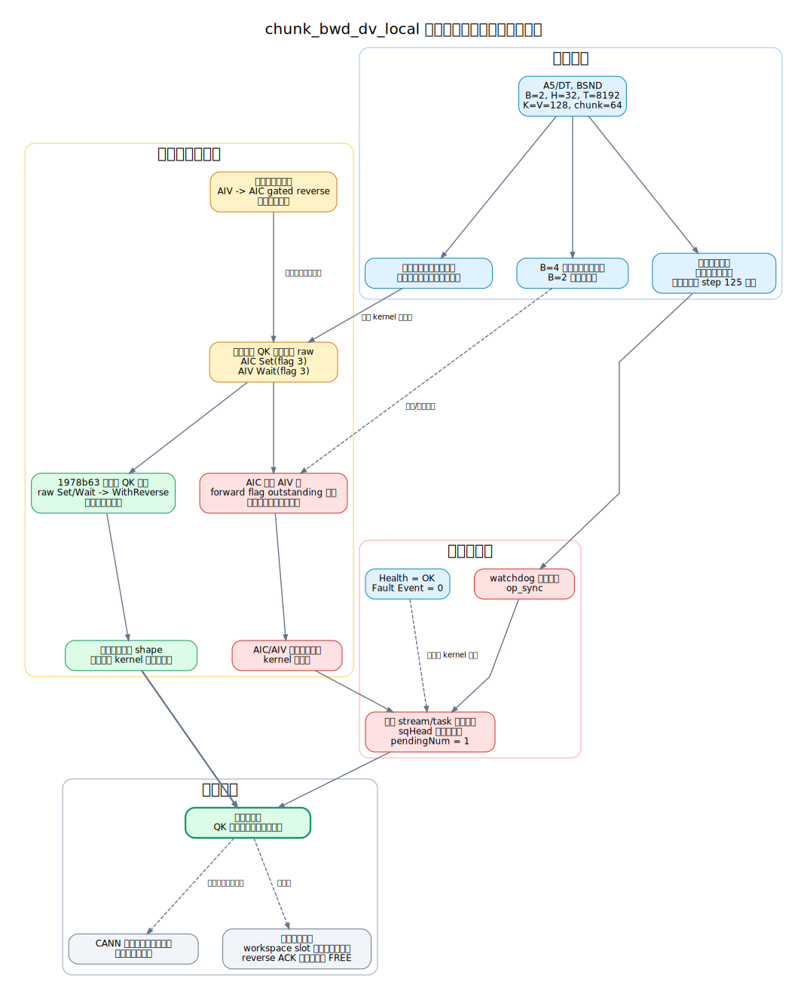
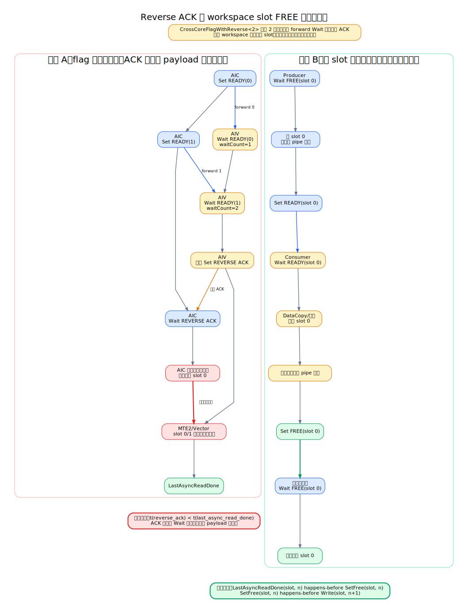
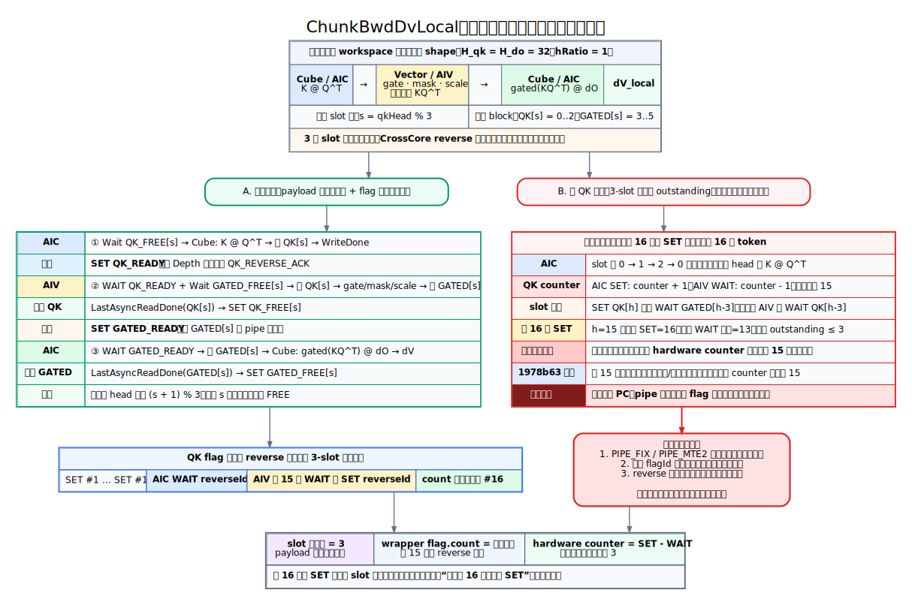
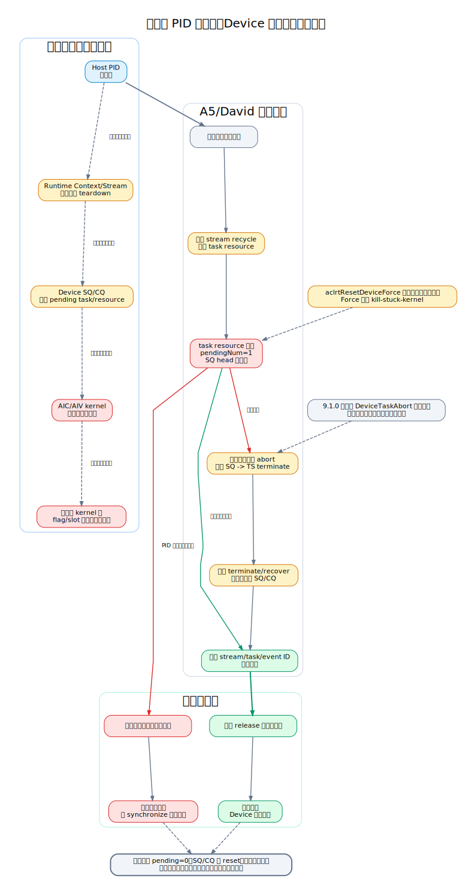

# `chunk_bwd_dv_local` A5 超时问题分析过程

本文记录 `chunk_bwd_dv_local` 在 Ascend 950 DT 上出现任务超时、后续执行异常和疑似设备残留的完整分析过程。内容包括原始复现、对照实验、runtime 日志、源码检查、修复提交、反证过程、工具盲区和仍待完成的验证。

本文是具体问题的调查记录。可复用的跨核流水设计规则、静态检查器方案和 review 清单见 [`cross-core-pipeline.md`](cross-core-pipeline.md)。

> 公开文档已删除机器地址、账号、进程号、绝对路径和日志目录。shape、runtime 字段、提交号、公开 PR/Issue 和源码位置保留，以保证证据可复核。

## 结论摘要

结论按证据强度分为三层：

1. **已确认**：卡住的是已下发的设备任务。watchdog 固定停在目标算子后的 `op_sync`；runtime 对同一 stream/task 重复报告三分钟超时，SQ head 不前进且 `pendingNum=1`。
2. **高置信根因**：QK 的 AIC -> AIV 通道使用 raw `CrossCoreSetFlag`/`CrossCoreWaitFlag`，没有 producer 侧的有界反压。提交 `1978b6338c739a0ab716f2eec593b3338f837a51` 只补齐该通道的 reverse 同步，未修改数学计算或接口，同一环境和原 shape 随即不再卡死。
3. **仍需独立验证**：进程退出后的“残留”更可能是旧 kernel、SQ/CQ 或 runtime resource 仍处于异步 teardown/recycle，而不是已完成清理后硬件 flag 跨进程永久污染。当前证据尚不能证明后者。



可编辑图源：[`chunk_bwd_dv_local_evidence_chain.dot`](diagrams/chunk_bwd_dv_local_evidence_chain.dot)

## 问题定义

### 原始调用

以下代码保留问题发生时使用的 legacy `torch.ops.npu` 复现通路，用于还原历史证据，不代表当前推荐入口。按现行规范，`chunk_bwd_dv_local` 作为 Ascend C 算子应以 `fla_npu.ops.ascendc` 作为 Python 主入口和主测试入口。

调用侧记录的 layout 为 BSND；复现脚本实际按 `B, H, T, D` 构造张量。为避免 layout 名称歧义，本文以实际实参 shape 为准：

| 参数 | 值 |
| --- | --- |
| 平台 | Ascend 950 DT |
| `q.shape` / `k.shape` | `[2, 32, 8192, 128]` |
| `d_o.shape` | `[2, 32, 8192, 128]` |
| `g.shape` | `[2, 32, 8192]` |
| `q/k/d_o.dtype` | `bfloat16` |
| `g.dtype` | `float32` |
| `chunk_size` | `64` |
| `scale` | `1 / sqrt(128)` |
| 可选参数 | `g_gamma/A/cu_seqlens/chunk_indices=None` |

原始最小脚本的核心循环如下：

```python
for step in range(200):
    dv = torch.ops.npu.npu_chunk_bwd_dv_local(
        q,
        k,
        d_o,
        g,
        scale,
        chunk_size,
        g_gamma=None,
        A=None,
        cu_seqlens=None,
        chunk_indices=None,
    )
    print(step, dv.shape, torch.isfinite(dv).all().item())
```

`torch.isfinite(...).all().item()` 会额外下发算子并触发主机同步。因此，后续诊断脚本把同步点前移到目标算子之后：

```python
for step in range(200):
    print(f"ENTER step={step}", flush=True)
    dv = torch.ops.npu.npu_chunk_bwd_dv_local(
        q,
        k,
        d_o,
        g,
        scale,
        chunk_size,
        g_gamma=None,
        A=None,
        cu_seqlens=None,
        chunk_indices=None,
    )
    torch.npu.synchronize()
    print(f"EXIT step={step}", flush=True)
```

该改动的目的不是规避问题，而是把“目标 kernel 未完成”和“后续 `isfinite/all` 算子异常”区分开。

## 证据清单

### 证据分级

- **A 级**：原始日志、可重复 A/B 实验或只改变单一变量的修复验证。
- **B 级**：目标版本源码、公开 API 文档或提交 diff。
- **C 级**：人工观察或多变量相关性，可用于形成假设，不能单独证明根因。

### 逐项证据

| ID | 等级 | 证据 | 能证明什么 | 不能证明什么 |
| --- | --- | --- | --- | --- |
| E01 | A | 单进程、单算子、固定输入循环即可复现 | 多进程互锁不是复现的必要条件 | 不能排除设备上已有状态影响 |
| E02 | A | 三个独立 context 完整执行，下一 context 在 step 125 卡住 | 问题具有调度/时序敏感性，不是每次首调用必现 | 不能单凭次数判断状态是否跨 launch 累积 |
| E03 | A | watchdog 在 30、60、180、300 秒均停于 `op_sync step=125` | 主机阻塞在目标算子后的设备同步 | 不能直接指出 AIC/AIV 的具体等待指令 |
| E04 | A | runtime 对同一 stream/task 重复报告三分钟超时，`sqHead` 不变、`pendingNum=1` | 至少一个已下发任务长期未完成 | 不能仅凭 runtime 行确定 kernel 内 PC |
| E05 | A | 超时时 Health 为 OK，Fault Event 为 0 | 没有已上报的设备故障事件 | 不能排除 kernel 软件死锁 |
| E06 | C | `B=4` 未观察到卡死，`B=2` 稳定触发 | shape 会改变 core 映射、流水距离或速度偏斜 | 不能说明 batch=2 非法 |
| E07 | C | 较早和较新 CANN 包的复现概率不同 | runtime/compiler/firmware 可能改变调度窗口 | 不能证明 CANN 改动是必要根因 |
| E08 | A | 后续在非 B103 包上仍复现 | 问题不专属于 B103 | 不能说明所有 CANN 版本概率相同 |
| E09 | B | 第一阶段只补 AIV -> AIC gated reverse，问题仍复现 | gated 单通道修复没有闭合整条双向流水 | 不否定 gated 方向原先也有问题 |
| E10 | B | 源码中 QK 仍为 AIC raw Set(flag 3)、AIV raw Wait(flag 3) | QK producer 没有 reverse credit/ACK | 不能单凭源码证明现场一定在此处停住 |
| E11 | A | `1978b63` 只把 QK raw Set/Wait 改成 `WithReverse`，同一环境原 shape 不再卡死 | QK 通知缺少有界反压是决定性因素 | 不能自动证明所有 workspace slot 生命周期安全 |
| E12 | C | 进程退出、原进程不可见后，同一 Device 的后续执行仍可能失败 | PID 生命周期和设备清理完成点不同 | 不能证明硬件 flag 在完整 reset 后仍保留 |
| E13 | B | CANN 9.1.0 文档说明 Reset/ResetForce 都会等待未完成任务 | ResetForce 不是 kill-stuck-kernel | 不能说明异常退出一定采用哪条内部清理路径 |
| E14 | B | A5/David teardown 在 task resource 非空时提交 recycle 并持续回收 | PID 消失后 runtime/device 清理可能继续 | 不能证明现场 recycle 具体卡在哪一步 |
| E15 | B | A5 abort 源码包含停发 SQ、TS terminate、轮询和 SQ/CQ 恢复 | 真正终止任务是独立于普通 reset 的协议 | 9.1.0 文档把 DeviceTaskAbort 标为预留，业务不能直接假定可用 |
| E16 | B | synccheck 没有直接报出 QK 反压缺失，且当时 sanitizer 对象命中未完全确认 | “工具无报告”不能作为无问题结论 | 不能据此否定 synccheck 对其它配对错误的价值 |

### 原始诊断摘要

脱敏后的 watchdog 结果：

```text
context=0 returncode=0 duration=15.0s stalled=False final_phase=complete
context=1 returncode=0 duration=15.2s stalled=False final_phase=complete
context=2 returncode=0 duration=15.6s stalled=False final_phase=complete
context=3 watchdog=30s  phase=op_sync step=125
context=3 watchdog=60s  phase=op_sync step=125
context=3 watchdog=180s phase=op_sync step=125
context=3 watchdog=300s phase=op_sync step=125
```

脱敏后的 runtime 关键行：

```text
SynchronizeExecutedTask: report three minutes timeout!
stream_id=61, sq_id=2, task_id=393,
sqHead=393, flip_num=0, pendingNum=1
```

该行在后续三个三分钟窗口中保持相同的 stream、task、SQ head 和 pending 数量。这不是“任务很慢”的普通表现，而是设备队列没有报告该任务完成。

设备状态对照：

```text
Health Status: OK
Error Code: NA
Fault Event Count: 0
```

这组证据将问题定位在“设备任务不返回”，但不等价于硬件健康状态异常。

## 分析时间线

### 阶段 1：从整网问题缩小到单算子

最初考虑模型调用链、多个进程、stream 交互和 CANN 包差异。构造单进程 `chunk_bwd_dv_local` 循环后仍可复现，因此：

- 整网不是必要条件。
- 多进程不是必要条件。
- shape 对应的单个 kernel 内部已有足够长的流水可以触发问题。

该 shape 含有：

```text
B * H * ceil(T / chunk_size)
= 2 * 32 * ceil(8192 / 64)
= 8192 个逻辑 (batch, head, chunk) 位置
```

实际跨核事件数还受 core 分配、sub-block 和空任务分支影响，不能直接等同于 8192，但足以说明“单次 Python op”并不等于“单次跨核通知”。

### 阶段 2：区分计算错误与同步停滞

原脚本的 `.item()` 会同步，但同步发生在 `isfinite/all` 之后。诊断脚本改为在目标 op 后立即 `torch.npu.synchronize()`，watchdog 仍固定停在 `op_sync`。

这一步排除了以下误判：

- 不是 `print` 卡住。
- 不是 `.item()` 的主机取值逻辑卡住。
- 不是只有后续 `isfinite/all` kernel 才会失败。

runtime 的稳定 `pendingNum=1` 进一步说明最后一个已下发任务没有完成。

### 阶段 3：CANN 版本假设

早期包对照呈现出明显相关性：

| OPP 编译包 | 运行时包 | 结果 |
| --- | --- | --- |
| B090 | B090 | 通过 |
| B100 | B090 | 通过 |
| B090 | B100 | 失败 |
| B100 | B100 | 失败 |

另有 B060 未观察到问题、B103 可稳定复现的记录。这一矩阵最初合理地把怀疑指向 runtime，因为结果随运行时包变化，而不随 OPP 编译包变化。

但后续出现两条反证：

1. 问题在非 B103 包上继续复现，说明 B103 不是必要条件。
2. 同一 runtime 环境只替换 `1978b63` kernel 后原 shape 不再卡死，说明 kernel 同步协议可以独立决定结果。

最终结论是：CANN 版本可能通过调度、pipe 速度或清理时序改变复现概率，但当前证据不支持把它作为必要根因。

### 阶段 4：第一次同步修复仍不完整

第一阶段修复把 A5 Vector 路径的 gated 输出从单向：

```text
AIV --GATED_READY--> AIC
```

改为带 reverse 的双向通知。v26.6.0 对应提交为 `7c83c99094385f987010d9dea44128f269ca6e12`，main 对应提交为 `67a207874130edaed23cd2aed008aba27942e8cf`。

该修复后问题仍复现，说明实际算子有两条相互耦合的跨核通道，只修一侧不够：

```text
QK 通道:     AIC -> AIV
Gated 通道:  AIV -> AIC
```

### 阶段 5：发现 QK 通道仍是 raw flag

源码检查发现 QK 通道仍使用：

```cpp
// AIC: QK MMAD 完成后
AscendC::CrossCoreSetFlag<0x2, PIPE_FIX>(SYNC_AIC_AIV_FLAG_3);

// AIV: 读取 QK workspace 前
AscendC::CrossCoreWaitFlag(SYNC_AIC_AIV_FLAG_3);
```

这组 Set/Wait 在局部看是配对的，但没有 producer 侧 credit。AIC 可以在一段时间内持续领先 AIV，硬件 flag 的有限通知窗口没有形成闭环反压。

对于任意执行前缀 `p`，协议需要保证：

```text
0 <= ProducedQkReady(p) - AcknowledgedQkReady(p) <= capacity
```

raw Set/Wait 没有显式的 `AcknowledgedQkReady` 返回路径。生产者与消费者速度接近时问题可能长期不出现；A5/DT、特定 batch/core 映射或特定 CANN 调度窗口让 AIC 更容易领先时，问题变得稳定。

### 阶段 6：最小修复和 A/B 证据

`1978b6338c739a0ab716f2eec593b3338f837a51` 于 2026-07-15 提交，核心修改为：

```diff
+Catlass::Arch::CrossCoreFlagWithReverse<> aicToAivQkReadyFlag{
+    SYNC_AIC_AIV_QK_READY_FLAG,
+    SYNC_AIV_AIC_QK_FREE_FLAG};

-AscendC::CrossCoreSetFlag<0x2, PIPE_FIX>(SYNC_AIC_AIV_FLAG_3);
+Catlass::Arch::CrossCoreSetFlagWithReverse<0x2, PIPE_FIX>(
+    aicToAivQkReadyFlag);

-AscendC::CrossCoreWaitFlag(SYNC_AIC_AIV_FLAG_3);
+Catlass::Arch::CrossCoreWaitFlagWithReverse<0x2, PIPE_MTE2>(
+    aicToAivQkReadyFlag);
```

修改同时覆盖普通路径和 `taskLineNum == 0` 路径，避免空任务破坏计数。提交没有修改：

- QK、gate 或 dV 的数学计算。
- tensor shape、dtype 或 layout 接口。
- host tiling 和 aclnn 接口。
- CANN runtime 或编译工具链。

同一环境下，替换为该提交的 kernel 后原 shape 不再卡死。这是目前最强的因果证据。

分支对应关系：

| 分支 | 提交 | PR |
| --- | --- | --- |
| `v26.6.0` | `1978b6338c739a0ab716f2eec593b3338f837a51` | [#209](https://github.com/flashserve/flash-linear-attention-npu/pull/209) |
| `main` | `915520a22b1f138fdb30218522bbcadc564ea5f0` | [#208](https://github.com/flashserve/flash-linear-attention-npu/pull/208) |

两个 PR 均关联公开 Issue [#207](https://github.com/flashserve/flash-linear-attention-npu/issues/207)。

### 阶段 7：从原问题扩展到 slot 生命周期审计

QK reverse 修复解决的是 flag 计数器反压。进一步审计发现，`CrossCoreFlagWithReverse<Depth>` 的 reverse ACK 在 consumer 完成第 `Depth` 次 forward `Wait` 时产生，不会自动等待后续异步 `DataCopy` 或计算完成。

因此：

```text
Depth == workspace slot 数
```

不等价于：

```text
reverse ACK == 对应 slot 已完成最后一次消费
```

#### 源码、slot 与 FREE 的统一模型

固定到 Catlass 提交 `41bf90da655bba3c66d0acd7e00abe33960ecfd6` 后，reverse ACK 的源码执行点是 consumer 路径中的 `CrossCoreSetFlag(flag.reverseId)`：它在 `CrossCoreWaitFlag(flag.id)` 的累计次数达到 `Depth` 时执行。该分支只检查通知计数，没有检查 payload 地址、slot 编号，也没有等待最后一次异步读取完成。

这里的 slot 不是 flag，也不只是一个下标。它表示一段会被轮转复用的固定 workspace 地址区间，以及该区间当前所属的 epoch 和 owner。例如双缓冲中的 `slotIndex = taskIndex % 2` 会让第 `n` 轮和第 `n + 2` 轮写入同一地址；因此“复用 slot”实际就是覆盖旧 payload。


可编辑图源：[`cross_core_reverse_source_and_slot_state.dot`](diagrams/cross_core_reverse_source_and_slot_state.dot)

本文中的 `FREE(slot, epoch)` 是一个所有权状态，而不是某个 flag 的名字。它至少要求：

```text
FREE(slot_i, epoch_n) :=
    owner(slot_i) == Producer
    && LastAsyncReadDone(slot_i, previous_epoch)
    && NoAsyncPipeReferences(slot_i, previous_epoch)
```

只有该条件成立后，producer 才能覆盖 `slot_i`。reverse ACK 若在 slot 仍处于 `READING` 时产生，只能证明 consumer 已完成该窗口内约定数量的 forward `Wait`，并允许 producer wrapper 进入下一通知窗口；它不能把 slot 状态推进到 `FREE`。



可编辑图源：[`cross_core_reverse_vs_slot_free.dot`](diagrams/cross_core_reverse_vs_slot_free.dot)

只有满足以下 happens-before 才能安全复用：

```text
LastAsyncReadDone(slot, n)
    happens-before SetFree(slot, n)

SetFree(slot, n)
    happens-before Write(slot, n + 1)
```

这一审计随后形成提交 `cbc48d80cbf0b45fa7f97b83844f15cefaaeda3d`，为 v26.6.0 上其它多级/双缓冲 workspace 路径增加按 slot 的 FREE；main 对应提交为 `070e47d64170998f53db55628bf05b53d4ef25ab`。它是由本问题扩展出的同类风险修复，不应反向写成原 QK 超时已经证明存在 slot 提前复用。

## 根因机制

### 两条相反方向的流水

该 kernel 的核心协同可以抽象为：

```text
AIC/Cube:
    QK = K @ Q^T
    write QK workspace
    notify QK_READY ----------------------+
                                             |
AIV/Vector:                                 v
    wait QK_READY
    read QK workspace
    apply gate/mask
    write gated workspace
    notify GATED_READY -------------------+
                                          |
AIC/Cube:                                v
    wait GATED_READY
    dV = gatedQK @ dO
```

下面把预期正确协议和旧 QK 协议放在同一张图中。对当前 shape，payload 使用 3 个逻辑 slot 组轮转，但同一个 QK flag 在 32 个 head 上有 32 次 `Set`/`Wait` 机会；slot 环深度与 CrossCore reverse 窗口必须分别分析。



可编辑图源：[`chunk_bwd_dv_local_normal_vs_deadlock.drawio`](diagrams/chunk_bwd_dv_local_normal_vs_deadlock.drawio)；可重复渲染图源：[`chunk_bwd_dv_local_normal_vs_deadlock.dot`](diagrams/chunk_bwd_dv_local_normal_vs_deadlock.dot)

需要特别区分“反压”和“死锁”。官方接口语义是：`CrossCoreSetFlag` 使对应 counter 加一，`CrossCoreWaitFlag` 在 counter 大于零时使其减一。因此，如果只有 AIC 因 counter 满而暂时停住、AIV 仍能继续执行 QK `Wait`，counter 会下降，AIC 可以恢复，这本身不是死锁。要形成闭环，AIV 还必须停在另一个等待点，无法再到达足够的 QK `Wait`；例如 AIV 等待 AIC 消费 gated 结果并返回 reverse credit，而 AIC 又因 QK 同步路径停住，无法到达 gated 消费点。

3-slot 调度还能给出更强的理论上界。对 `h >= 3`，AIC 在执行 `Set(QK_READY[h])` 之前先执行 `Wait(GATED_READY[h-3])`；而 `GATED_READY[h-3]` 只有在 AIV 已经执行 `Wait(QK_READY[h-3])`、读取 QK 并完成 gated 写出后才会产生。因此在 `h=15`，AIC 虽然执行的是第 16 次 QK `Set`，但 AIV 至少已经执行 13 次 QK `Wait`，hardware counter 的未消费量理论上不超过 3。slot 可以不断释放和复用，所以“第 16 次总调用”不等于“同时积压 16 个通知”。

`CrossCoreFlagWithReverse::count` 统计的是 wrapper 的总调用次数，不是硬件 counter 的当前值。它在第 15 次总调用后增加一次反向握手。由此，不能再把原问题简单解释为“QK hardware counter 累到 15 后永久卡死”；reverse 修复也可能是在修正异步 pipe 的在途顺序或同一 flagId 长期单向重复使用的实现约束，或者只是改变了足以触发其它竞态的时序。

当前证据没有设备侧程序计数器和各 flag counter 快照，所以不能把上述候选环写成已确认的精确停点。`1978b63` 的最小 A/B 可以高置信说明 QK 通道缺少 producer 侧 reverse 握手或相应顺序约束是决定性因素，但不能单独区分“纯 counter 瞬时饱和”“跨 pipe 指令在途状态”或“两条通道在某个具体迭代形成循环等待”。

任一方向允许 producer 无界领先，都会让有限 flag 状态或 workspace 生命周期承受超出设计的在途距离。两条通道相互依赖时，一个通道停止前进最终会表现为整个 kernel 不返回。

### 为什么不是第一次必现

同步容量问题通常依赖相对速度，而不是固定索引：

- AIC 与 AIV 的启动先后不固定。
- batch、head 和 chunk 到 core 的映射会改变单 core 连续任务数。
- HBM、FIX/MTE2/MTE3、Vector 和 Cube 的相对速度会改变最大在途通知数。
- 插桩、日志和 CANN 版本也会扰动该速度关系。

因此，“前三轮通过、下一轮 step 125 卡住”和“B=2 卡、B=4 不卡”都符合速度偏斜触发的协议问题。它们不符合一个简单的确定性越界，因为确定性越界更常在固定 task 或首轮出现。

### 为什么 A5/DT 更容易暴露

A5/DT 的更高带宽或更快 producer 路径可能增大 AIC 相对 AIV 的领先量。这里的“快”不是安全保证：

```text
producer 越快
-> 未确认的 forward 通知越多
-> 越容易越过有限 counter window
```

所以较慢环境不复现只能说明没有触发最坏流水距离，不能证明协议正确。

## 为什么 synccheck 没有直接检出

### 工具检查目标不同

synccheck 更擅长发现：

- Set/Wait 缺失或模板模式不匹配。
- 参与核数量、分支或同步 API 使用错误。
- 某些 pipe 间缺失同步。

原 QK 代码在局部存在一个 Set 和一个 Wait。问题是 producer 在任意执行前缀中可以领先多少，以及是否存在反向 credit。这属于有界队列/反压性质，不是简单配对性质。

### 动态插桩会改变问题

sanitizer 插桩会改变 AIC/AIV、MTE 和 host launch 的相对速度。若问题只在 producer 明显领先时触发，插桩可能降低复现概率。相反，某些保守报告也可能只来自工具对手工流水的建模不足。

### 本次测试链还有激活证据缺口

当时 A5 sanitizer 编译链没有稳定生成可抽查的 sanitizer 符号，且存在 Cube/Matmul 路径的保守报告。因此，“synccheck 没报 QK 反压问题”同时包含两层限制：

1. 需要先证明目标 `.o` 确实为 sanitizer 版本，并在日志中看到目标 kernel 启动 sanitizer。
2. 即使工具已激活，也不能期待它自动证明 producer lead 的上界。

这也是后续静态检查器必须显式建模 `counter_capacity`、`reverse_depth`、loop bound 和 slot ownership 的原因。

## 进程退出后的“残留”分析

### 已观测现象

卡死进程退出后，主机侧已看不到原进程，但在同一 Device 上立即启动下一次执行仍可能失败或再次卡住。切换到其它 Device 后可以继续测试。

这个现象说明：

```text
Host PID 生命周期 != Device task/context/SQ 资源生命周期
```

它尚不能说明：

```text
CrossCore flag 在完整任务终止和 SQ/CQ reset 后仍永久污染 Device
```

### CANN 9.1.0 源码证据

分析使用的 runtime 9.1.0 源码快照为 `b8205b7f91d5aec1059ad07b2bf2d594826dc615`。

`aclrtResetDevice` 和 `aclrtResetDeviceForce` 的文档都写明：若默认 Context 或 Stream 上任务未完成，系统会等待任务完成后再释放。`Force` 主要改变引用计数释放方式，不表示杀掉卡死 kernel。

A5/David 的 `DavidStream::TearDown` 路径会：

1. 读取 stream 的 head/tail。
2. task resource 非空时提交 `MT_STREAM_RECYCLE_TASK`。
3. 在 resource 非空且 Device 仍为 normal 时循环 `TaskReclaimByStream`。
4. 只有进入 task-abort 状态等条件才跳出普通回收循环。

真正的 David Device abort/recover 源码包含：

1. 停止 host/device SQ 继续下发。
2. 执行 abort 前回调。
3. 通知 TS 终止所有 SQ 中的任务。
4. 轮询任务终止状态。
5. 执行 abort 后回调。
6. 通知 TS 恢复 SQ。
7. 轮询恢复状态。
8. 清理资源并恢复 runtime 状态。

但 9.1.0 API 文档仍把 `aclrtDeviceTaskAbort` 标为“预留接口，暂不支持”。源码存在不等于当前业务栈可以直接依赖。



可编辑图源：[`process_exit_device_cleanup.dot`](diagrams/process_exit_device_cleanup.dot)

### 当前最合理解释

当 kernel 卡在跨核同步中时，Python 进程退出只触发资源清理的开始：

```text
PID 消失
-> 系统检测退出
-> Context/Stream teardown
-> recycle 或 abort/query
-> SQ/CQ 与 task resource 清理
-> 资源最终释放
```

在中间窗口内可能同时成立：

- `npu-smi` 已不显示旧 PID。
- 旧 task 仍未完成或仍在回收。
- stream/task/event ID 尚未释放。
- 新进程创建资源失败或 synchronize 卡住。

昇腾官方故障处理文档说明，异常退出后的资源释放是异步过程，最长可能需要约一分钟；在释放完成前重启任务可能失败。

### 仍需补齐的决定性实验

要把“延迟清理”与“完整清理后设备级残留”分开，下一轮应在独占 Device 上执行：

| 时间点 | 采样内容 |
| --- | --- |
| 卡死时 | PID、stream/task、SQ head/tail、pending、Health/Fault |
| 退出后 0/5/15/30/60/120 秒 | 原 PID、teardown/recycle/abort 日志、资源分配错误 |
| 每个时间点 | 独立小算子健康探针，带主机超时和显式 synchronize |
| 恢复前 | 保存最终 snapshot，再执行设备级恢复操作 |

判据：

| 结果 | 结论 |
| --- | --- |
| 一分钟内自动恢复 | 支持异常退出后的异步清理窗口 |
| pending 保持 1，SQ head 不动 | 支持旧 kernel/task 未终止 |
| pending 已归零，但创建 stream/event 报资源不足 | 支持资源 ID 回收未完成 |
| 明确记录 abort、SQ/CQ reset 和资源释放后，简单探针仍卡住 | 才支持更深层 firmware/hardware 清理缺陷 |
| 只有原问题算子失败，简单探针通过 | 仍应优先查 kernel 协议，而非 Device 全局残留 |

## 被排除或降级的假设

| 假设 | 最终状态 | 依据 |
| --- | --- | --- |
| 必须整网才能复现 | 排除 | 单算子循环可复现 |
| 必须多进程才复现 | 排除 | 单进程可复现 |
| 纯输入值或 non-finite 问题 | 大幅降级 | 固定输入多轮结果不同，阻塞点为 op_sync |
| batch=2 接口非法 | 排除 | 接口接受并可多轮完成，修复后同 shape 通过 |
| B103 独有 runtime 回归 | 排除 | 非 B103 包仍复现 |
| CANN 版本完全无影响 | 不成立 | 包版本明显改变复现概率，但不是必要根因 |
| 只修 gated reverse 即可 | 排除 | 第一阶段修复后仍复现 |
| QK 通道缺少有界反压 | 高置信确认 | 源码缺口 + 最小同步 diff + 同环境 A/B |
| 原问题必然是 workspace slot 提前复用 | 未证明 | reverse 修复解决原问题，但 ACK/FREE 风险需独立审计 |
| PID 消失即 Device 清理完成 | 排除 | runtime teardown/abort 是独立异步流程 |
| hardware flag 完整 reset 后仍跨进程永久残留 | 未证明 | 尚缺 pending=0、SQ/CQ reset 后探针仍失败的证据 |

## 修复后的验证边界

公开 PR 的补充压力记录包括：

- 原始 BF16 + FP32 Gate B2 shape 多轮共 2000 次。
- B4 对照多轮共 600 次。
- 相关算子同步、burst 和交替调用合计 6296 次。
- 测试结束后 Health 正常、Fault 为 0，未观察到残留进程。

这些结果增强了修复稳定性的证据，但仍需区分：

- PR 记录是提交者验证，不等价于独立 CI 审核。
- 无插桩压力通过不等价于 sanitizer 已覆盖所有内存 hazard。
- A5 环境通过不替代每个目标 DT/CANN 组合上的原 shape 回归。
- QK flag 反压通过不替代其它算子的 slot ownership 审计。

## 后续静态检查工具的直接输入

本问题应成为静态协议检查器的第一组真实回归：

### `CC001`：循环内 raw forward Set 无有界反压

检测条件：

```text
CrossCoreSetFlag 位于可多次执行的 loop
且 producer 没有 reverse/credit wait
且无法静态证明最大发送次数小于安全容量
```

修复前 QK 通道应报错，`1978b63` 后应通过。

### `CC002`：reverse ACK 早于 payload 最后消费

检测条件：

```text
WithReverse 的 consumer 在 Wait(forward) 时累计 ACK
但 payload 的 DataCopy/计算发生在该 Wait 之后
且 ACK 被声明为 slot FREE
```

工具应提示 ACK 只能证明通知窗口已消费，不能证明 slot 已释放。

### `CC004`：空任务或 tail 分支破坏 token 平衡

修复必须同时覆盖正常路径和 `taskLineNum == 0`。静态检查器应比较所有 `continue`/tail 分支的 Set/Wait/ACK 净变化。

### 必须配套的动态回归

- 原始 B2 shape 的无插桩长循环。
- B4 对照和 `B2 -> B4 -> B2` 切换。
- 单次同步与异步 burst。
- 新进程单次调用循环，区分单 kernel 竞态与跨 context 清理。
- 确认目标对象已插桩后的 synccheck/racecheck。
- 隔离 Device 上的 timeout、退出、等待和健康探针恢复测试。

## 参考资料

- [公开 Issue #207](https://github.com/flashserve/flash-linear-attention-npu/issues/207)
- [main 修复 PR #208](https://github.com/flashserve/flash-linear-attention-npu/pull/208)
- [v26.6.0 修复 PR #209](https://github.com/flashserve/flash-linear-attention-npu/pull/209)
- [v26.6.0 QK reverse 修复提交](https://github.com/flashserve/flash-linear-attention-npu/commit/1978b6338c739a0ab716f2eec593b3338f837a51)
- [Catlass `CrossCoreFlagWithReverse` 实现](https://gitcode.com/cann/catlass/blob/41bf90da655bba3c66d0acd7e00abe33960ecfd6/include/catlass/arch/cross_core_sync.hpp)
- [CANN 9.1.0 A5/3510 核间同步与 CrossCore counter 语义](https://www.hiascend.com/document/detail/zh/CANNCommunityEdition/910beta3/programug/Ascendcopdevg/docs/guide/%E7%BC%96%E7%A8%8B%E6%8C%87%E5%8D%97/%E9%AB%98%E7%BA%A7%E7%BC%96%E7%A8%8B/%E7%A1%AC%E4%BB%B6%E5%AE%9E%E7%8E%B0/%E6%9E%B6%E6%9E%84%E8%A7%84%E6%A0%BC/NPU%E6%9E%B6%E6%9E%84%E7%89%88%E6%9C%AC3510.md)
- [CANN runtime 9.1.0 Device 管理](https://gitcode.com/cann/runtime/blob/b8205b7f91d5aec1059ad07b2bf2d594826dc615/docs/03_api_ref/04_Device%E7%AE%A1%E7%90%86.md)
- [CANN runtime 9.1.0 David stream teardown](https://gitcode.com/cann/runtime/blob/b8205b7f91d5aec1059ad07b2bf2d594826dc615/src/runtime/core/src/stream/stream_david.cc)
- [CANN runtime 9.1.0 David abort/recover](https://gitcode.com/cann/runtime/blob/b8205b7f91d5aec1059ad07b2bf2d594826dc615/src/runtime/core/src/dfx/fast_recover.cc)
- [进程异常退出后的异步资源清理说明](https://www.hiascend.com/document/detail/zh/CANNCommunityEdition/82RC1alpha002/maintenref/troubleshooting/troubleshooting_0112.html)
- [异常退出后资源未及时释放的故障处理](https://www.hiascend.com/document/detail/zh/CANNCommunityEdition/83RC1/maintenref/troubleshooting/troubleshooting_0114.html)
- [MindStudio Sanitizer synccheck](https://www.hiascend.com/document/detail/zh/canncommercial/83RC1/devaids/optool/atlasopdev_16_0181.html)
