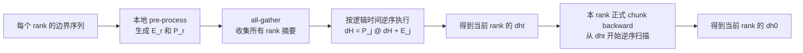

# `pre_process_bwd_kernel_merged` 与跨 Rank CP 反向状态传播

## 1. 文档目的

本文分析 fla-org `flash-linear-attention` 中的 `pre_process_bwd_kernel_merged`，说明它在 Context Parallel（CP）反向过程中的数学语义、每个入参的作用、Kernel 内部执行流程，以及将该机制用于 GDN、KDA、GDN2 Ascend C 实现时需要补齐的能力。

本文统一使用 `dH` 表示状态梯度，不使用字母 `G` 表示状态梯度，避免与 GDN 的 gate `g`、KDA/GDN2 的 key gate `gk` 淆混。

分析基线为上游提交 [`e52dbc0`](https://github.com/fla-org/flash-linear-attention/tree/e52dbc0ea19d3a40d7ab7f9eed855d2b473994d2)：

- [`pre_process_bwd_kernel_merged`](https://github.com/fla-org/flash-linear-attention/blob/e52dbc0ea19d3a40d7ab7f9eed855d2b473994d2/fla/ops/cp/chunk_delta_h.py#L493-L760)
- [`merge_fwd_bwd_kernel`](https://github.com/fla-org/flash-linear-attention/blob/e52dbc0ea19d3a40d7ab7f9eed855d2b473994d2/fla/ops/cp/chunk_delta_h.py#L335-L475)
- [`chunk_gated_delta_rule_bwd_dhu_pre_process`](https://github.com/fla-org/flash-linear-attention/blob/e52dbc0ea19d3a40d7ab7f9eed855d2b473994d2/fla/ops/cp/chunk_delta_h.py#L947-L1135)
- [上游 CP 数学说明](https://github.com/fla-org/flash-linear-attention/blob/e52dbc0ea19d3a40d7ab7f9eed855d2b473994d2/fla/ops/cp/README.md#L210-L241)

## 2. 核心结论

`pre_process_bwd_kernel_merged` 不是完整 backward Kernel，也不执行跨 rank 通信。它将本 rank 边界序列的反向状态递推压缩成一个仿射摘要：

$$
\boxed{
\mathrm d\mathbf H_r^{start}
=
\mathbf P_r\mathrm d\mathbf H_r^{end}
+\mathbf E_r
}
$$

其中：

- $\mathrm d\mathbf H_r^{end}$ 是当前 rank 末端状态的梯度，对应代码中的 `dht`。
- $\mathrm d\mathbf H_r^{start}$ 是当前 rank 起始状态的梯度，对应概念上的 `dh0`。
- $\mathbf E_r\in\mathbb R^{K\times V}$ 是与输入 `dht` 无关的本地梯度常量项。
- $\mathbf P_r\in\mathbb R^{K\times K}$ 是把末端 `dH` 传播到起始位置的线性变换。

Kernel 将两者打包到一个 FP32 tensor：

```text
dhm[hv, :, :V] = E_r    # [K, V]
dhm[hv, :, V:] = P_r    # [K, K]
```

这里源码把后半部分称为 `dm`，但它不是某个模型参数的梯度。它是反向状态转移矩阵，也就是正向状态转移 Jacobian 的转置。

`merged` 表示计算 $\mathbf E_r$ 和 $\mathbf P_r$ 的两个阶段共用一次 Triton grid launch，不表示已经把不同 rank 的摘要合并。

## 3. 符号与 Shape

### 3.1 数学符号

| 符号 | Shape | 含义 |
| --- | --- | --- |
| $\mathbf H_{r,c}$ | `[K,V]` | rank $r$ 内 chunk $c$ 的输入状态 |
| $\mathbf H_{r,c+1}$ | `[K,V]` | chunk $c$ 的输出状态 |
| $\mathrm d\mathbf H_{r,c}$ | `[K,V]` | $\partial L/\partial\mathbf H_{r,c}$ |
| $\mathbf D_c$ | `[K,K]` | 当前 chunk 的总衰减矩阵，实际为对角矩阵 |
| $\bar{\mathbf Q}_c$ | `[C,K]` | 应用 chunk 内 gate 后的有效 query |
| $\bar{\mathbf K}_c$ | `[C,K]` | 衰减到 chunk 末端后的有效 key |
| $\mathbf W_c$ | `[C,K]` | WY 表示中的 erase/update 辅助量 |
| $\mathrm d\mathbf O_c$ | `[C,V]` | 当前 chunk 的输出梯度 |
| $\mathrm d\mathbf V_c^{local}$ | `[C,V]` | 尚未加入后续状态梯度贡献的本地 `dV` |
| $C$ | 标量 | chunk size，代码中为 `BT` |

### 3.2 代码维度

| 代码名 | 含义 |
| --- | --- |
| `B` | rank-local batch 或 packed buffer 的 batch 维 |
| `T` | 当前 rank 的 token buffer 长度 |
| `H` | `q/k` 的 head 数，不是状态矩阵 $\mathbf H$ |
| `HV` | value/state head 数 |
| `K` | 状态矩阵行维，也是 q/k 的单 head 维度 |
| `V` | 状态矩阵列维，也是 value/output 的单 head 维度 |
| `BT` | chunk size |

为避免歧义，正文将代码参数 `H` 称为 `H_qk`，将状态矩阵写成粗体 $\mathbf H$。

## 4. 从单 Chunk 反向公式推导仿射摘要

### 4.1 正向状态递推

将 GDN、KDA、GDN2 的 chunk 状态传播统一写成：

$$
\mathbf V'_c
=
\mathbf U_c-\mathbf W_c\mathbf H_{r,c}
$$

$$
\mathbf H_{r,c+1}
=
\mathbf D_c\mathbf H_{r,c}
+\bar{\mathbf K}_c^T\mathbf V'_c
$$

代入 $\mathbf V'_c$：

$$
\mathbf H_{r,c+1}
=
\left(\mathbf D_c-\bar{\mathbf K}_c^T\mathbf W_c\right)
\mathbf H_{r,c}
+\bar{\mathbf K}_c^T\mathbf U_c
$$

正向状态转移矩阵为：

$$
\mathbf M_c
=
\mathbf D_c-\bar{\mathbf K}_c^T\mathbf W_c
$$

### 4.2 `dV` 的状态贡献

反向处理 chunk $c$ 时，已知后续状态梯度：

$$
\mathrm d\mathbf H_{r,c+1}
=
\frac{\partial L}{\partial\mathbf H_{r,c+1}}
$$

后续状态通过 $\bar{\mathbf K}_c^T\mathbf V'_c$ 对 $\mathbf V'_c$ 产生额外梯度：

$$
\widehat{\mathrm d\mathbf V}_c
=
\mathrm d\mathbf V_c^{local}
+\bar{\mathbf K}_c\mathrm d\mathbf H_{r,c+1}
$$

这里必须使用 `dv_local`。如果输入 `dv` 已经加入过 $\bar{\mathbf K}_c\mathrm d\mathbf H_{r,c+1}$，pre-process 会把这部分重复计算一次。

### 4.3 `dH` 递推

当前 chunk 的起始状态梯度为：

$$
\mathrm d\mathbf H_{r,c}
=
\mathbf D_c\mathrm d\mathbf H_{r,c+1}
+s\bar{\mathbf Q}_c^T\mathrm d\mathbf O_c
-\mathbf W_c^T\widehat{\mathrm d\mathbf V}_c
$$

其中 $s$ 是 `scale`，通常为 $K^{-1/2}$。代入上一节的 $\widehat{\mathrm d\mathbf V}_c$：

$$
\mathrm d\mathbf H_{r,c}
=
\left(\mathbf D_c-\mathbf W_c^T\bar{\mathbf K}_c\right)
\mathrm d\mathbf H_{r,c+1}
+s\bar{\mathbf Q}_c^T\mathrm d\mathbf O_c
-\mathbf W_c^T\mathrm d\mathbf V_c^{local}
$$

定义：

$$
\boxed{
\mathbf P_c
=
\mathbf D_c-\mathbf W_c^T\bar{\mathbf K}_c
}
$$

$$
\boxed{
\mathbf E_c
=
s\bar{\mathbf Q}_c^T\mathrm d\mathbf O_c
-\mathbf W_c^T\mathrm d\mathbf V_c^{local}
}
$$

得到单 chunk 的反向仿射变换：

$$
\boxed{
\mathrm d\mathbf H_{r,c}
=
\mathbf P_c\mathrm d\mathbf H_{r,c+1}
+\mathbf E_c
}
$$

同时有：

$$
\mathbf P_c=\mathbf M_c^T
$$

这一关系可以用来检查矩阵方向是否写反。$\mathbf P_c$ 中必须是 $\mathbf W_c^T\bar{\mathbf K}_c$，不能写成 $\bar{\mathbf K}_c^T\mathbf W_c$。

## 5. Rank 内多个 Chunk 的组合

设一个 rank 内有 $N_c$ 个 chunk，编号为 $0,1,\ldots,N_c-1$。逐 chunk 关系为：

$$
\mathrm d\mathbf H_{r,c}
=
\mathbf P_{r,c}\mathrm d\mathbf H_{r,c+1}
+\mathbf E_{r,c}
$$

完整 rank 的线性项为：

$$
\boxed{
\mathbf P_r
=
\mathbf P_{r,0}\mathbf P_{r,1}\cdots\mathbf P_{r,N_c-1}
}
$$

完整 rank 的常量项为：

$$
\boxed{
\mathbf E_r
=
\mathbf E_{r,0}
+\mathbf P_{r,0}\mathbf E_{r,1}
+\mathbf P_{r,0}\mathbf P_{r,1}\mathbf E_{r,2}
+\cdots
}
$$

所以：

$$
\boxed{
\mathrm d\mathbf H_r^{start}
=
\mathbf P_r\mathrm d\mathbf H_r^{end}
+\mathbf E_r
}
$$

虽然 Kernel 按 chunk 从后向前循环，但矩阵链的最终顺序是 $\mathbf P_{r,0}\mathbf P_{r,1}\cdots$。Stage 2 从单位阵开始，每次执行：

```text
P = P_chunk @ P
```

因此不能把最终结果误写成 $\mathbf P_{r,N_c-1}\cdots\mathbf P_{r,0}$。

## 6. `dH`、`dht`、`dh0`、`dh` 与 `dhm`

| 代码名 | 数学含义 | 典型 Shape | 说明 |
| --- | --- | --- | --- |
| `dht` | $\mathrm d\mathbf H_r^{end}$ | `[N,HV,K,V]` 或 `[N,HV,V,K]` | 当前 rank 末端状态的梯度，是本地正式 backward 的边界输入 |
| `dh0` | $\mathrm d\mathbf H_r^{start}$ | 与 `initial_state` 对应 | 当前 rank 完成反向状态扫描后的边界输出 |
| `dh[c]` | $\mathrm d\mathbf H_{r,c+1}$ | 每 chunk 一个 `[K,V]` | 正式 backward 在处理当前 chunk 前保存的状态梯度 |
| `dhm[..., :V]` | $\mathbf E_r$ | `[HV,K,V]` | 令 rank 末端 `dH=0` 后得到的起始 `dH` |
| `dhm[..., V:]` | $\mathbf P_r$ | `[HV,K,K]` | rank 末端 `dH` 到起始 `dH` 的反向线性映射 |

相邻 rank 的状态边界满足：

$$
\mathbf H_r^{end}=\mathbf H_{r+1}^{start}
$$

对应的反向边界关系为：

$$
\mathrm d\mathbf H_r^{end}
=
\mathrm d\mathbf H_{r+1}^{start}
$$

即概念上：

```text
dht[r] = dh0[r + 1]
```

如果采用点对点方式，可以等待 rank `r+1` 完成全部 backward 后，把 `dh0[r+1]` 发给 rank `r`。这种方案会把所有 rank 的 backward 串行化。上游改为每个 rank 先并行计算 `(E_r,P_r)`，再通过 all-gather 重建各 rank 的 `dht`。

## 7. Kernel 完整入参说明

上游签名为：

```python
def pre_process_bwd_kernel_merged(
    q, k, w, g, gk, do, dhm, dv, cu_seqlens,
    scale, T,
    H, HV, K, V, BT, BLOCK_SIZE, BK1,
    USE_G, USE_GK, USE_BG, IS_VARLEN,
    AFFINE_CHAIN_PRECISION=None,
):
```

### 7.1 Tensor 入参和输出

| 参数 | 典型 Shape | 作用 |
| --- | --- | --- |
| `q` | `[B,T,H_qk,K]` | 构造 $s\bar{\mathbf Q}^T\mathrm d\mathbf O$。GDN 传原始 `q`；KDA/GDN2 传已经应用 key gate 的 `qg`。 |
| `k` | `[B,T,H_qk,K]` | 构造 $\bar{\mathbf K}\mathrm d\mathbf H$ 和 $\mathbf W^T\bar{\mathbf K}$。GDN 传原始 `k`；KDA/GDN2 传 `kg`。DPLR 模式由 wrapper 用 `bg` 替代。 |
| `w` | `[B,T,HV,K]` | WY erase/update 辅助量，参与 $-\mathbf W^T\mathrm d\mathbf V$ 和 $-\mathbf W^T\bar{\mathbf K}$。GDN2 必须传 `w_wy`，不能传公开输入 `w_gate`。 |
| `g` | `[B,T,HV]` 或 `None` | GDN 的 chunk-local 累计标量 log2 gate。非空时启用 `USE_G`。 |
| `gk` | `[B,T,HV,K]` 或 `None` | KDA/GDN2 的 chunk-local 累计逐 K 维 log2 gate。非空时启用 `USE_GK`。 |
| `do` | `[B,T,HV,V]` | 当前 rank 的输出梯度 $\mathrm d\mathbf O$。 |
| `dhm` | `[HV,K,V+K]`，FP32 | 唯一输出。前 `V` 列保存 $\mathbf E_r$，后 `K` 列保存 $\mathbf P_r$。 |
| `dv` | `[B,T,HV,V]` | 只读的 $\mathrm d\mathbf V^{local}$。它应来自先于状态反向执行的本地 output/intra-chunk 反向阶段。 |
| `cu_seqlens` | 至少两个整数 | 给出本次汇总 segment 的 `[bos,eos)`。普通 CP wrapper 传 `cu_seqlens[:2]`；Kernel 本身只处理一个窗口。 |

重要约束：

- `q/k/w/do/dv/g/gk` 按连续 token-major `[B,T,H,D]` 地址计算，没有显式 stride 参数。
- `dhm` 固定使用 `[K,V+K]` 逻辑布局，与 `state_v_first` 无关。
- `dv` 不会被该 Kernel 回写。
- KDA/GDN2 的 `qg/kg` 必须与正式 `bwd_dhu` 使用同一份定义和同一舍入语义。

### 7.2 运行时标量

| 参数 | 作用 |
| --- | --- |
| `scale` | query-output 梯度项的缩放，通常是 `K**-0.5`。它只乘 $\bar{\mathbf Q}^T\mathrm d\mathbf O$。 |
| `T` | rank-local buffer 的 token 长度。`IS_VARLEN=True` 时，Kernel 用 `eos-bos` 覆盖实际扫描长度。 |

### 7.3 编译期参数

| 参数 | 作用 |
| --- | --- |
| `H` | `q/k` 的 head 数。GDN 的 GVA 场景使用 `hv // (HV/H)` 将 value head 映射到 q/k head。 |
| `HV` | value/state head 数，也是 grid 的第二维。 |
| `K` | 状态行维。当前 wrapper 明确限制 `K <= 256`。 |
| `V` | 状态列维，也是 Stage 1 输出列数。 |
| `BT` | chunk size，必须与 gate cumsum、WY 生成和正式 backward 使用的 chunk size 一致。 |
| `BLOCK_SIZE` | `dhm` 列方向 tile。wrapper 使用 `32 if K <= 64 else 64`。 |
| `BK1` | `next_power_of_2(K)`，Stage 2 计算完整 K 行时使用。 |
| `USE_G` | 标量 gate 路径，由 `g is not None` 自动推导。 |
| `USE_GK` | 逐 K gate 路径，由 `gk is not None` 自动推导。 |
| `USE_BG` | DPLR 专用分支。GDN、KDA、GDN2 都应为 `False`。 |
| `IS_VARLEN` | 是否通过 `cu_seqlens` 获取 segment 边界。CP wrapper 中实际为 `True`。 |
| `AFFINE_CHAIN_PRECISION` | 控制 $\mathbf P$ 矩阵链 `tl.dot` 的输入精度，例如 `tf32x3`、`ieee` 或默认值。 |

`USE_G` 与 `USE_GK` 对目标三种算法必须互斥。上游 Kernel 没有显式 assert；如果二者同时为真，Stage 1 会同时应用两种 gate，而 Stage 2 会优先 `USE_G`，两阶段语义不一致。

## 8. Grid 与任务划分

wrapper 使用：

```python
BLOCK_SIZE = 32 if K <= 64 else 64
grid = (
    ceil_div(V, BLOCK_SIZE) + ceil_div(K, BLOCK_SIZE),
    HV,
)
```

program id 的含义：

- `program_id(1)` 是 value/state head `hv`。
- `program_id(0) * BLOCK_SIZE < V` 时，该 program 计算 $\mathbf E_r$ 的一段 V 列。
- 其余 `program_id(0)` 计算 $\mathbf P_r$ 的一段 K 列。
- Kernel 将 `i_n` 固定为 0，没有 batch/sequence program id，一次 launch 只汇总一个 `[bos,eos)` segment。

Stage 1 将 K 行拆成最多四组 64 行 FP32 accumulator，因此当前限制 `K <= 256`。T、K、V 的尾块都使用 mask，不要求整除 `BT` 或 `BLOCK_SIZE`。

## 9. Stage 1：计算 Rank 常量项 `E_r`

Stage 1 只负责 `dhm[..., :V]`。它将末端 `dH` 初始化为零，然后从最后一个 chunk 向第一个 chunk 扫描：

```text
dH = zeros([K, V_tile], fp32)

for chunk c from last to first:
    dV_hat = Kbar[c] @ dH + dV_local[c]
    dH = D[c] @ dH
         + scale * Qbar[c].T @ dO[c]
         - W[c].T @ dV_hat

E_rank = dH
```

由于初始条件是 rank 末端 `dH=0`，最终得到的不是一般情况下完整的 `dh0`，而是仿射映射中的常量项 $\mathbf E_r$。

该阶段所有 `dH` accumulator 使用 FP32。输入矩阵可以是模型 dtype，矩阵乘结果累加到 FP32。

## 10. Stage 2：计算 Rank 线性项 `P_r`

Stage 2 只负责 `dhm[..., V:]`。它从单位阵开始，按 chunk 逆序计算：

```text
P = identity([K, K], fp32)

for chunk c from last to first:
    P_chunk = D[c] - W[c].T @ Kbar[c]
    P = P_chunk @ P

P_rank = P
```

源码明确让矩阵链保持 FP32，避免每轮乘法后回写 BF16 导致误差随 chunk 数和 rank 数放大。

对于 GDN/KDA/GDN2，符号是减号。`USE_BG=True` 的 DPLR 分支使用加号，并且 query 项的 scale 语义也不同，不能把该开关当作 GDN2 模式。

## 11. GDN、KDA、GDN2 参数映射

### 11.1 总表

| 算法 | `q` 参数 | `k` 参数 | gate 参数 | $\mathbf D_c$ | `w` 参数 |
| --- | --- | --- | --- | --- | --- |
| GDN | raw `q` | raw `k` | `g` | $\exp_2(g_{last})\mathbf I$ | WY `w`，已折叠 scalar `beta` |
| KDA | `qg` | `kg` | `gk` | $\operatorname{Diag}(\exp_2(gk_{last}))$ | WY `w`，已折叠 scalar `beta` |
| GDN2 | `qg` | `kg` | `gk` | $\operatorname{Diag}(\exp_2(gk_{last}))$ | `w_wy`，已折叠 K 轴 erase gate `b` |

上游调用位置：

- [GDN backward](https://github.com/fla-org/flash-linear-attention/blob/e52dbc0ea19d3a40d7ab7f9eed855d2b473994d2/fla/ops/gated_delta_rule/chunk.py#L147-L216)
- [KDA backward](https://github.com/fla-org/flash-linear-attention/blob/e52dbc0ea19d3a40d7ab7f9eed855d2b473994d2/fla/ops/kda/chunk_bwd.py#L504-L589)
- [GDN2 backward](https://github.com/fla-org/flash-linear-attention/blob/e52dbc0ea19d3a40d7ab7f9eed855d2b473994d2/fla/ops/gdn2/chunk_bwd.py#L385-L454)

### 11.2 GDN 标量 gate

GDN 传入 raw `q/k`，Kernel 内构造：

$$
\bar{\mathbf Q}_{c,t}
=
\mathbf Q_{c,t}\exp_2(g_{c,t})
$$

$$
\bar{\mathbf K}_{c,t}
=
\mathbf K_{c,t}\exp_2(g_{c,last}-g_{c,t})
$$

$$
\mathbf D_c
=
\exp_2(g_{c,last})\mathbf I
$$

若 `HV > H_qk`，Kernel 不要求物理 repeat `q/k`，而是按 `hv // (HV/H_qk)` 复用对应的 q/k head。

### 11.3 KDA 逐 K gate

KDA 在进入 pre-process 前已经构造：

$$
\mathbf {qg}_{c,t}
=
\mathbf q_{c,t}\odot\exp_2(\mathbf {gk}_{c,t})
$$

$$
\mathbf {kg}_{c,t}
=
\mathbf k_{c,t}\odot
\exp_2(\mathbf {gk}_{c,last}-\mathbf {gk}_{c,t})
$$

所以 pre-process 直接把 `qg` 当作 $\bar{\mathbf Q}$、把 `kg` 当作 $\bar{\mathbf K}$，只额外读取 chunk 末行的 `gk` 构造：

$$
\mathbf D_c
=
\operatorname{Diag}(\exp_2(\mathbf {gk}_{c,last}))
$$

不能把 raw `q/k` 直接传入 KDA 路径，否则 $\mathbf E_r$ 和 $\mathbf P_r$ 都会缺少逐维 gate。

### 11.4 GDN2

GDN2 的 CP 反向状态传播与 KDA 使用同一种逐 K gate 形式：

```text
q = qg
k = kg
w = w_wy
g = None
gk = chunk-local cumulative key gate
```

GDN2 的公开输入 `b` 和 `w_gate` 不直接进入该 Kernel：

- K 轴 erase gate `b` 已折叠进 WY 辅助量 `w_wy`。
- V 轴 write gate `w_gate` 已折叠进 `u_wy` 及后续生成的 `dv_local`。
- Kernel 参数名 `w` 指 `w_wy`，不是公开输入 `w_gate`。

## 12. 跨 Rank 合并

### 12.1 为什么不能 all-reduce

每个 rank 提供的是仿射变换：

$$
\mathcal T_r(X)=\mathbf P_rX+\mathbf E_r
$$

若 rank $a$ 在时间上早于 rank $b$，两个摘要的组合为：

$$
(\mathbf E_a,\mathbf P_a)\otimes(\mathbf E_b,\mathbf P_b)
=
\left(
\mathbf E_a+\mathbf P_a\mathbf E_b,
\mathbf P_a\mathbf P_b
\right)
$$

该运算有顺序且不满足交换律，因此不能使用 `all_reduce(sum)`。上游使用 `all_gather` 收集所有摘要，再由每个 rank 按逻辑时间顺序本地合并。

### 12.2 当前 Rank 的 `dht`

假设当前 rank 为 $r$，同一逻辑序列在它之后还有 rank $r+1,\ldots,r+n$，且全局最终状态没有额外 loss：

```text
dH = zeros([K, V], fp32)

for j from r+n down to r+1:
    dH = P[j] @ dH + E[j]

dht[r] = dH
```

也就是从逻辑上最晚的 rank 向当前 rank 的直接后继合并。不能从 `r+1` 正向累加，也不能把各 rank 的 $\mathbf E$ 简单相加。

如果未来允许最终状态参与额外 loss，merge 初值必须改成外部 terminal `dH`，不能继续固定为零。当前上游 CP wrapper 明确要求用户传入的 `dht` 为 `None`。

### 12.3 完整数据流



`pre_process_bwd_kernel_merged` 只覆盖图中的第一个计算节点，不负责 all-gather、merge 或正式 local backward。

## 13. 连续 CP、Varlen 与 Zigzag

### 13.1 连续切分

连续 CP 下，每个 rank 可能同时包含多个 packed sequence segment：

- 向前一个 rank 发布摘要时，只需处理本 rank 的第一条本地 sequence，因为只有它可能是前一 rank 中某条序列的延续。
- 从后续 rank 接收状态梯度时，将合并后的 `dht` 写到本 rank 最后一条非空 sequence，因为只有它可能继续到后一 rank。
- 本 rank 中间开始的新 sequence 不应继承前一条 sequence 的状态或状态梯度。

因此上游普通路径使用 `cu_seqlens[:2]` 生成 `dhm`，但把合并结果写入 `dht[-1]`。这两个位置看似不对称，实际分别对应“向左发布”和“从右接收”。

### 13.2 Kernel 的 segment 限制

Kernel 内 `i_n` 固定为 0，一次 launch 只处理一个 `[bos,eos)`。如果 NPU 方案需要一次处理多个跨 rank segment，必须：

- 在 host/L2 层多次 launch；或
- 显式增加 segment 维 grid 和对应 offset metadata。

不能直接假定 Kernel 会遍历 `cu_seqlens` 中的全部 sequence。

### 13.3 Zigzag CP

zigzag 布局下，每个物理 rank 有 front/back 两段，需要分别生成两个摘要。上游的逻辑 chain 顺序是：

```text
front(rank 0), front(rank 1), ..., front(rank W-1),
back(rank W-1), back(rank W-2), ..., back(rank 0)
```

all-gather 后必须先按该逻辑顺序重排，再为每个 part 从未来向过去合并。直接按物理 rank 编号做 backward merge 会把 back 部分顺序写反。

### 13.4 `state_v_first`

`state_v_first=False` 时状态布局为 `[K,V]`；`state_v_first=True` 时状态存储布局为 `[V,K]`。但：

- `dhm` 始终保持 `[K,V+K]`。
- pre-process 公式不变。
- merge 时才把计算改写为转置布局：

$$
\mathrm d\mathbf H^T
\leftarrow
\mathrm d\mathbf H^T\mathbf P^T+\mathbf E^T
$$

不能因为状态使用 `[V,K]` 就转置通信中的 `dhm`。

## 14. Ascend C 落地建议

### 14.1 推荐的内部能力拆分

建议先实现两个内部能力，而不是立即把通信编排暴露成公共算子 API：

```text
ChunkDeltaHBwdPreprocess(
    q_or_qg,
    k_or_kg,
    w_wy,
    do,
    dv_local,
    g_or_gk,
    scale,
    chunk_size,
    boundary_offsets,
) -> dhm_fp32
```

```text
ChunkDeltaHBwdMerge(
    gathered_dhm,
    logical_post_rank_count,
    logical_rank,
    state_v_first,
    terminal_dH=None,
) -> dht_fp32
```

三种算法共享通信、摘要布局和 merge；pre-process 内只根据 gate 类型选择 $\bar Q$、$\bar K$、$\mathbf D$ 的构造方式。

### 14.2 正式 backward 必须支持非零 `dht`

本地状态反向不能再固定从零开始。正式 `bwd_dhu` 需要：

1. 读取本 rank 对应 sequence 的 `dht`。
2. 用 `dht` 初始化反向状态 accumulator。
3. 在每个 chunk 处理前保存正确的 `dh[c]`。
4. 完成本 rank 扫描后得到真实 `dh0`。
5. 保证输出 `dv` 只加入一次 $\bar K\mathrm dH$。

如果主 backward 忽略 `dht`，即使 preprocess 和通信结果完全正确，跨 rank 梯度仍不会进入 `dq/dk/dv/dg` 等后续路径。

### 14.3 Forward CP 同样是前置条件

反向 preprocess 只解决未来 rank 对当前 rank 的状态梯度传播。完整训练还要求正向：

- 每个 rank 生成正向状态仿射摘要。
- prefix merge 得到本 rank 的 `initial_state`。
- 正式 forward 从该非零 `initial_state` 开始。

只实现 `pre_process_bwd_kernel_merged` 不能单独完成 GDN/KDA/GDN2 的跨 rank CP 支持。

### 14.4 Layout 适配

上游 Triton 输入按 token-major `[B,T,H,D]` 连续寻址。本仓现有 Ascend C 路径还存在 BSND/BNSD、TND/NTD 等布局。移植时不能照搬上游 pointer arithmetic，应在设计中明确：

- 对外 layout 与内部性能 layout。
- `q/k` 的 `H_qk` 与 `do/dv/state` 的 `HV` 映射。
- packed varlen 的 token offset、sequence offset 与 chunk index。
- `state_v_first` 只影响状态输入输出，还是也影响内部 workspace。
- layout swap 是 L2 处理、独立 L0，还是 Kernel 内分支。

### 14.5 Gate 必须在 rank-local chunk 语义下重建

`g/gk` 是 chunk-local 累计 gate。如果 CP rank 边界切进一个全局 chunk，本地 chunk 起点已经变化，不能直接切片复用全局累计后的中间量。必须确保：

- rank-local `g/gk` 从本地 chunk 起点重新累计或正确 rebase。
- `qg/kg` 与新的本地 chunk 边界一致。
- `w_wy/u_wy` 使用同一套 chunk metadata。
- preprocess 与正式 forward/backward 使用相同的 partial-chunk 语义。

只要 `gk_last`、`qg`、`kg` 或 `w_wy` 中任意一个仍基于旧 chunk 边界，$\mathbf E_r$、$\mathbf P_r$ 和本地 backward 就不再描述同一条状态递推。

### 14.6 Dtype 与数值精度

建议以下对象固定使用 FP32：

- `dhm` 的 $\mathbf E_r$ 与 $\mathbf P_r$。
- rank 内 $\mathbf P$ 链的 accumulator。
- 跨 rank merge 的 `dH` accumulator。
- 必要时的 `dht/dh0` 边界状态梯度。

模型输入和 `do/dv_local/qg/kg/w_wy` 可以保持模型 dtype，再在矩阵累加时进入 FP32。不能在每个 chunk 或每个 rank 后把 $\mathbf P$ 链回写 BF16，否则误差会随链长累积。

### 14.7 通信量

每个 rank 的摘要元素数为：

$$
HV\times K\times(V+K)
$$

FP32 字节数为：

$$
4\times HV\times K\times(V+K)
$$

例如 `HV=96, K=128, V=128` 时，每个 rank 摘要为 12 MiB；8 rank all-gather 后，每个 rank 持有 96 MiB 摘要。正确性阶段可以先采用 all-gather 对齐上游，性能阶段需要评估：

- 通信时间与本地 GEMM 是否可以重叠。
- 是否需要分 head/tile 通信。
- 是否改成 reverse scan、send/recv 或分层 collective。
- 优化方案是否仍保持严格的仿射组合顺序。

不能为减少通信直接改成 all-reduce。

## 15. 当前仓库接入前置检查

本文编写时，当前 checkout 的 GDN `chunk_gated_delta_rule_bwd_dhu` 入口仍显式忽略 `gk`、`h0` 和 `dht`，内部实现也没有写出 `dh0`：

```text
fla/ops/ascendc/gdn/chunk_gdn_bwd/
  chunk_gated_delta_rule_bwd_dhu/op_kernel/
  chunk_gated_delta_rule_bwd_dhu.cpp
```

因此接入顺序不应只新增 preprocess。至少需要同步完成：

1. GDN/KDA/GDN2 正向接收跨 rank `initial_state`。
2. 本地 backward 接收非零 `dht`，并正确生成 `dh0`。
3. 标量 `g` 与逐 K `gk` 两条路径使用一致的状态公式。
4. 实现 FP32 `(E,P)` 摘要及有序 merge。
5. 增加 CP 编排、通信 stream/lifetime 和错误处理。
6. 补齐 GDN2 算子本体后再接入共享 CP 路径。

该段描述的是接入前基线，不应代替实现时对当前分支代码、接口、文档和测试的重新核对。

## 16. 常见错误

### 16.1 把状态梯度写成 gate `G`

状态梯度统一写成 `dH`。`g/gk` 只表示 gate，避免公式和代码讨论中出现歧义。

### 16.2 把 `dhm[..., :V]` 当成完整 `dh0`

它只是在末端 `dH=0` 条件下得到的 $\mathbf E_r$。真实起始状态梯度仍需要：

$$
\mathrm d\mathbf H_r^{start}
=
\mathbf P_r\mathrm d\mathbf H_r^{end}+\mathbf E_r
$$

### 16.3 把 `dhm[..., V:]` 当成参数梯度

它是反向状态转移矩阵 $\mathbf P_r$，不是 `dM` 意义上的模型参数梯度。

### 16.4 对 rank 摘要做求和

仿射摘要组合有严格顺序，不能对 $\mathbf E$ 求和或对 $\mathbf P$ 求平均。

### 16.5 KDA/GDN2 传 raw `q/k`

这两种模式必须传 `qg/kg`。同时正式 `bwd_dhu` 也必须消费同一份门控中间量。

### 16.6 GDN2 把公开 `w_gate` 传给参数 `w`

Kernel 参数 `w` 是 `[T,HV,K]` 的 `w_wy`，而公开 `w_gate` 位于 V 轴，数学角色和 Shape 都不同。

### 16.7 输入的 `dv` 已经包含状态项

pre-process 内会再次执行 $\bar K\mathrm dH$。输入必须是 `dv_local`，否则状态贡献被累计两次。

### 16.8 忽略 rank 边界切开 chunk

直接切片全局 `gk/qg/kg/w_wy` 可能破坏 chunk-local gate 定义。必须重新建立本地 chunk metadata 和累计量。

### 16.9 只实现 backward preprocess

若 forward 仍从零状态开始，或 local backward 仍忽略 `dht`，完整 CP 结果依然错误。

## 17. 验证方案

### 17.1 数学单元测试

先用纯 PyTorch/NumPy 构造小矩阵验证：

1. 显式逐 chunk backward 得到 `dh0_direct`。
2. 独立计算每个 chunk 的 $(E_c,P_c)$。
3. 合成 rank 摘要 $(E_r,P_r)`。
4. 验证 `dh0_direct == P_r @ dht + E_r`。
5. 组合多个 rank，验证 all-gather merge 与全序列 backward 一致。

测试必须使用非零随机 `dht`；只测 `dht=0` 无法验证 $\mathbf P_r$。

### 17.2 单算子覆盖

| 维度 | 必测场景 |
| --- | --- |
| rank 数 | 2、4，以及目标规模 |
| CP layout | contiguous；若计划支持则增加 zigzag |
| chunk 边界 | rank 边界对齐 chunk、切开 chunk、最后一个 partial chunk |
| sequence | 单序列跨多个 rank、多序列、空/零长尾 segment |
| head | `H_qk == HV`、GDN 的 `HV > H_qk` |
| gate | GDN scalar `g`、KDA/GDN2 per-K `gk` |
| gate 数据 | 每 head/每 K 维不同，避免广播错误被掩盖 |
| 状态布局 | `[K,V]` 与 `state_v_first=[V,K]` |
| dtype | FP16/BF16 输入，FP32 摘要和状态链 |
| terminal gradient | 零 `dht`、非零 `dht`；若公开支持 final-state loss 则覆盖外部 terminal `dH` |

### 17.3 端到端梯度

以单 rank 全序列结果为基线，对比多 rank CP：

- forward output。
- `dq`、`dk`、`dv`。
- GDN 的 `dg/dbeta`。
- KDA 的 `dgk/dbeta` 及相关 gate 参数梯度。
- GDN2 的 `db/dw_gate/dgk`。
- `dh0`，如果存在可求导 `initial_state`。

必须使用同一原始全局输入和同一 loss，只改变 CP 切分。缩小 shape 可以用于定位，但最终需要回到原目标 shape 和原切分方式验证。

### 17.4 中间量定位

出现误差时按以下顺序对比：

1. rank-local `g/gk`。
2. `qg/kg/w_wy/dv_local`。
3. 每个 rank 的 $\mathbf E_r$。
4. 每个 rank 的 $\mathbf P_r$。
5. merge 后的 `dht`。
6. 正式 backward 保存的每 chunk `dh[c]`。
7. 最终参数和输入梯度。

如果 $\mathbf E_r$ 正确但 $\mathbf P_r$ 错误，优先检查矩阵方向、chunk 组合顺序和 FP32 链。如果 $(E,P)$ 都正确但 `dht` 错误，优先检查 logical rank 顺序、sequence 边界和 zigzag 重排。

## 18. 实现检查清单

- [ ] 全部状态梯度文档和变量说明统一使用 `dH`。
- [ ] `dv` 明确为不含未来状态项的 `dv_local`。
- [ ] GDN 传 raw `q/k + g`。
- [ ] KDA/GDN2 传 `qg/kg + gk`。
- [ ] GDN2 传 `w_wy`，不传公开 `w_gate`。
- [ ] `USE_G` 与 `USE_GK` 互斥并在 host 侧校验。
- [ ] $\mathbf E$、$\mathbf P$、merge accumulator 使用 FP32。
- [ ] rank 内 chunk 顺序和 rank 间逻辑顺序均经过公式与测试验证。
- [ ] 使用 all-gather 或等价的有序 scan，不使用简单 all-reduce。
- [ ] contiguous、varlen、zigzag 分别定义 boundary segment。
- [ ] `state_v_first` 不改变 `dhm` 布局。
- [ ] rank-local gate cumsum、partial chunk 和 `qg/kg/w_wy` 使用同一 chunk metadata。
- [ ] 正式 forward 消费非零 `initial_state`。
- [ ] 正式 backward 消费非零 `dht` 并生成真实 `dh0`。
- [ ] 任何 Kernel 修改后重跑完整单 rank 与多 rank 梯度对比。

## 19. 一句话理解

`pre_process_bwd_kernel_merged` 所做的事情可以概括为：

> 不等待后续 rank 给出具体 `dH`，先把本 rank 的反向状态传播压缩成 `dH_start = P @ dH_end + E`；收集所有 rank 的 `(E,P)` 后，再按时间逆序快速重建每个 rank 真正需要的 `dht`。
