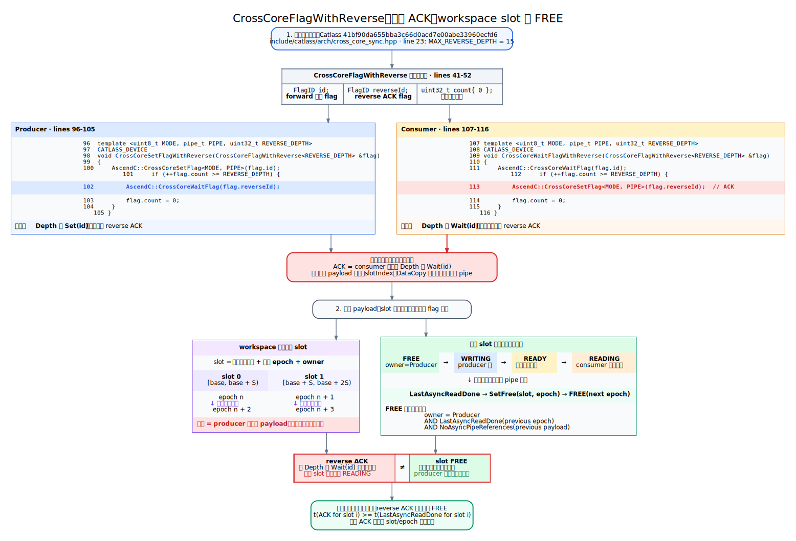

# 跨核流水、超时与进程退出后的设备残留

本文用于分析 AscendC 算子中 AIC/AIV 通过 workspace 交换数据时的跨核流水问题，重点回答以下问题：

- `CrossCoreSetFlag`/`CrossCoreWaitFlag` 配对后，为什么仍可能超时。
- `CrossCoreFlagWithReverse` 解决了什么，为什么不能自动证明 workspace slot 可安全复用。
- 为什么主机进程已经退出，后续进程仍可能在同一 Device 上失败或卡住。
- 如何把算子设计文档转成可静态检查的生产者消费者协议。

本方法的具体问题分析过程、原始日志证据和修复提交见 [`chunk-bwd-dv-local-timeout-investigation.md`](chunk-bwd-dv-local-timeout-investigation.md)。

## 两类有界资源

跨核流水至少同时占用两类有界资源，不能把它们合并成一个概念。

| 资源 | 容量 | 获得方式 | 归还方式 | 容量耗尽的典型结果 |
| --- | --- | --- | --- | --- |
| CrossCore flag 计数器 | 硬件/API 定义的有限深度 | producer `Set` forward flag | consumer `Wait` 后按协议返回 reverse ACK | producer 的后续 `Set` 无法前进 |
| workspace payload slot | tiling 分配的 slot 数 | producer 获得 slot 所有权 | consumer 完成最后一次异步读取后返回 FREE | slot 被提前覆盖，产生数据竞争或循环等待 |

这里的 slot 指一段会被轮转复用的 workspace 地址及其所有权状态，不只是一个地址变量。它的状态至少应包含 `free`、`being-written`、`ready` 和 `being-read`。

### `CrossCoreFlagWithReverse` 的实际语义

Catlass 的封装可简化为以下逻辑：

```cpp
// producer
Set(forward);
if (++setCount == Depth) {
    Wait(reverse);
    setCount = 0;
}

// consumer
Wait(forward);
if (++waitCount == Depth) {
    Set(reverse);
    waitCount = 0;
}
```

固定到 Catlass 提交 `41bf90da655bba3c66d0acd7e00abe33960ecfd6`，上面 consumer 分支中的 `Set(reverse)` 对应源码 `CrossCoreSetFlag(flag.reverseId)`，这就是 reverse ACK 的产生点。它紧随第 `Depth` 次 `CrossCoreWaitFlag(flag.id)`，源码没有在两者之间检查 payload 或等待最后消费 pipe 完成。

下图把源码执行点、双缓冲 slot 的实际地址复用和 `FREE` 状态机放在同一张图中：



可编辑图源：[`cross_core_reverse_source_and_slot_state.dot`](diagrams/cross_core_reverse_source_and_slot_state.dot)

reverse ACK 表达的是“consumer 已执行 `Depth` 次 forward `Wait`”，它用于限制 forward flag 的累计深度。它默认不表达以下事实：

- 对应 payload 已经完成 `DataCopy`。
- MTE/VEC/CUBE/FIX 等异步 pipe 已经完成最后一次读取。
- 对应 workspace slot 已经可以被 producer 覆盖。

因此，`Depth` 与 workspace slot 数相等只是一个数值关系，不是生命周期证明。若 consumer 在 `Wait(forward)` 后立即累计 ACK，而实际数据读取仍在异步执行，producer 收到批量 ACK 后仍可能覆盖正在读取的 slot。

这里的 `FREE` 是 slot 的所有权状态，不是 flag 的别名：

```text
FREE(slot_i, epoch_n) :=
    owner(slot_i) == Producer
    && LastAsyncReadDone(slot_i, previous_epoch)
    && NoAsyncPipeReferences(slot_i, previous_epoch)
```

slot 是“固定 workspace 地址区间 + 当前 epoch + owner”。以双缓冲为例，`slotIndex = taskIndex % 2` 会让第 `n` 轮和第 `n + 2` 轮覆盖同一地址；producer 只有在上述 `FREE` 条件成立后才能开始下一轮写入。

### reverse ACK 何时可以兼任 slot FREE

只有同时证明以下条件时，reverse ACK 才能兼任 slot FREE：

1. forward 通知与 payload slot 按固定顺序一一对应。
2. 每个 reverse ACK 覆盖的所有 slot 均已完成最后一次异步读取。
3. consumer 的 ACK 之前存在从最后消费 pipe 到 ACK pipe 的有效 happens-before 边。
4. producer 收到 ACK 后只复用这批已经释放的 slot。
5. tail、空任务、`continue`、sub-block 分工和 head ratio 不会改变通知与 slot 的映射。

最关键的判定式是：

```text
t(reverse_ack_for_slot_i) >= t(last_async_read_done_for_slot_i)
```

如果只能证明 ACK 晚于 `Wait(forward)`，不能证明 ACK 晚于 `last_async_read_done`，就必须把 flag 计数器反压与 slot FREE 分成两套协议。

推荐的 slot 生命周期是：

```text
producer: WaitFree(slot) -> write payload -> wait write pipe -> SetReady(slot)
consumer: WaitReady(slot) -> read/compute -> wait last read pipe -> SetFree(slot)
```

## `chunk_bwd_dv_local` 案例

已观察到的触发条件包括：长序列、固定输入循环调用、A5/DT 上更容易稳定复现、某些 batch 调度组合会卡住，而改变 batch 后不再复现。卡住时 runtime 持续报告同一个 stream 上 `pendingNum=1`，SQ head 长时间不前进，但健康状态没有硬件故障事件。

这些现象更符合流水速度偏斜触发的有界资源耗尽，而不是输入值或单次计算量错误：

1. AIC 产生 QK payload，并连续发送 QK ready。
2. 旧实现只有 forward ready，没有对应的 reverse 反压。
3. AIC 在特定调度下持续领先 AIV，forward flag 状态逐步累计。
4. 有限 flag 深度耗尽后，某个跨核同步操作无法继续。
5. 另一方向的 gated 流水仍依赖该阶段，最终形成 AIC/AIV 循环等待。
6. kernel 不返回，runtime 只能看到 stream 中最后一个任务始终 pending。

提交 `1978b6338c739a0ab716f2eec593b3338f837a51` 为 QK ready 通道增加 `CrossCoreFlagWithReverse`，闭合了 flag 计数器反压，原始复现用例不再超时。这能证明旧 QK 通知协议缺少有界反压是该用例的关键问题，但不能据此跳过对 workspace slot 生命周期的独立检查。

### 为什么 A5/DT 和特定 batch 更容易暴露

同步 bug 的复现概率由生产者与消费者的相对速度、core 映射、循环次数和流水在途距离共同决定：

- HBM 或计算路径更快，可能让 producer 更快耗尽 flag 深度或更早复用 slot。
- batch、head ratio 和 block 分配会改变每个 core 连续承担的 task 数量。
- batch 变大不一定增加风险，它也可能改变 core 映射，使生产者与消费者重新接近平衡。
- 单次调用可能没有超过有界资源容量，固定输入循环或长序列更容易进入坏状态。

因此，“B=2 卡住、B=4 不卡住”是调度敏感同步问题的线索，不是 batch 维度本身非法的证据。

## 进程退出后为什么仍像是有残留

### 五层状态不能混为一谈

| 层次 | 可见状态 | 退出或清理的含义 |
| --- | --- | --- |
| Python/主机进程 | PID、主机内存 | PID 消失只证明主机进程结束 |
| runtime Context/Stream | context、stream、event、task 对象 | 需要 teardown、回收或 abort |
| Device SQ/CQ | head、tail、pending task、资源 ID | 需要 TS/driver 确认终止并回收 |
| AIC/AIV kernel | 正在执行、等待 flag、已退出 | 卡在跨核 wait 的 kernel 不会因 Python 对象析构自动完成 |
| 核间 flag 与 workspace 状态 | kernel 内协议状态 | 随在途任务终止和资源重置而失效，不能仅凭后续失败断言其跨进程永久污染 |

NPU 异步 launch 返回只代表任务已下发。主机 PID 退出时，设备上的任务、SQ/CQ 和 runtime 资源可能仍处于异步清理过程，因此 `npu-smi` 不再显示原进程不等于设备队列已经恢复可用。

### 正常 reset 不是任务 abort

CANN 9.1.0 的 `aclrtResetDevice` 和 `aclrtResetDeviceForce` 文档都说明：若默认 Context 或 Stream 上仍有未完成任务，系统会等待任务完成后再释放。`Force` 主要改变 `aclrtSetDevice` 引用计数的释放方式，不表示强制终止卡死 kernel。

在 A5/David runtime 路径中，stream teardown 会提交维护回收任务，并在 task resource 非空且设备仍处于 normal 状态时持续回收。任务终止是另一条 abort 路径，需要停止 SQ 下发、通知 TS 终止任务、轮询终止状态、清理 SQ/CQ，再恢复 runtime 状态。

源码中存在 Device task abort/recover 实现，不等于业务可以直接依赖对应公开接口。CANN 9.1.0 API 文档仍将 `aclrtDeviceTaskAbort` 标为预留、暂不支持；定位脚本应优先使用目标版本和目标产品明确支持的 `aclrtStreamAbort` 等能力，并先验证调用约束。

这解释了以下时间窗口：

```text
主机进程退出
  -> 系统检测进程退出并开始清理
  -> stream/context teardown 或 task abort/recycle
  -> 等待设备确认、清理 SQ/CQ 和 task resource
  -> 释放 stream/task/event ID 与内存
  -> 新进程可稳定使用 Device
```

在这个窗口中，旧 PID 可以已经不可见，但设备侧仍存在未完成任务或待回收资源。官方故障处理资料也说明，异常退出后的资源释放是异步过程，短时间内重启业务可能因为资源尚未释放而失败。

### 当前证据支持和不支持什么

支持的判断：

- SQ head 长时间不动且 `pendingNum=1`，说明至少一个已下发任务没有完成。
- 健康状态正常、无 fault event，只能排除已上报的设备故障，不能排除 kernel 协议死锁。
- 同一 CANN 环境替换为修复后的 kernel 后原 shape 不再卡住，强烈支持算子同步协议是首要原因。
- 旧进程消失后新进程立即失败，可能是旧任务仍在执行、SQ/CQ 正在回收或公共资源 ID 尚未释放。

尚不能直接证明的判断：

- “CrossCore flag 寄存器在完整任务终止和 context 清理后仍跨进程永久保留”。
- “只要 PID 不存在，所有设备任务就必然已被杀掉”。
- “`aclrtResetDeviceForce` 可以终止任意卡死 kernel”。
- “健康状态 OK 就证明 Device 调度状态已清空”。

若确认 abort 已成功、SQ/CQ 已 reset、pending 已归零，新进程仍在最小健康算子上卡住，才应继续调查更深层的 firmware/hardware 同步状态或清理缺陷。

## 残留问题的可证伪实验

实验应使用独占 Device，并在每轮开始前确认没有其它业务任务。保留重置前的日志和快照，避免先恢复再丢失关键证据。

### 实验矩阵

分别执行以下退出方式，并记录清理耗时：

1. 正常完成全部任务后退出，作为基线。
2. 保留卡死进程，不退出，观察 SQ head、tail 和 pending。
3. 卡死后发送 `SIGTERM`。
4. 卡死后发送 `SIGKILL`。
5. 在可控的 ACL/C++ harness 中，由 watchdog 调用受支持的 stream abort，再退出。

第 5 项只能用于定位。`aclrtStreamAbort` 要求持有原 Stream/Context，且存在跨 stream 依赖时需要一并处理依赖流。不要在异常 signal handler 中临时拼装资源清理逻辑；官方资料指出，这可能与系统的异常退出清理发生冲突。

### 观测时间线

建议在退出后的 `0/5/15/30/60/120` 秒采样：

```bash
ps -ef | grep '<repro-process>'
npu-smi info -t proc-mem -i <device>
npu-smi info -t health -i <device>
npu-smi info -t current-fault-event -i <device>
```

对 runtime 和 device 日志按同一时间线搜索：

```bash
grep -nE \
  'SynchronizeExecutedTask|pendingNum|sqHead|sqTail|TearDown|recycl|abort|CleanSq|SqCqUpdate|DeviceReset' \
  <log-files>
```

每个时间点再用独立进程运行一个只包含单次小规模计算和显式 synchronize 的健康探针，并设置主机超时。不要用原复现算子作为唯一健康探针，否则无法区分“旧任务未清理”和“新 kernel 再次命中同一 bug”。

### 假设与判据

| 假设 | 支持证据 | 反证 |
| --- | --- | --- |
| H1: 只是异常退出后的延迟清理 | 原 PID 消失后，teardown/recycle 日志继续推进；约一分钟内健康探针恢复 | 超过清理窗口后 pending、SQ 状态和探针仍不变 |
| H2: 卡死 kernel 未被终止 | 同一 pending task 和 SQ head 持续不变；普通 reset 一直等待 | stream/task abort 明确成功后 pending 归零且探针恢复 |
| H3: 任务已停但资源 ID 尚未释放 | 新进程在创建 context/stream/event 时报告资源不足，没有新的 kernel pending | 创建资源成功但 synchronize 卡在设备任务 |
| H4: SQ/CQ 或调度状态未完整恢复 | abort/recycle 某一步失败，SQ/CQ reset 无完成记录 | abort、reset、资源回收均完成且健康探针正常 |
| H5: 完整清理后仍有设备级残留 | 已确认无 pending、SQ/CQ 已 reset，简单算子仍卡住，只有设备级恢复有效 | 等待异步清理或正确 abort 后自动恢复 |

定位结论应写成“哪一层的哪个完成条件未满足”，不要只写“卡上有残留”。

## 静态协议检查工具建议

### 先让设计文档可机读

自然语言写清生产者和消费者有助于 review，但要做确定性分析，还需要为每条通道补充机器可读的协议。建议在算子目录维护 sidecar YAML，或使用结构化源码注释：

```yaml
channels:
  - name: qk_ready
    producer: AIC
    consumer: AIV
    forward_flag: 3
    reverse_flag: 2
    reverse_depth: 15
    ack_semantics: flag_depth
    producer_pipe: PIPE_FIX
    payload: qk_workspace
    slot_expr: qk_head % p1_slot_num
    slot_count: p1_slot_num

  - name: qk_slot_free
    producer: AIV
    consumer: AIC
    ack_semantics: slot_free
    completion_pipe: PIPE_MTE2
```

`ack_semantics` 必须明确区分：

- `flag_depth`: 只限制 forward flag 的累计通知数。
- `slot_free`: 表示 payload 已经完成最后一次异步消费，可以复用地址。
- `barrier`: 所有参与核到达阶段边界，不携带 payload 所有权。

设计文档还需要提供 loop/task 到 slot 的映射、初始 credit、空任务行为、tail 分支、参与核数量和高阶 API 占用的 flag 范围。缺少这些信息时，静态工具最多给出保守告警，不能证明协议安全。

### 中间表示和核心不变量

工具可把 AscendC 源码提取为 `channel + event + payload + slot + loop` 中间表示，并检查以下不变量：

```text
0 <= SetForward(prefix) - WaitForward(prefix) <= flag_capacity

0 <= Produce(slot, prefix) - Free(slot, prefix) <= 1

WriteDone(slot, n) happens-before SetReady(slot, n)

WaitReady(slot, n) happens-before Read(slot, n)

LastAsyncReadDone(slot, n) happens-before SetFree(slot, n)

SetFree(slot, n) happens-before Write(slot, n + 1)
```

每个 `if`、`continue`、tail、空任务和 sub-block 分支都要保持 token 数和参与核集合一致。工具还应检查 flag ID 冲突、模板模式/pipe 不一致，以及 Matmul/Catlass 等高阶组件的隐式 flag 占用。

### 实现分阶段

1. **Inventory 检查**：用词法/Tree-sitter 扫描所有 raw `CrossCoreSetFlag`、`CrossCoreWaitFlag` 和 `CrossCoreFlagWithReverse`，生成 flag ID、方向、pipe、循环层级和文件位置清单。
2. **局部规则检查**：识别 loop 中只有 forward Set、魔法数字 flag、分支漏 Set/Wait、同 ID 多通道、reverse ACK 紧跟 `Wait` 但 payload 后续仍异步读取等模式。
3. **CFG 与 slot 分析**：基于 Clang AST/CFG 或能兼容 AscendC 扩展的前端，做支配关系、分支平衡、`index % slotCount` 复用距离和异步 pipe 完成点分析。
4. **有界模型检查**：把有限 slot、flag capacity、producer/consumer 速度偏斜和 tail 分支编码为 SMT/状态机，搜索死锁、overflow 和提前复用反例。
5. **CI 增量门禁**：先对历史代码告警并建立 allowlist，再禁止新代码引入高置信问题，最终要求新跨核通道提供协议 sidecar。

AscendC 扩展语法可能让标准 Clang 前端无法直接解析。可先对预处理结果做轻量语法适配，或使用 Tree-sitter 完成 inventory，再逐步给常用封装添加函数摘要，而不是一开始追求完整 C++ 语义。

### 建议的诊断编号

| 编号 | 含义 |
| --- | --- |
| `CC001` | loop 中 forward Set 没有可证明的有界反压 |
| `CC002` | reverse ACK 早于 payload 的最后异步消费完成 |
| `CC003` | modulo slot 在复用前没有可证明的 FREE |
| `CC004` | tail、空任务或 `continue` 导致 Set/Wait token 不平衡 |
| `CC005` | flag ID、方向、模式或 pipe 冲突 |
| `CC006` | 生产完成点到 ready、消费完成点到 free 缺少 happens-before |
| `CC007` | 源码实现与协议 sidecar 的参与核、深度或 slot 映射不一致 |

### 回归用例

静态工具至少应包含以下负例 fixture：

- loop 内连续 raw Set，无 reverse 或 credit。
- `Depth=slotCount`，但 consumer 在 `Wait` 后、`DataCopy` 完成前返回批量 ACK。
- 两个 slot 使用 `% 2` 轮转，producer 第三次写前没有等待第一个 slot FREE。
- tail/空任务分支只执行一侧通知。
- AIC/AIV 对相同 flag 使用不同模式或 pipe。
- 多个通道复用同一 flag ID。
- consumer 的最后读取在 MTE/VEC pipe，FREE 却缺少对应完成事件。
- 修复前和修复后的真实 QK 通道，确保工具能识别反压差异。

## 静态检查与运行时工具的边界

- `synccheck` 擅长发现 Set/Wait 配对、参与核或同步 API 使用错误，不一定能发现“配对正确但 producer 可长期领先”的容量问题。
- `racecheck` 只有在实际调度触发地址重叠时才可能报告 slot 提前复用，并且必须确认运行时命中了 sanitizer 版本对象。
- `memcheck`、`initcheck` 分别覆盖越界/泄漏和未初始化读取，不替代协议证明。
- 静态工具可证明给定模型下的 token、slot 和 happens-before 不变量，但无法单独证明编译器、runtime、firmware 的实际清理行为。
- 原 shape 的 A5 长循环压测仍是必要回归；sanitizer 用例和无插桩压力用例都要保留，因为插桩会改变生产者消费者速度。

进程退出后的故障恢复测试会影响 Device 状态，不适合作为普通并行 CI。建议放入独占 Device 的隔离任务，注入 timeout 后验证 abort、资源回收和健康探针恢复。

## Review 清单

- 每条跨核通道是否区分 flag depth 与 payload slot ownership。
- raw forward Set 是否存在可证明的最大领先量。
- reverse ACK 的语义是计数器反压还是 slot FREE。
- ready 是否发生在写 pipe 完成后，FREE 是否发生在最后读 pipe 完成后。
- slot 数、轮转表达式、初始 credit 和流水最大在途距离是否一致。
- tail、空任务、head ratio 和 sub-block 分支是否保持 token 平衡。
- 固定输入长循环是否覆盖同一 core 多次复用同一 slot。
- 超时后是否按 PID、Context/Stream、SQ/CQ、kernel、flag/slot 五层记录状态。
- 是否在 reset 前保留 pending、SQ head/tail、abort/recycle 和健康探针证据。

## 参考资料

- [CANN runtime 9.1.0 Device 管理](https://gitcode.com/cann/runtime/blob/9.1.0/docs/03_api_ref/04_Device%E7%AE%A1%E7%90%86.md)
- [CANN runtime 9.1.0 Stream 管理](https://gitcode.com/cann/runtime/blob/9.1.0/docs/03_api_ref/06_Stream%E7%AE%A1%E7%90%86.md)
- [CANN runtime 9.1.0 异常处理](https://gitcode.com/cann/runtime/blob/9.1.0/docs/03_api_ref/13_%E5%BC%82%E5%B8%B8%E5%A4%84%E7%90%86.md)
- [CANN runtime 9.1.0 David stream teardown](https://gitcode.com/cann/runtime/blob/9.1.0/src/runtime/core/src/stream/stream_david.cc)
- [CANN runtime 9.1.0 A5 task abort/recover](https://gitcode.com/cann/runtime/blob/9.1.0/src/runtime/core/src/dfx/fast_recover.cc)
- [进程异常退出后的异步资源清理说明](https://www.hiascend.com/document/detail/zh/CANNCommunityEdition/82RC1alpha002/maintenref/troubleshooting/troubleshooting_0112.html)
- [异常退出后资源未及时释放的故障处理](https://www.hiascend.com/document/detail/zh/CANNCommunityEdition/83RC1/maintenref/troubleshooting/troubleshooting_0114.html)
- [Catlass CrossCoreFlagWithReverse 实现](https://gitcode.com/cann/catlass/blob/41bf90da655bba3c66d0acd7e00abe33960ecfd6/include/catlass/arch/cross_core_sync.hpp)
