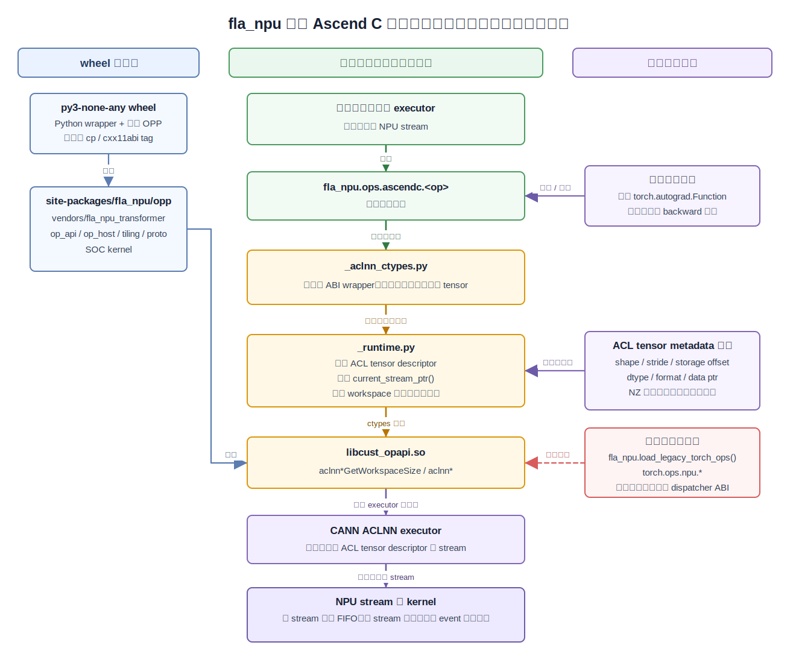
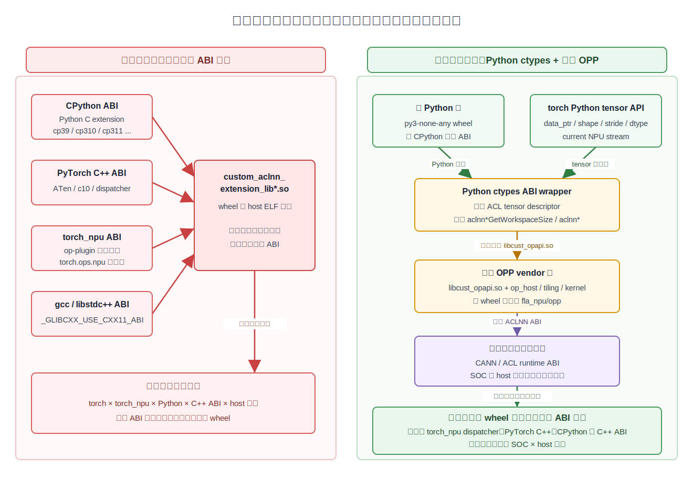
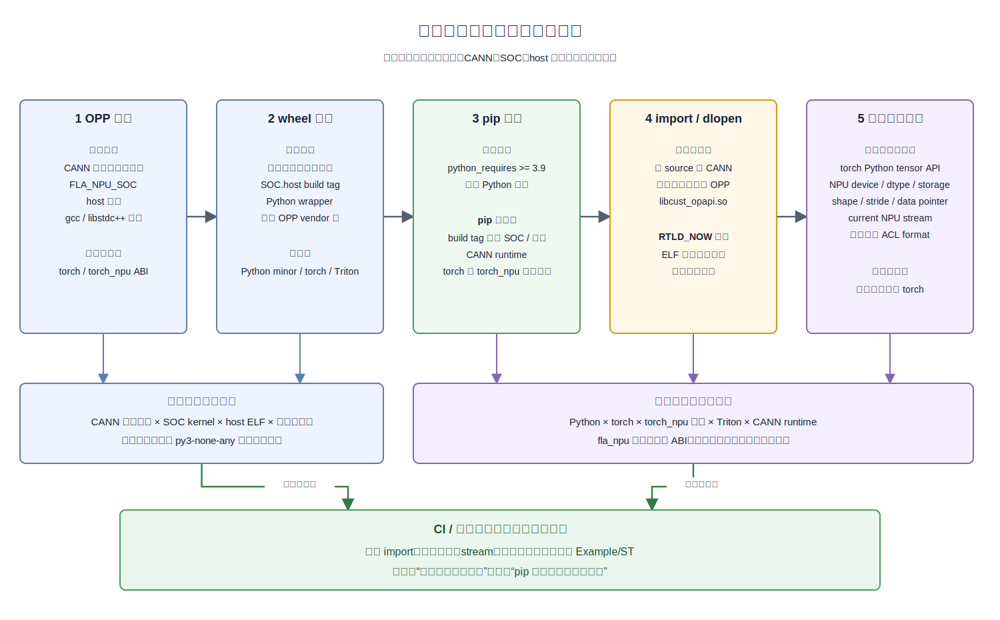
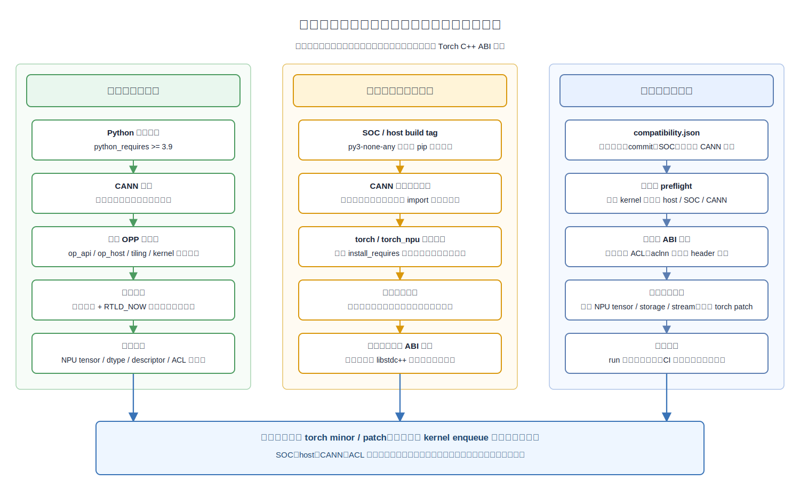

# fla_npu 解耦运行时设计

本文说明 `flash-linear-attention-npu` 如何在默认交付路径上摆脱
`torch_npu` dispatcher、PyTorch C++ extension ABI、CPython ABI 和 C++ ABI 绑定。
这份设计可以作为其他自定义 Ascend C 算子仓库的一键 wheel 化参考。

图源文件见 [`../assets/fla-npu-decoupled-runtime.drawio`](../assets/fla-npu-decoupled-runtime.drawio)，
Markdown 中直接渲染的 SVG 见 [`../assets/fla-npu-decoupled-runtime.svg`](../assets/fla-npu-decoupled-runtime.svg)。
版本依赖对比图源见 [`../assets/fla-npu-version-dependency.drawio`](../assets/fla-npu-version-dependency.drawio)，
SVG 见 [`../assets/fla-npu-version-dependency.svg`](../assets/fla-npu-version-dependency.svg)。
依赖确定阶段图源见 [`../assets/fla-npu-dependency-lifecycle.drawio`](../assets/fla-npu-dependency-lifecycle.drawio)，
SVG 见 [`../assets/fla-npu-dependency-lifecycle.svg`](../assets/fla-npu-dependency-lifecycle.svg)。
兼容性门禁图源见 [`../assets/fla-npu-compatibility-guardrails.drawio`](../assets/fla-npu-compatibility-guardrails.drawio)，
SVG 见 [`../assets/fla-npu-compatibility-guardrails.svg`](../assets/fla-npu-compatibility-guardrails.svg)。



## 设计目标

- 默认 Python 入口是 `from fla_npu.ops.ascendc import 算子名`。
- 默认 Ascend C 调用链通过 Python `ctypes` 直调 `aclnn*` 符号，不经过 `torch.ops.npu` dispatcher。
- 默认 wheel 使用 `py3-none-any` 作为 Python compatibility tag，不编译 PyTorch C++ extension，因此不绑定 `cp39/cp310/cp311/cp312`、torch 的 `cxx11abi` 或某个 torch minor 版本；内嵌 OPP 仍按 SOC 和 host 架构分别构建。
- wheel 内嵌 OPP vendor 树，安装后只要加载 CANN 环境并进入 Python 环境即可调用默认 `fla_npu.ops.ascendc`。
- Triton 算子入口保持 `from fla_npu.ops.triton import 算子名`，打包时映射根目录 `fla/ops/triton/triton_core`，源码只保留一份。
- legacy `torch.ops.npu.*` 只作为显式兼容路径保留，不在普通 import 或默认调用时启用。

## 版本依赖基础课

很多自定义算子仓库出现“只能在某个 torch、torch_npu、Python 或 gcc 组合里安装”的问题，并不是 wheel 把整个宿主框架复制了进去，而是 wheel 中包含了针对构建环境 ABI 编译的桥接扩展。扩展机器码会固化编译时使用的类型布局、C++ 符号、dispatcher schema、动态库依赖和编译器 ABI 约定；加载时，目标环境必须提供与这些约定兼容的实现。



常见版本依赖来源如下：

| 依赖来源 | 典型触发条件 | 结果 |
| --- | --- | --- |
| CPython ABI | 使用 `CppExtension` / `BuildExtension` 生成 Python extension，文件名或 wheel tag 带 `cp39`、`cp310`、`cp311`、`cp312` | 构建产物和安装标签通常绑定 Python minor 版本；即使运行时通过 `torch.ops.load_library()` 加载，也不能默认视为跨 Python ABI 通用 |
| PyTorch C++ ABI | 使用 `torch.utils.cpp_extension.CppExtension`，include/link `libtorch`、ATen、c10 | 绑定构建时 torch minor/patch 的 C++ ABI 和 dispatcher 细节 |
| torch_npu ABI | include/link `libtorch_npu.so`，注册 `torch.ops.npu.*`，依赖 torch_npu op-plugin 生成代码 | 绑定构建时 torch_npu 版本、修复补丁和算子注册机制 |
| C++ 标准库 ABI | C++ extension 编译时受 `_GLIBCXX_USE_CXX11_ABI`、gcc/libstdc++ 影响 | wheel 名或运行时需要区分 `cxx11abi`，跨编译器组合容易加载失败 |
| 平台二进制 ABI | wheel 内有面向 host 的 ELF，例如 x86_64 或 aarch64 的 Python extension、op_api 动态库 | 即使文件名使用 `py3-none-any`，实际二进制仍必须按 host 架构构建和管理，不能跨架构混用 |
| CANN/ACL/OPP ABI | 算子二进制、`libcust_opapi.so`、op_host/tiling/kernel 依赖 CANN runtime 和 SOC | 这是 Ascend C 算子的真实运行依赖，不能也不应该伪装成无依赖 |

本仓的解耦设计解决的是前五类里由默认 Python 交付路径引入的绑定。也就是说，默认 `fla_npu.ops.ascendc` 不把 CPython extension、PyTorch C++ extension、torch_npu dispatcher 或 C++ ABI 放进调用链。剩下的 CANN/ACL/OPP/SOC 依赖是硬件运行时依赖，仍然需要通过 CANN 环境、SOC 对应 wheel 和 OPP ABI 兼容性管理。

### `custom_aclnn_extension_lib*.so` 的作用

`custom_aclnn_extension_lib*.so` 是旧路径的 **PyTorch dispatcher 桥接库**，不是 Ascend C kernel，也不是提供自定义 `aclnn*` 符号的 `libcust_opapi.so`。仓库通过 `torch.utils.cpp_extension.CppExtension` 将 `torch_npu/csrc/aten` 和 `op_plugin` 中的生成代码、注册代码和参数适配代码编译成这个 host ELF。

它在旧调用链中承担四项职责：

1. 把 op-plugin / ATen 生成的 schema、dispatcher 注册和参数适配代码编译成可加载模块。
2. 被 `torch.ops.load_library()` 加载后，向 PyTorch dispatcher 注册 `torch.ops.npu.<op>`。
3. 接收 dispatcher 传入的 torch tensor、标量和可选属性，按生成代码完成参数适配。
4. 从 PyTorch 调用层进入自定义 `aclnn` host 发射链路；真正的 `aclnn*GetWorkspaceSize` / `aclnn*` 实现仍由 OPP 中的 `libcust_opapi.so` 提供，kernel 则位于 OPP 的 SOC 二进制目录。

因此，这个 `.so` 是多层 ABI 的**汇合点**，但不是把所有依赖静态装在一起的“依赖集合包”：

- op-plugin / ATen 生成的桥接和注册机器码会进入该 `.so`。
- 编译时使用的 C++ 类型布局、符号修饰、dispatcher schema 和 `_GLIBCXX_USE_CXX11_ABI` 等假设会固化在 ELF 中。
- `libtorch.so`、`libc10.so`、`libtorch_npu.so` 通常由目标环境动态提供；ELF 主要通过 `DT_NEEDED`、未解析外部符号和 RPATH 等信息声明如何寻找它们。
- `CppExtension` 产物命名和 wheel 标签通常还会携带 CPython minor 与 host 架构信息。

加载时只要其中一层不兼容，就可能出现 wheel tag 不匹配、`undefined symbol`、`GLIBCXX_* not found`、dispatcher schema 注册失败或旧 `torch.ops.npu.*` 不可用。图中从四类 ABI 指向该 `.so` 的箭头表示“编译、链接和注册约定在这里汇合”，并不表示四套动态库都被复制进该文件。

两个容易混淆的动态库边界如下：

| 动态库 | 所属层 | 主要职责 | 默认 ctypes 路径是否需要 |
| --- | --- | --- | --- |
| `custom_aclnn_extension_lib*.so` | PyTorch / torch_npu 兼容层 | 注册 `torch.ops.npu.*`、承接 dispatcher 调用、把 torch 参数转入自定义 `aclnn` 调用链 | 否，仅 `FLA_NPU_BUILD_LEGACY_EXTENSION=1` 构建且显式 `load_legacy_torch_ops()` 时使用 |
| `libcust_opapi.so` | CANN 自定义 OPP op_api 层 | 提供 `aclnn*GetWorkspaceSize` / `aclnn*`，创建 executor 并发射自定义算子 | 是，默认 `fla_npu.ops.ascendc` 由 Python `ctypes` 直接加载 |

## 本设计如何消除版本绑定

旧方案通常是：

1. 用 `torchnpugen` 和 `torch_npu` op-plugin 生成 C++ 注册代码。
2. 用 `CppExtension` 把生成代码编译成 dispatcher 桥接库 `custom_aclnn_extension_lib*.so`。
3. 桥接库链接 `libtorch`、`libc10`、`libtorch_npu`，并记录对当前框架 ABI 的符号和类型假设。
4. 显式调用 `fla_npu.load_legacy_torch_ops()`，内部通过 `torch.ops.load_library()` 加载桥接库并注册 `torch.ops.npu.<op>`。
5. 用户调用 `torch.ops.npu.<op>`，由桥接库完成 dispatcher 参数适配，再进入 `libcust_opapi.so` 提供的自定义 `aclnn*`。

这条链路的 wheel 必然知道构建时的 Python ABI、torch ABI、torch_npu ABI、gcc/libstdc++ ABI 和 host 架构，因此经常出现“同一个源码要为多个 torch/Python 组合分别编 wheel”的问题。

当前默认方案改成：

1. wheel 内只安装 Python package `fla_npu` 和 OPP vendor 树。
2. Python wrapper 用 `ctypes.CDLL` 加载 wheel 内嵌的 `libcust_opapi.so`。
3. `_runtime.py` 用 torch Python tensor 提供 data pointer、shape、stride、dtype、device 和 current stream。
4. `_runtime.py` 直接调用 `aclnn*GetWorkspaceSize` 和 `aclnn*`。
5. 高层 autograd 用 `torch.autograd.Function` 绑定 forward/backward，不注册 torch_npu dispatcher。

这样 wheel 不再需要 PyTorch C++ extension，所以 Python compatibility tag 可以保持 `py3-none-any`。这不表示 wheel 内的 OPP 二进制可以跨 SOC 或 host 架构；它表示同一个 SOC/host wheel 可以在 torch Python API、CANN/ACL 和系统动态库均兼容时，跨多个 torch、torch_npu、Python minor 和 gcc 组合验证。

## 还会保留哪些依赖

解耦不是“没有任何依赖”，而是把不该出现在默认 Python wheel 里的 ABI 依赖移走。仍需保留或关注的依赖包括：

- **CANN 环境**：运行前需要 source CANN `set_env.sh`，提供 ACL runtime、OPP 基础路径和设备运行环境。
- **SOC 和架构**：A2、A3、A5 的 kernel binary 不同；aarch64 和 x86_64 host 产物也需要分别构建。
- **aclnn ABI**：`_aclnn_ctypes.py` 的参数顺序、类型和输出分配必须和 `aclnn_*.h` 保持一致。
- **torch Python tensor API**：默认 wrapper 使用 torch tensor 的 `data_ptr()`、storage、shape、stride、dtype、device 和 `torch.npu.current_stream()`。
- **可选 torch_npu format 读取**：如果宿主进程已经加载 `torch_npu`，runtime 可以复用 `torch_npu.get_npu_format()` 读取真实 ACL format；这不是默认 import 依赖。
- **legacy 兼容路径**：只有显式 `fla_npu.load_legacy_torch_ops()` 时才重新引入 torch_npu、PyTorch C++ extension 和 dispatcher 依赖。

## 依赖在什么阶段确定

新架构不是“没有依赖”，而是把不同依赖放回应该负责它们的阶段：

> Python、torch、torch_npu 和 Triton 由目标 Python 环境在运行时提供；CANN 编译接口、SOC、host 架构和 OPP host 二进制仍由构建环境决定。



各阶段的职责如下：

| 阶段 | 此时确定或读取的依赖 | 已有检查 | 不在此阶段确定的内容 |
| --- | --- | --- | --- |
| OPP 构建 | CANN 头文件和编译工具链、`FLA_NPU_SOC`、host 架构、gcc/libstdc++ 基线 | 要求已 source CANN；`build.sh --soc=...` 生成对应 op_api、op_host、tiling 和 kernel | 默认路径不读取 torch、torch_npu、torchnpugen 或 PyTorch C++ ABI |
| wheel 组装 | 包版本、分支或 commit 标识、SOC/host build tag、内嵌 OPP vendor 树 | 检查 `libcust_opapi.so` 和 OPP 关键目录完整；默认清理 legacy extension | 不锁定目标环境的 torch、torch_npu、Python minor 或 Triton 版本 |
| pip 安装 | 当前 Python 是否满足 `python_requires >= 3.9`，以及普通 Python 依赖 | pip 会拒绝低于最低 Python 版本的环境 | `py3-none-any` 不会让 pip 自动检查 build tag 中的 SOC 和 host 架构，也不会检查 CANN |
| import / 动态加载 | CANN 环境是否初始化、实际采用的 OPP root、`libcust_opapi.so` 及其 ELF 依赖 | 默认优先 wheel 内嵌 OPP；使用绝对路径和 `RTLD_NOW` 加载，缺库、错误架构和缺失动态符号会立即失败 | 尚未执行具体算子，不代表每个 aclnn 签名和 kernel 都已经验证 |
| 首次 Ascend C 调用 | 当前 torch Python API、NPU tensor、dtype、storage、shape/stride、当前 NPU stream、可选真实 ACL format | 检查 NPU device 和支持的 dtype；读取 `torch.npu.current_stream()`；检查 ACL descriptor、workspace 和 launch 返回值 | 不要求 wheel 知道构建时 torch/torch_npu 版本 |
| Triton 调用 | 目标环境实际安装的 Triton Ascend 和 JIT/runtime 能力 | 环境检查脚本可检查最低版本及 A5 特殊最低版本；导入或 JIT 失败会在调用时暴露 | Triton 版本不编入 Ascend C OPP，也不应影响 `fla_npu.ops.ascendc` |
| CI / 发布验证 | 声明支持的 Python、torch、torch_npu、CANN、SOC 和 host 组合 | 在测试矩阵中验证 import、符号加载、stream、精度和端到端 example | CI 结论是兼容范围证据，不等于 pip 已自动实施这些门禁 |

默认一键 wheel 构建时，[`setup.py`](../../setup.py) 会对 Python 和 CANN 构建环境做检查，但在未启用 `FLA_NPU_BUILD_LEGACY_EXTENSION=1` 时会明确跳过 torch、torch_npu、torchnpugen 和 Triton 的构建时检查。这不是遗漏，而是避免把目标运行环境的框架版本重新冻结进 wheel。

运行环境仍然必须提供一套本身可用的 Ascend PyTorch 后端。`fla_npu` 可以避免额外绑定某个 torch/torch_npu ABI，但不能把一套原本不匹配的 torch 和 torch_npu 组合修复成可用组合。

### “版本正确”如何保证

新架构里的“版本正确”应理解为**目标环境满足当前调用链需要的接口、符号、SOC 和行为约定**，而不是要求版本字符串与构建机完全相等。保证分为以下几层：

1. **安装门禁**：pip 根据 `python_requires` 检查 Python 大版本范围。
2. **产物身份**：wheel build tag 标识 SOC 和 host 架构；稳定分支、主线 commit 和公开版本用于追溯源码。
3. **OPP 自洽性**：默认从同一内嵌 vendor 树取得 op_api、op_host、tiling、proto、config 和 kernel，避免从多个安装位置拼接版本。
4. **动态加载门禁**：`ctypes.CDLL(..., RTLD_NOW)` 在第一次加载时验证 ELF 可加载性、host 架构、依赖库和必需动态符号。
5. **调用能力检查**：wrapper 检查 NPU tensor、dtype 和 descriptor，runtime 从当前 torch 环境取得 stream，并检查 ACL API 返回值。
6. **测试矩阵证明**：跨 Python、torch、torch_npu、CANN、SOC 和 host 组合运行单算子、Example/ST 和精度测试，给出发布版本实际支持范围。



### 当前已经硬检查的内容

- Python 低于 `3.9` 时构建或安装会失败。
- 未 source CANN 环境时，OPP 构建和首次 Ascend C 调用会失败。
- wheel 内嵌 OPP 缺少 `libcust_opapi.so` 或关键目录时，打包验证会失败。
- `libcust_opapi.so` host 架构错误、依赖动态库缺失或必需符号无法解析时，`RTLD_NOW` 加载会失败。
- 输入不是 NPU tensor、dtype 不受支持、descriptor 创建失败或 ACL launch 返回错误时，调用会失败。
- 默认 OPP 搜索顺序使用 wheel 内嵌 vendor；只有显式设置 `FLA_NPU_OPP_PATH` 时，外部 OPP 才会覆盖默认选择。

### 当前不能称为硬保证的内容

以下内容目前主要依赖用户选择、环境检查脚本和发布测试矩阵，不能写成 pip 已自动保证：

1. SOC 和 host 架构位于 wheel build tag 中，但最终兼容 tag 是 `py3-none-any`；pip 不会根据 build tag 自动拒绝装错 SOC 或架构的文件。
2. 构建过程能读取并打印 CANN 版本，但当前没有在 import 时强制执行经过发布验证的 CANN 运行版本范围。
3. `requirements.txt` 不锁定 torch、torch_npu 和 Triton；这有利于跨版本复用，但 pip 不会检查 torch 与 torch_npu 是否属于彼此配套的发布组合。
4. `scripts/check_npu_env.py` 能检查最低版本、GDN 修复版本、NPU 可用性和 A5 Triton 最低版本，但它目前不是 `pip install` 后自动运行的门禁。
5. 动态加载可以发现缺失符号，却无法仅凭符号名识别“函数名不变但 aclnn 参数 ABI 已不兼容”的变化；这仍需要 header diff、ABI 测试和真实调用覆盖。
6. 移除 PyTorch C++ extension 消除了 torch 的 C++ ABI 绑定，但 `libcust_opapi.so` 等 host ELF 仍有 CANN 工具链和系统 libstdc++ 基线，需要发布环境验证。

### 推荐的完整兼容性闭环

如果要让错误环境在第一次 kernel enqueue 之前被明确拒绝，推荐在 wheel 内增加机器可读的 `compatibility.json`，并由 runtime 执行一次性 preflight：

```json
{
  "schema_version": 1,
  "package_version": "<public version>",
  "source_commit": "<commit>",
  "soc": "<ascend910b | ascend910_93 | ascend950>",
  "host_arch": "<aarch64 | x86_64>",
  "cann_build_version": "<build version>",
  "cann_runtime_range": "<release-verified range>",
  "required_acl_symbols": ["aclCreateTensor", "<aclnn symbols>"]
}
```

preflight 应完成以下工作：

- 比较 `platform.machine()` 与 `host_arch`。
- 从 ACL 或 NPU device 属性读取实际 SOC，并与 wheel 的 `soc` 对比。
- 读取实际 CANN runtime 版本并检查发布验证范围；A5 额外要求满足对应最低 CANN 版本。
- 在发起算子前解析公共 ACL 和当前 wrapper 所需的 aclnn 符号。
- 对 torch 使用能力探测而不是精确锁版本，例如检查 NPU tensor、storage API、`torch.npu.current_stream()` 和 stream pointer。
- 对 torch_npu 检查其与 torch 的发布族或功能探针，明确区分“fla_npu wheel 可复用”与“宿主 Ascend PyTorch 组合本身可用”。
- 外部 run 包覆盖内嵌 OPP 后同步更新兼容性清单，防止 metadata 与实际 op_api/kernel 版本脱节。
- CI 根据同一份清单生成或校验版本矩阵，发布时只声明真实跑通的组合。

这个闭环不需要把 torch/torch_npu 写成严格 `install_requires` pin。它保留跨版本复用能力，同时把 SOC、CANN、host ELF 和必要运行能力变成可解释、可提前失败的检查。

## 解耦带来的好处

- **包数量更少**：默认只需要按 SOC 和 host 架构构建 wheel，不需要再按 torch/Python/C++ ABI 组合爆炸式构建。
- **安装更简单**：新 conda 环境里只要 CANN 和 Python 依赖齐全，默认一键 wheel 不需要安装 torch_npu 生成工具链才能构建。
- **升级 torch 更容易**：torch minor 升级只要 Python tensor/current stream API 兼容，就不需要重编 PyTorch C++ extension。
- **问题边界更清晰**：调用失败通常落在 Python wrapper ABI、OPP 产物、CANN/ACL runtime 或 kernel 本身，不再混入 dispatcher 注册和 C++ ABI 加载问题。
- **迁移风险可控**：旧 `torch.ops.npu.*` 被隔离为 opt-in 兼容路径，新代码默认走 `fla_npu.ops.ascendc`。
- **其他仓可复用**：公共 runtime 负责 descriptor、workspace、stream、保活和 format 透传，具体算子只补自己的 `aclnn` 签名和输出形状。

## 如何判断改动是否重新引入版本依赖

开发或 review 时遇到下面任一情况，都要认为可能重新引入版本依赖：

- 默认 import 或默认算子调用路径里新增 `import torch_npu`。
- 默认 wheel 构建路径里新增 `CppExtension`、`BuildExtension`、`torch.ops.load_library()` 或 host `.so` Python extension。
- 默认路径链接 `libtorch.so`、`libc10.so`、`libtorch_npu.so`。
- 默认构建必须依赖 `torchnpugen`、torch_npu op-plugin 生成代码或 derivatives 生成。
- wheel 文件名重新出现 `cp311`、`linux_aarch64`、`cxx11abi` 等非 pure-python tag。
- 为了读取 format、stream 或 device 信息，在公共 runtime 里把 torch_npu 从“可选复用”改成“必须 import”。
- 新增 autograd 支持时依赖 dispatcher derivatives，而不是在 Python 入口层用 `torch.autograd.Function` 直调 backward op。

如果确实要支持旧调用路径，必须放到 `fla_npu.load_legacy_torch_ops()` 这样的显式 opt-in 路径，并在文档、测试和 PR 描述中说明它不是默认交付路径。

## 非目标

- 不尝试让 wheel 脱离 CANN/ACL runtime。运行时仍需要用户先 source CANN `set_env.sh`。
- 不把所有 SOC 合成一个 wheel。OPP binary 仍按 SOC 和架构分别构建，例如 `910b`、`910_93`、`950`。
- 不在默认路径里提供 `torch_npu.ops` 或 `torch.ops.npu` 注册。旧路径必须显式调用 `fla_npu.load_legacy_torch_ops()`。
- 不在每个算子 API 上暴露 stream 参数。stream 通过当前 NPU stream 约定传递，详见“外部 executor stream 感知”。

## 分层架构

| 层级 | 代表文件或目录 | 职责 | 默认是否依赖 torch_npu |
| --- | --- | --- | --- |
| Python 公共入口 | `torch_custom/fla_npu/fla_npu/ops/ascendc/__init__.py` | 导出稳定函数名、选择 raw ctypes wrapper 或 autograd wrapper | 否 |
| 具体算子 wrapper | `_aclnn_ctypes.py` | 按 `aclnn_*.h` 签名组织参数、分配输出、处理少量 ABI 特例 | 否 |
| 公共 runtime | `_runtime.py` | 创建 ACL tensor/int-array descriptor、分配 workspace、获取当前 stream、发起 `aclnn` 两段式调用 | 否 |
| OPP 动态库加载 | `torch_custom/fla_npu/fla_npu/__init__.py` | 定位 wheel 内嵌或外部 OPP，加载 `libcust_opapi.so` | 否 |
| OPP vendor 树 | `site-packages/fla_npu/opp/vendors/fla_npu_transformer` | 保存 `op_api`、op_host、tiling、proto、kernel object 和 config | 否 |
| legacy 兼容路径 | `fla_npu.load_legacy_torch_ops()` | 显式加载 `custom_aclnn_extension_lib*.so` 并注册 `torch.ops.npu` | 是 |

默认路径只要求 Python 层能够拿到 torch NPU tensor 的 device pointer、shape、stride、dtype 和 current stream。它不链接 PyTorch C++ 库，也不使用 torch_npu dispatcher。

## wheel 产物

一键编包最终安装到当前 Python 环境的 `site-packages`，核心内容如下：

```text
site-packages/
  fla_npu/
    __init__.py
    ops/
      ascendc/
        __init__.py
        _runtime.py
        _aclnn_ctypes.py
      triton/
        __init__.py
        triton_core/
    opp/
      vendors/
        config.ini
        fla_npu_transformer/
          bin/set_env.bash
          op_api/lib/libcust_opapi.so
          op_api/lib/libopapi.so
          op_impl/ai_core/tbe/op_host/...
          op_impl/ai_core/tbe/op_tiling/...
          op_impl/ai_core/tbe/kernel/...
          op_proto/...
```

`libcust_opapi.so` 是本仓自定义 op_api 动态库。打包时会同时生成 `libopapi.so` 副本或别名，便于兼容部分 CANN 动态加载习惯。

`fla_npu.__init__` 会按以下顺序寻找可用 OPP：

1. `FLA_NPU_OPP_PATH` 指向的外部 OPP root 或 vendor 目录。
2. wheel 内嵌的 `fla_npu/opp`。
3. 已有 `ASCEND_CUSTOM_OPP_PATH` 或 `ASCEND_OPP_PATH` 中的唯一匹配 vendor。

找到 vendor 后，runtime 会把 vendor 和 OPP root 前置到 `ASCEND_CUSTOM_OPP_PATH`，把 `op_api/lib` 前置到 `LD_LIBRARY_PATH`，并设置 `FLA_NPU_OP_API_LIB` 指向实际加载的 `libcust_opapi.so`。

## 默认调用链

一次默认 Ascend C 调用按以下步骤执行：

1. 用户调用 `fla_npu.ops.ascendc.<op>(...)`。
2. `__init__.py` 通过 `_get_direct_op()` 取得 `_aclnn_ctypes.py` 中的 ctypes wrapper。
3. wrapper 根据 Python 参数分配输出 tensor，并用 `ctx.tensor()`、`ctx.int_array()`、`ctx.int_tensor()` 构造 `aclnn` 参数。
4. `_runtime.py` 调用 `aclCreateTensor` 或 `aclCreateIntArray` 创建 descriptor。
5. runtime 调用 `<aclnnOp>GetWorkspaceSize(...)` 获得 workspace 大小和 executor。
6. 若需要 workspace，runtime 在输出所在 device 上用 `torch.empty(..., dtype=torch.uint8)` 分配 workspace。
7. runtime 调用 `<aclnnOp>(workspace, workspace_size, executor, current_stream)` 将 kernel enqueue 到当前 NPU stream。
8. descriptor 在 launch 返回后销毁，输出、workspace 和临时 helper tensor 被 `_RECENT_LAUNCH_STORAGE` 短期保活。

这条链路里没有 `torch.ops.load_library()`，也没有 `torch.ops.npu.<op>` 查找。

## 外部执行器 stream 感知

本仓默认不把 stream 设计成每个算子的显式参数，而是遵循“当前 NPU stream”约定：

```python
def current_stream_ptr() -> int:
    import torch

    stream = torch.npu.current_stream()
    return int(getattr(stream, "npu_stream"))
```

外部执行器如果希望 FLA 算子运行在自己的 stream 上，需要在调用 `fla_npu.ops.ascendc.<op>` 前把该 stream 设为当前 NPU stream。这样 runtime 在 launch 阶段拿到的 `current_stream_ptr()` 就是外部执行器的 stream。

推荐做法：

- 外部框架在进入 FLA API 前负责设置 device 和 current stream。
- FLA wrapper 不创建新 stream，也不在内部做全局 synchronize。
- 跨 stream 调用时，外部执行器负责通过 event 建立 wait/record 关系。
- 如果某个宿主框架无法把自己的 ACL stream 暴露为 `torch.npu.current_stream()`，应在 `_runtime.py` 增加统一的 stream provider 或上下文管理器，而不是给每个算子单独加 `stream=` 参数。

这能保持公共 API 稳定，同时让同一套 Python wrapper 被 torch、图执行器或更高层 runtime 复用。

## 数据依赖和异步保活

`aclnn` launch 是异步的。默认数据依赖靠三层机制保证：

1. **同 stream FIFO 顺序**：同一 current stream 上的前后 kernel 按 enqueue 顺序执行。
2. **跨 stream event**：跨 stream 生产消费关系必须由调用方或外部 executor 显式 record/wait event。
3. **Python 对象保活**：runtime 把输出 tensor、workspace 和临时 helper tensor 放入 `_RECENT_LAUNCH_STORAGE` 小 ring，避免异步 kernel 消费前对象被 Python GC 回收。

注意事项：

- descriptor 只用于构建 executor 和发起 launch，launch 返回后由 runtime 销毁。
- 用户传入的普通输入 tensor 由调用方持有，且 torch stream 语义会管理 tensor 与当前 stream 的常规生命周期。
- `ctx.int_tensor()` 创建的可选 index tensor 是临时对象，必须保活到异步 launch 消费完成，因此会进入 `_RECENT_LAUNCH_STORAGE`。
- runtime 不主动同步。需要错误定位时可以临时设置 `ASCEND_LAUNCH_BLOCKING=1`，验证结束后应关闭。

## 正反向自动绑定

解耦后不再依赖 torch_npu 的 derivatives 生成和 dispatcher autograd 注册。正反向绑定放在 Python 公共入口层完成：

- `_aclnn_ctypes.py` 暴露 raw op，例如 `npu_fast_gelu_custom` 和 `npu_fast_gelu_custom_backward`。
- `ops/ascendc/__init__.py` 维护 `_ASCENDC_OPS` 和 `BACKWARD_OPS`，提供稳定导出名。
- 对具备稳定反向语义的高层函数，入口层用 `torch.autograd.Function` 包装，例如 `fast_gelu_custom()` 和 `causal_conv1d()`。
- wrapper 根据 `requires_grad`、run mode、optional 参数等条件判断是否能绑定自定义 backward。不能安全绑定时回到 raw forward op。
- backward 阶段直接调用匹配的 ctypes backward op，例如 `_get_direct_op("npu_fast_gelu_custom_backward")`。

新增一组正反向算子时，建议按以下顺序做：

1. 在 `_aclnn_ctypes.py` 按 `aclnn_*.h` 签名补 forward 和 backward raw wrapper。
2. 在 `ops/ascendc/__init__.py` 的 `_ASCENDC_OPS` 中加入 raw op 名。
3. 在 `BACKWARD_OPS` 中写清 forward 到 backward 的对应关系。
4. 如果用户期望 `torch.autograd` 自动反传，新增一个高层 Python 函数并用 `torch.autograd.Function` 保存 backward 所需上下文。
5. 对 decode、inplace cache、可选状态输出等不满足 autograd 语义的模式，要显式留在 raw op 路径并在文档和测试里说明。

这套做法的关键是：autograd 依赖 torch 的 Python tensor 和 `torch.autograd.Function`，但不依赖 torch_npu dispatcher 或 PyTorch C++ extension。

## ACL 私有格式和 NZ 透传

ACL tensor descriptor 需要同时描述逻辑视图和底层存储。本仓 runtime 创建 descriptor 时传入：

- 逻辑 shape。
- stride。
- storage offset。
- dtype。
- ACL format。
- storage shape。
- storage data pointer。

因此 Python wrapper 的原则是“透传描述，不解释私有 layout”：

- 默认不要对输入做 `.contiguous()`、转置、reshape 或 CPU round-trip，除非对应 `aclnn` ABI 明确要求。
- 对 ACL 内部私有格式，比如 NZ，应该把真实 format 作为 descriptor metadata 传给 `aclCreateTensor`，由 op_host、tiling 和 kernel 解释。
- `_runtime.acl_format()` 不主动 import `torch_npu`。如果宿主进程已经加载了 `torch_npu`，它会复用 `torch_npu.get_npu_format(tensor)` 读取真实 NPU format；否则按 tensor 维度回退到 ND/NCL/NCHW/NCDHW 等保守 format。
- 这个可选读取不是默认依赖。普通调用路径不会因为未安装 `torch_npu` 而 import 失败。

新增或修改支持私有 format 的算子时，需要特别注意：

- op_host 的 dtype/format 校验要明确声明支持哪些 layout 和 private format。
- Python wrapper 不能为了适配测试强行转成 ND，除非需求规格就是只支持 ND。
- 如果某个上游框架无法从 torch tensor 暴露真实 ACL format，应在 runtime 层补统一 format metadata 入口，而不是在单个算子里临时 import `torch_npu`。
- 一旦 wrapper 对某个输入做了 `.contiguous()`，就可能破坏 NZ 等私有 format 透传。此类例外必须有 ABI 原因和测试覆盖。

## 旧 torch_npu 兼容路径

旧调用路径仍保留，但必须显式启用：

```python
import fla_npu

fla_npu.load_legacy_torch_ops()
```

该路径会：

- import `torch` 和 `torch_npu`。
- 加载 `custom_aclnn_extension_lib*.so`。
- 调用 `torch.ops.load_library()` 注册旧 dispatcher op。
- 给 `torch.ops.npu.*` 和 `torch_npu.ops.*` 安装兼容 wrapper 和弃用提示。

只有旧 API 迁移、兼容性测试或用户明确要求旧路径时才使用它。新 example、ST、CI 和文档默认使用 `fla_npu.ops.ascendc.<op>`。

## 常见问题

### 是否完全不依赖 torch？

不是。默认路径仍使用 torch Python tensor 作为 NPU 内存、dtype、shape、stride 和 current stream 的承载对象，也使用 `torch.autograd.Function` 实现高层 autograd wrapper。解耦的是 torch_npu dispatcher、PyTorch C++ extension ABI、CPython 扩展 ABI 和 C++ ABI。

### 是否完全不依赖 torch_npu？

默认 `fla_npu.ops.ascendc` 自身不 import `torch_npu`，不要求 torch_npu 参与算子注册，也不链接 `libtorch_npu.so`。目标环境仍需由可用的 Ascend PyTorch 后端提供 NPU tensor 和 `torch.npu` stream；该后端可以由宿主程序预先初始化。只有显式调用 `fla_npu.load_legacy_torch_ops()` 时，fla_npu 才会主动 import torch_npu 并进入旧 dispatcher 路径。

### 一个 wheel 如何兼容多个 torch、python 和 cxx 版本？

默认 wheel 的 Python 调用层是纯 Python，tag 是 `py3-none-any`，没有 `cp311`、PyTorch extension 平台 tag 或 torch `cxx11abi` 绑定。wheel 仍内嵌面向特定 SOC 和 host 架构的 OPP 二进制，并通过 build tag 区分；这些二进制由 CANN/ACL runtime 加载，Python 层通过 `ctypes` 查找 `libcust_opapi.so` 中的 `aclnn*` 符号。

仍需满足：

- Python 版本满足项目 `python_requires`。
- torch 能提供 NPU tensor、`torch.npu.current_stream()` 和常规 tensor API。
- CANN/ACL runtime 与 wheel 中 OPP 产物 ABI 兼容。
- SOC 对应，例如 910B、910_93、950 不能混用错误 kernel binary。

### 为什么不把 stream 作为每个算子的参数？

每个算子都加 `stream=` 会污染 API，并让高层 example、autograd wrapper 和未来其他 executor 绑定复杂化。当前 stream 约定集中在 `_runtime.current_stream_ptr()`，需要适配外部 executor 时只改 runtime 层。

### 如何确认数据依赖没有被破坏？

先确认 producer 和 consumer 是否在同一 current stream。若不在同一 stream，必须检查外部 executor 是否插入 event。然后检查 Python wrapper 是否保活了 workspace 和临时 tensor，是否存在提前释放、就地覆盖或额外 `.contiguous()` 破坏 format 的行为。

### 单独编 run 包覆盖 wheel 内嵌 OPP 时会发生什么？

run 包 `--install` 或 `--full` 会把当前 run 包里的 `packages/vendors/fla_npu_transformer` 合并覆盖到当前 Python 环境 wheel 的 `site-packages/fla_npu/opp/vendors/fla_npu_transformer`。覆盖后 `libcust_opapi.so`、op_host、tiling、proto、kernel config 和 kernel object 都以新 run 包为准。部分算子 run 包会替换共享 opapi/tiling/proto 库，未包含的算子可能不再可用，因此安装前应列出包含算子、未包含算子和 aclnn ABI header 变化。

### 其他仓如何复用这套设计？

最小复用集合如下：

- wheel 内只保留一个 import 包，例如 `fla_npu`。
- 默认路径只用 Python ctypes 直调 `aclnn*`。
- `torch.ops.*` 兼容路径放到显式 opt-in 函数。
- OPP vendor 树内嵌到 import 包下，并由 runtime 自动前置环境变量。
- stream、descriptor、workspace、异步保活、format 透传都放在一个公共 runtime 文件里。
- 具体算子文件只描述 `aclnn_*.h` 签名、输出分配和必要 ABI 特例。
- autograd 绑定在 Python 公共入口层维护，不依赖 torch_npu derivatives 生成。

## 修改红线

- 默认 import `fla_npu` 和 `from fla_npu.ops.ascendc import op` 不得 import `torch_npu`。
- 默认 wheel 不得因为新增算子退回 `CppExtension` 或 `torch.ops.load_library()`。
- 不得把 `torch.ops.npu` 当作新代码推荐路径。
- 不得在源码里复制第二份 Triton `triton_core`。打包时映射根目录源码即可。
- 不得在 wrapper 中无说明地 `.contiguous()` 输入，尤其是可能承载 NZ 等 ACL 私有格式的 tensor。
- 修改 `_runtime.py` 的 stream、format、workspace 或保活逻辑时，必须同步更新本文和对应测试。
