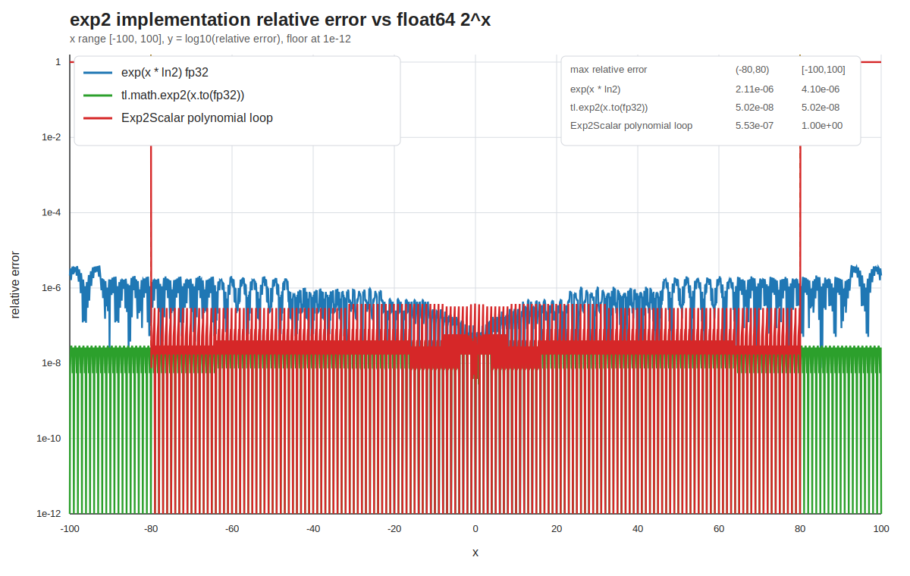

# Chunk KDA 算子与三方实现精度对比报告

## 1. 测试对象

本次验证覆盖：

- `torch.ops.npu.npu_chunk_kda_fwd`
- `torch.ops.npu.npu_chunk_kda_bwd`
- L0 `ChunkKdaFwd`
- L0 `ChunkKdaBwd`

对标对象为 fla-org KDA chunk 公式语义，以及仓内按该公式实现的 PyTorch reference：

- `tests/reference/chunk_kda_reference.py`
- `torch_custom/fla_npu/test/test_npu_chunk_kda.py` 中的 autograd golden

## 2. 覆盖范围

| Case | 覆盖点 | 结果 |
|---|---|---|
| AscendC custom 包构建 | `chunk_kda_fwd`、`chunk_kda_bwd` L0/L2 构建 | 通过 |
| forward float32 | `chunk_size=64`、`initial_state`、`final_state`、全部中间量 | 通过 |
| forward varlen/GVA/V256 | `chunk_size=128`、`HV > H`、`cu_seqlens`、`V=256` | 通过 |
| forward bf16 | `chunk_size=32`、BF16 q/k/v/state、float32 gk/beta | 通过 |
| forward fp16 | `chunk_size=64`、FP16 q/k/v/state、float32 gk/beta、全部中间量 | 通过 |
| forward CATLASS score | BF16 `K=32` 连续两次运行，覆盖 `q_pos @ k_neg^T` 与 `k_pos @ k_neg^T` | 通过 |
| AIV-only fallback 稳定性 | bf16 小 K 连续调用与 fp32 fallback | 通过 |
| backward float32 | `dq/dk/dv/dbeta/dgk/dh0` vs autograd golden | 通过 |
| backward fp16 | `chunk_size=64`、FP16 q/k/v/state、float32 gk/beta | 通过 |
| backward GVA/V256 | `chunk_size=128`、`HV > H`、`V=256` | 通过 |

## 3. 精度阈值

| 数据类型 | 阈值 |
|---|---|
| float32 | `rtol=3e-3, atol=3e-3` |
| fp16 | `rtol=2e-2, atol=2e-2` |
| bf16 | `rtol=2e-2, atol=2e-2` |

## 4. exp2 精度曲线

下图使用 float64 `2^x` 作为 reference，对比 `exp(x * ln2)` fp32 路径、三方 Triton `tl.math.exp2(x.to(tl.float32))` 语义，以及旧 `Exp2Scalar` scalar 多项式循环的相对误差。



注：Triton 曲线按源码语义使用 fp32 `exp2` 模拟，用于对比公式路径；不同 GPU 后端 libdevice 的最后几 ulp 可能存在差异。

## 5. 已执行测试

```text
bash build.sh --pkg --ops=chunk_kda_fwd,chunk_kda_bwd --soc=ascend910b --vendor_name=custom -j1 -O0
python3 -m pytest torch_custom/fla_npu/test/test_npu_chunk_kda.py -q -s
执行小 K 连续调用检查
执行 BF16 K=32 CATLASS score 连续调用检查
```

结果：

- custom 包构建通过。
- KDA pytest 共 7 项通过。
- 小 K 连续调用通过。
- BF16 `K=32` CATLASS score 路径连续调用通过。

## 6. 测试结论

KDA AscendC L0/L2 正反向算子已完成构建、安装和精度验证。测试覆盖 key-wise `gk` gate、GVA、varlen、`initial_state/output_final_state`、反向 `dht/dh0` 递推、`chunk_size=32/64/128`、`V=256`、float32/float16/bfloat16 forward，以及 float32/float16 backward。

所有已执行精度用例均通过，NPU 输出与 PyTorch reference/autograd golden 在设定阈值内一致。
