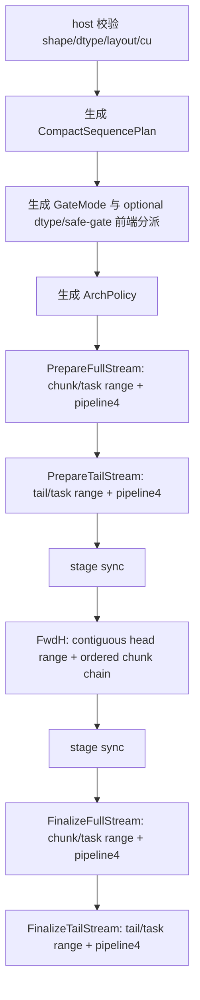
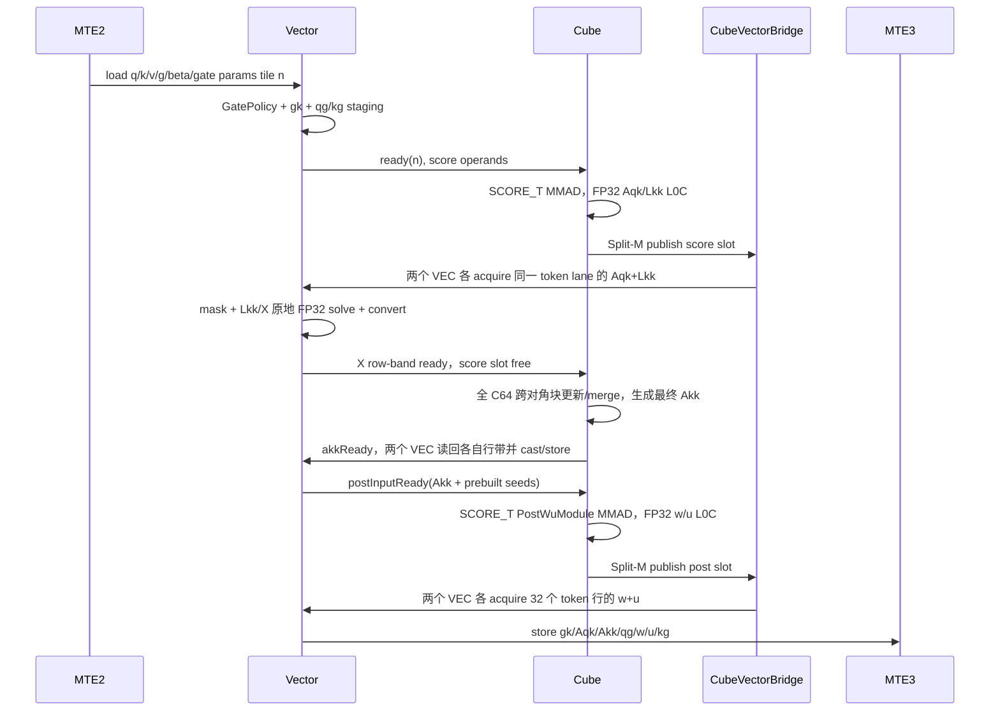

# ChunkKdaFwd 详细设计

## 1. 文档目的

本文以仓库当前 `ChunkKdaFwd` 实现为基线，同时给出下一版重构的可执行目标设计。本文既供测试人员建立功能、精度、性能、异常、稳定性和确定性测试，也供实现 Agent 逐文件修改代码。本文覆盖：

- KDA 前向数学定义和张量符号；
- `fla_npu` Python 接口、aclnn L2 接口和私有 L0 接口；
- 算子原型中每个输入、输出和属性的语义；
- L2 归一化、host tiling、A2/A3 通用 kernel 和 A5 arch35 kernel；
- 当前 Gate、Prepare、Post-WU、FwdH、Finalize 五阶段基线，以及目标 `Prepare(Gate + Prepare + Post-WU) -> FwdH -> Finalize` 三段调度主链；
- GM workspace、UB、L1、L0A、L0B、L0C 的分配及生命周期；
- tiling key、host `CompactSequencePlan`、full/tail 静态任务流、平台能力适配和可选输出分支；
- 确定性、同步、数值精度和风险分析；
- 300 条独立编号的测试用例设计、覆盖映射和反向用例设计，其中 100 条为 GVA 专项用例。

公开契约以 `README.md`、`docs/api.md` 和 aclnn 原型为准。本文中的私有 L0、tiling 字段、workspace 偏移和片上内存布局是当前实现细节，可随内部优化调整，不构成 ABI。

本文用红色标记必须从当前实现迁移到目标实现的差异：

<font color="red"><strong>【现状 -> 目标】红字内容是实现任务，不是可选优化；实现完成前测试不得把目标行为写成已支持。</strong></font>

未带红字的数学公式和公开输入输出语义保持不变。第 8 至 14 章描述目标结构；凡引用“当前”字段或地址，仅用于说明删除或迁移来源。

### 1.1 最终目标决策摘要

| 主题 | 目标决策 |
| --- | --- |
| 外部契约 | Python/aclnn/L0 原型、`chunk_indices` canonical 内容、公开 shape/dtype/量化点不因本次调度优化改变 |
| 数值 | Cube 输入保留当前 FP16/BF16 `SCORE_T`；MMAD 累加、Score mask/solve、state 主累积保持 FP32 |
| Prepare/Finalize 分核 | 默认按 sequence+batch 展平后的 full+tail chunk stream 分核；仅当全局逻辑 chunk task 总数不足物理核数时启用 `(chunk,headOwner)` 二级分核；owner 边界按 runtime head window 序号划分，不按裸 `H_v` 均分，也不为 GVA 单独生成模板 |
| FwdH 分核 | 连续 head range 分核；同 `(sequence,head)` 的 chunk 状态链由同一 core 串行完成 |
| A5 Score | 单 head 的 32-row score block 打包成 `Aqk16,Lkk16,Aqk16,Lkk16`，一次 `SPLIT_M` 交给两个 AIV；两个 block 覆盖 C64 |
| A5 Post-WU | 保留现有一次 N=256 的 `[w|u]` MMAD，FP32 L0C 按 M 均分给两个 AIV |
| 四-head 流水 | 四个逻辑 descriptor、Score/Post-WU 各两个物理 slot；credit 状态机推进，不常驻四份完整 head/state |
| tail | 与 full 分离的静态 task stream；tail chunk 入口一次计算有效 block/lane，完整 chunk 永不因存在 tail 降级 |
| A2/A3 | 共享同一 row-range 数学和 scheduler；以 per-core GM workspace bridge 替代 A5 direct UB，不实例化 `SPLIT_M`；两类 bridge 都使用 mode 2 聚合两个 AIV 的完成信号 |
| L2 | 短距离 spill 和共享数据固定 NORMAL；只有 host 证明一次性流式读取且目标 API 支持时才尝试 DISABLE |
| 验收 | 先验证编译/UB/路由/同步，再做精度和 sanitizer，最后以 msopprof 验证 5% 与 16K `<12 ms` 目标 |

## 2. 实现范围与源码索引

| 层级 | 主要文件 | 职责 |
| --- | --- | --- |
| Python 稳定入口 | `torch_custom/fla_npu/fla_npu/ops/ascendc/_aclnn_ctypes.py` | 参数预校验、输出创建、ctypes 调用、12 返回值策略 |
| Python 输出策略 | `torch_custom/fla_npu/fla_npu/ops/ascendc/_kda_policy.py` | FLA 对齐的可选输出 mask |
| aclnn L2 | `op_host/op_api/aclnn_chunk_kda_fwd.{h,cpp}` | 完整校验、layout/shape 归一化、L0 调度和导出转换 |
| 私有 L0 | `op_host/op_api/chunk_kda_fwd.{h,cpp}` | 将张量、元数据、属性和输出地址注册到唯一物理 L0 |
| 算子定义 | `op_host/chunk_kda_fwd_def.cpp` | GE 输入、输出、属性、dtype 和 SoC 注册 |
| host tiling | `op_host/chunk_kda_fwd_tiling.{h,cpp}` | shape 解析、分支选择、workspace 规划、tiling data |
| 平台能力选择 | `op_host/arch35/chunk_kda_fwd_tiling_impl.h` | 当前 arch35 布尔分支；目标改为 A2/A3/A5 能力与流水策略 |
| 统一 kernel 入口 | `op_kernel/chunk_kda_fwd.cpp` | tiling key 和架构分派 |
| 通用编排 | `op_kernel/chunk_kda_fwd_common.h` | 当前五阶段编排；目标改为统一 sequence/chunk 编排和地址解析 |
| 平台实现 | `op_kernel/*.h`、`op_kernel/arch35/*.h` | 共享数学模块，以及 A2/A3 MemBase、A5 RegBase 的搬运/同步适配 |
| 现有用例规格 | `tests/op_cases/chunk_kda_fwd.json` | 当前仓库已实现的 canonical 用例；与本文的 runtime-window 断言保持同步 |
| 用例执行 | `tests/operators/chunk_kda_fwd/` | 精度、路由、性能、ST 和契约测试 |

支持 SoC 为 A2 `ascend910b`、A3 `ascend910_93`、A5 `ascend950`。三个 SoC 共用同一公开接口、L2 调用路径和物理 L0；A5 在 tiling key 2 下使用 arch35 特化。

## 3. 数学定义

### 3.1 符号

| 符号 | 含义 |
| --- | --- |
| `B` | 物理 batch；rank-4 varlen 时固定为 1 |
| `N` | 逻辑序列数；dense 时等于 `B`，varlen 时为 `len(cu_seqlens)-1` |
| `T` | dense 序列长度或 packed 总 token 数 |
| `H_k` | q/k head 数 |
| `H_v` | v/g/beta/state head 数 |
| `G=H_v/H_k` | GVA `group_size`，必须为正整数 |
| `K` | q/k 和 key-wise gate 维度 |
| `V` | value/state 输出维度 |
| `C` | `chunk_size`，仅为 64 或 128 |
| `N_c` | chunk 总数；varlen 为各序列 `ceil(L_n/C)` 之和 |
| `L` | 当前 chunk 的有效 token 数，`1 <= L <= C` |

对 value head `hv`，其 q/k head 为：

```text
h(hv) = floor(hv / G)
```

下文省略 batch、逻辑序列和 head 下标，所有公式在每个序列、每个 `hv` 上独立成立。

#### 3.1.1 GVA head 映射

本算子支持 GVA（Grouped Value Attention）。Q/K 使用 `H_k` 个 head，V、gate、beta、state 和全部公开输出使用 `H_v` 个 head，约束为：

```text
1 <= H_k <= H_v <= 128
H_v % H_k == 0
G = H_v / H_k
hk(hv) = floor(hv / G)
```

对每个 value head `hv`，只从 `q[...,hk(hv),:]` 和 `k[...,hk(hv),:]` 读取 Q/K；`v/g/beta/A_log/dt_bias/H_prev` 以及 `attn_out/gk/Aqk/Akk/w/u/qg/kg/v_new/h/final_state` 均按 `hv` 独立索引。也就是说，同组 value head 共享 Q/K head，但不会共享 gate、beta、V 或状态。`H_k=H_v` 时 `G=1`，退化为逐 head 一一映射。

以 `H_k=2,H_v=6,G=3` 为例：

```text
value head: 0  1  2 | 3  4  5
q/k head:   0  0  0 | 1  1  1
state:      0  1  2 | 3  4  5   # 每个 value head 独立
```

计算阶段统一使用最多四个 value head 的 runtime window，`headCnt` 只作为运行时参数传给同一实现。令 `R=H_v/H_k`，对任意满足上述 shape 约束的正整数 `R` 都使用以下同一套公式，不按 ratio 枚举实现：

```text
R <= 4:
    completeHkGroupsPerWindow = floor(4 / R)
    windowWidth = floor(4 / R) * R
    headCnt = min(windowWidth, H_v - hvBase)
R > 4:
    当前 H_k 组内部按最多 4 个 H_v 拆窗，窗口不跨 H_k 组
    currentHkGroupEnd = (floor(hvBase / R) + 1) * R
    headCnt = min(4, currentHkGroupEnd - hvBase)
```

`R<=4` 时，每个窗口只拼接 `floor(4/R)` 个完整 Q/K head 组，末窗也不切开任何一组；因此同一次 head 遍历中，每个 Q/K head 只属于一个窗口，不会因切窗重复从 GM 读取。例如 `R=3/2/1` 的完整窗宽分别为 `3/4/4`。

`R>4` 时，一个 Q/K head 组内每 4 个 value head 切一窗，且窗口绝不跨到下一个 Q/K head 组；同一 Q/K head 可以在它所属的多个窗口中重新从 GM 读取。因此 `R=7` 拆成 `[4,3]`，`R=8` 拆成 `[4,4]`，`R=19` 拆成 `[4,4,4,4,3]`；这些只是统一公式的代表例，不是支持 ratio 的枚举表。每个窗口内，Q/K 输入对每个不同的 `hk` 只加载一次；gate、beta、V、state 和所有 value-side 输出始终逐 `hv` 处理，不参与 Q/K 复用。

测试不能只使用随机输入比较最终输出。GVA 专项 golden 还要为每个 Q/K head、每个 value head 和每个组边界注入不同的可追踪值，逐项断言：

- 同组 value head 确实读取同一个 Q/K head；
- `hv=G-1` 与 `hv=G` 分别映射到相邻的两个 Q/K head；
- 改动一个 Q/K head 只影响它负责的连续 `G` 个 value head；
- 改动一个 value head 的 V/g/beta/initial state 只影响该 value head；
- runtime window 内每个不同 Q/K head 只加载一次，切换到新的 Q/K head 时不复用旧索引；
- 对所有合法整数 `R`，窗口边界与上述公式一致；代表点至少包含 `R=1/2/3/4/7/8/19`，其中 `R<=4` 不切开 Q/K head 组且不跨窗重读，`R>4` 只允许在同一 Q/K head 组的相邻窗口间重读；
- dense/varlen、full/tail、key1/key2 和所有 layout 使用完全相同的映射规则。

### 3.2 Gate 激活与 chunk-local 累计

令 `x = g + dt_bias`。`dt_bias` 不存在时按 0 处理。

```text
use_gate_in_kernel = false:
    gate[t,d] = g[t,d]

use_gate_in_kernel = true, safe_gate = false:
    gate[t,d] = -exp(A_log[hv]) * softplus(x[t,d])

use_gate_in_kernel = true, safe_gate = true:
    gate[t,d] = lower_bound * sigmoid(exp(A_log[hv]) * x[t,d])
```

`gate` 是自然对数域衰减。每个逻辑序列重新起算，每个 chunk 内再重新起算：

```text
gk[i,d] = sum(gate[j,d], j=chunk_start..i) / ln(2)
```

后续统一使用 `exp2`，因此：

```text
2 ** (gk[i,d] - gk[j,d])
= exp(sum(gate[r,d], r=j+1..i))
```

`cu_seqlens` 边界和 chunk 边界都必须重置累计，不能跨序列或跨 chunk 传播 gate。

### 3.3 chunk 内相关性矩阵

对当前 chunk 的 `Q,K,V,gk,beta`，定义逐 K 维衰减：

```text
E[i,j,d] = 2 ** (gk[i,d] - gk[j,d])
```

Query-Key 和 Key-Key 分数为：

```text
S_qk[i,j] = scale * sum_d(Q[i,d] * K[j,d] * E[i,j,d])
S_kk[i,j] = beta[i] * sum_d(K[i,d] * K[j,d] * E[i,j,d])
```

构造下三角矩阵：

```text
Aqk[i,j] = S_qk[i,j], j <= i; 否则为 0
Lkk[i,j] = S_kk[i,j], j <  i; 否则为 0
Akk       = inverse(I + Lkk)
```

`Aqk/Akk` 的公开存储最后一维固定为 `C`。tail chunk 仅 `[0,L)` 行列有效，其余区域必须写为 0，避免历史数据污染反向。

### 3.4 WY 表示

```text
K_beta_g[i,d] = K[i,d] * beta[i] * 2 ** gk[i,d]
V_beta[i,v]   = V[i,v] * beta[i]

w  = Akk @ K_beta_g
u  = Akk @ V_beta
qg = Q * 2 ** gk
kg = K * 2 ** (gk_last - gk)
```

其中 `gk_last` 是当前 chunk 最后一个有效 token 的 K 维 gate 向量。`qg_scaled = scale * qg` 是只在内部使用的 workspace 张量。

### 3.5 chunk 间状态递推

内部状态统一为 `[K,V]`，令进入当前 chunk 的状态为 `H_prev`：

```text
v_new = u - w @ H_prev
H_next = diag(2 ** gk_last) @ H_prev + transpose(kg) @ v_new
```

若 `initial_state=None`，每个逻辑序列的 `H_prev` 从全 0 开始。序列之间状态完全隔离。`h` 保存每个 chunk 计算前的 `H_prev`，`final_state` 保存每个逻辑序列最后一个 chunk 的 `H_next`。

### 3.6 最终输出

```text
O_inter = qg_scaled @ H_prev
O_local = Aqk @ v_new
attn_out = O_inter + O_local
```

主矩阵计算使用 FP32 累积；公开 `attn_out/Aqk/Akk/w/u/qg/kg/v_new/h` 按 q dtype 写回，`gk/final_state` 固定为 FP32。

## 4. 对外 Python 接口

```python
from fla_npu.ops.ascendc import chunk_kda_fwd

outputs = chunk_kda_fwd(
    q, k, v, g, beta, scale, chunk_size,
    layout="BSND",
    initial_state=None,
    output_final_state=False,
    cu_seqlens=None,
    chunk_indices=None,
    safe_gate=False,
    lower_bound=None,
    use_gate_in_kernel=False,
    A_log=None,
    dt_bias=None,
    disable_recompute=False,
    return_intermediate_states=False,
    state_v_first=False,
)
```

返回固定为 12 项：

```text
(attn_out, final_state, gk, Aqk, Akk, w, u, qg, kg, v_new, h, initial_state)
```

第 12 项是 Python 对原 `initial_state` 对象的透传，不是 aclnn 或 L0 输出。

### 4.1 Python 参数逐项说明

| 参数 | 类型/必选性 | 语义与测试关注点 |
| --- | --- | --- |
| `q` | Tensor，必选 | Query；FP16/BF16；shape 由 layout 决定 |
| `k` | Tensor，必选 | Key；shape、dtype 必须与 q 完全一致 |
| `v` | Tensor，必选 | Value；与 q 同 dtype，head 为 `H_v`，末维为 `V` |
| `g` | Tensor，必选 | FP32/BF16；已激活 gate 或 raw gate，由 `use_gate_in_kernel` 决定 |
| `beta` | Tensor，必选 | FP32/BF16；每 token、每 value head 的 delta 系数 |
| `scale` | float，必选 | Query-Key 缩放，通常为 `K**-0.5`；当前实现不额外限制范围 |
| `chunk_size` | int，必选 | 仅 64/128；决定矩阵末维、chunk 切分和 tiling key |
| `layout` | str，默认 BSND | 仅大写 `BSND/BNSD/TND/NTD`；只解释五个主输入 |
| `initial_state` | Tensor/None | FP32；每逻辑序列一份状态；末两维由 `state_v_first` 解释 |
| `output_final_state` | bool | 只控制 Python 是否创建并返回 `final_state` |
| `cu_seqlens` | int 序列/None | packed varlen 边界；首项 0、非递减、末项 T，最多 1024 个逻辑序列 |
| `chunk_indices` | int 序列/None | 可省略并由 Python 构造；若传入必须是完整 canonical sequence-major `(seq,chunk)` 对 |
| `safe_gate` | bool | 选择数值稳定模板；raw gate 时还决定激活公式 |
| `lower_bound` | float/None | None 转为 -5.0；仅 `use_gate_in_kernel && safe_gate` 时要求 `[-5,0)` |
| `use_gate_in_kernel` | bool | true 表示 g 是 raw gate，且 `A_log` 必选 |
| `A_log` | Tensor/None | raw gate 时必选 FP32/BF16 `[H_v]`；读取后转 FP32 参与激活 |
| `dt_bias` | Tensor/None | raw gate 时可选 FP32/BF16 `[H_v*K]`；允许与 `A_log` 独立选 dtype |
| `disable_recompute` | bool | 控制反向中间量是否公开，不改变前向数学结果 |
| `return_intermediate_states` | bool | 单独控制 `h` 是否公开 |
| `state_v_first` | bool | false 为 `[K,V]`，true 为 `[V,K]`；只影响 state/h 导入导出 |

### 4.2 Python 可选输出策略

| 输出 | 公开条件 |
| --- | --- |
| `attn_out` | 始终 |
| `final_state` | `output_final_state` |
| `gk` | `not use_gate_in_kernel or disable_recompute` |
| `Aqk/Akk` | 始终 |
| `w/u/qg/kg/v_new` | `disable_recompute` |
| `h` | `disable_recompute or return_intermediate_states` |
| 第 12 项 | 始终透传原 `initial_state`，可为 None |

16 种四布尔属性组合必须全部测试。隐藏输出不代表跳过内部计算；L0 必需的阶段结果会写入 workspace。

## 5. Shape、dtype 和 layout 契约

### 5.1 输入 shape

| layout | q/k | v | g | beta |
| --- | --- | --- | --- | --- |
| BSND | `[B,T,H_k,K]` | `[B,T,H_v,V]` | `[B,T,H_v,K]` | `[B,T,H_v]` |
| BNSD | `[B,H_k,T,K]` | `[B,H_v,T,V]` | `[B,H_v,T,K]` | `[B,H_v,T]` |
| TND | `[T,H_k,K]` | `[T,H_v,V]` | `[T,H_v,K]` | `[T,H_v]` |
| NTD | `[H_k,T,K]` | `[H_v,T,V]` | `[H_v,T,K]` | `[H_v,T]` |

### 5.2 输出 shape

| 输出 | rank-4 输入 | rank-3 输入 | dtype |
| --- | --- | --- | --- |
| `attn_out` | `[B,T,H_v,V]` | `[T,H_v,V]` | q dtype |
| `final_state` | `[N,H_v,K,V]` 或 `[N,H_v,V,K]` | 同左 | FP32 |
| `gk` | `[B,H_v,T,K]` | `[H_v,T,K]` | FP32 |
| `Aqk/Akk` | `[B,H_v,T,C]` | `[H_v,T,C]` | q dtype |
| `w/qg/kg` | `[B,H_v,T,K]` | `[H_v,T,K]` | q dtype |
| `u/v_new` | `[B,H_v,T,V]` | `[H_v,T,V]` | q dtype |
| `h` | `[B,N_c,H_v,K,V]` 或 `[B,N_c,H_v,V,K]` | `[N_c,H_v,K,V]` 或 `[N_c,H_v,V,K]` | q dtype |

除 `attn_out/final_state/h` 外，中间量固定为 head-major，和输入 layout 解耦。

### 5.3 支持边界

- q/k/v dtype 必须相同且为 FP16 或 BF16。
- g、beta 可独立为 FP32 或 BF16。
- `1 <= H_k <= H_v <= 128` 且 `H_v % H_k == 0`。
- `16 <= K,V <= 256` 且 K、V 均为 16 的倍数。
- `chunk_size` 仅为 64 或 128。
- rank-4 varlen 要求物理 `B=1`；rank-3 天然为 packed。
- `cu_seqlens` 允许零长逻辑序列，但整个调用必须至少产生一个 chunk。
- `chunk_indices` 不支持稀疏、重排或缺项，只接受完整 canonical 顺序。
- 非连续输入由 L2 连续化；layout 字符串必须大写。
- `A_log/dt_bias` 可独立为 FP32 或 BF16，形成 FP32/FP32、FP32/BF16、BF16/FP32、BF16/BF16 四种合法组合；`initial_state` 仍必须为 FP32。

Python、legacy op-plugin、aclnn L2 和 OpDef 均接受 `A_log/dt_bias` 的 FP32/BF16
组合；kernel 仅在内置 Gate 阶段按 tiling 中的实际 dtype 分派。q/k/v、g、beta、
state、输出 dtype 组合和 shape 约束不因此改变。

## 6. aclnn L2 接口

```cpp
aclnnStatus aclnnChunkKdaFwdGetWorkspaceSize(
    const aclTensor *q,
    const aclTensor *k,
    const aclTensor *v,
    const aclTensor *g,
    const aclTensor *beta,
    const aclTensor *aLogOptional,
    const aclTensor *dtBiasOptional,
    const aclTensor *initialStateOptional,
    const aclIntArray *cuSeqlensOptional,
    const aclIntArray *chunkIndicesOptional,
    const char *layout,
    double scale,
    int64_t chunkSize,
    bool safeGate,
    double lowerBound,
    bool useGateInKernel,
    bool stateVFirst,
    const aclTensor *attnOut,
    const aclTensor *finalStateOut,
    const aclTensor *gkOut,
    const aclTensor *aqkOut,
    const aclTensor *akkOut,
    const aclTensor *wOut,
    const aclTensor *uOut,
    const aclTensor *qgOut,
    const aclTensor *kgOut,
    const aclTensor *vNewOut,
    const aclTensor *hOut,
    uint64_t *workspaceSize,
    aclOpExecutor **executor);

aclnnStatus aclnnChunkKdaFwd(
    void *workspace,
    uint64_t workspaceSize,
    aclOpExecutor *executor,
    aclrtStream stream);
```

### 6.1 aclnn 参数逐项说明

| 参数 | 方向/必选性 | L2 语义 |
| --- | --- | --- |
| `q/k/v/g/beta` | 输入，必选 | 与第 4、5 章公开张量契约完全一致 |
| `aLogOptional` | 输入，可选 | raw gate 系数；`useGateInKernel=true` 时不能为空；FP32/BF16 `[H_v]` |
| `dtBiasOptional` | 输入，可选 | raw gate bias；空指针按 0 处理；FP32/BF16 `[H_v*K]` |
| `initialStateOptional` | 输入，可选 | FP32 初始状态；L2 按 `stateVFirst` 转为内部 `[K,V]` |
| `cuSeqlensOptional` | 输入，可选值数组 | packed 边界；L2 按值校验后由 L0 转成 INT64 tensor |
| `chunkIndicesOptional` | 输入，可选值数组 | canonical chunk 对；传入时逐 pair 校验 |
| `layout` | 输入，必选字符串 | 仅大写四 layout；决定主输入解释和 L2 转置 |
| `scale` | 输入，必选属性 | double 进入 L0，tiling 中保存为 float |
| `chunkSize` | 输入，必选属性 | 仅 64/128 |
| `safeGate` | 输入，必选属性 | 选择 safe 数值模板和 raw gate 公式 |
| `lowerBound` | 输入，必选属性 | raw safe gate 时检查 `[-5,0)` |
| `useGateInKernel` | 输入，必选属性 | 区分 raw gate 与 activated gate |
| `stateVFirst` | 输入，必选属性 | 只控制 state/h 的 L2 导入导出转置 |
| `attnOut` | 输出，必选 | 固定 BSND/TND，q dtype |
| `finalStateOut` | 输出，可选 | 非空同时表示需要公开最终状态 |
| `gkOut` | 输出，可选 | 固定 head-major FP32；非空时直接作为内部 gk 存储 |
| `aqkOut/akkOut` | 输出，必选 | 固定 head-major、末维 C；L0 主中间结果 |
| `wOut/uOut` | 输出，可选 | WY 表示；空时内部结果落 workspace |
| `qgOut/kgOut` | 输出，可选 | gate 缩放后的 q/k；空时内部结果落 workspace |
| `vNewOut` | 输出，可选 | 状态修正后的 value；空时内部结果落 workspace |
| `hOut` | 输出，可选 | chunk 输入状态；L2 从内部 head-major 转为公开 sequence-major |
| `workspaceSize` | 输出，必选指针 | 返回整个 executor 图所需 workspace bytes |
| `executor` | 输出，必选二级指针 | 返回已固化参数、转换和 L0 launch 的执行器 |
| `workspace` | 执行阶段输入 | 调用方按 `workspaceSize` 分配的设备内存 |
| `workspaceSize`（执行阶段） | 执行阶段输入 | 必须与 GetWorkspaceSize 返回需求匹配 |
| `executor`（执行阶段） | 执行阶段输入 | 第一阶段返回的同一个执行器 |
| `stream` | 执行阶段输入 | 当前 aclrt stream；算子在该 stream 上异步发射 |

L2 参数与 Python 同名参数语义一致，但 L2 不接收 `output_final_state/disable_recompute/return_intermediate_states`。调用方是否传入可选输出指针就是唯一导出策略。`attnOut/aqkOut/akkOut` 必选，其他输出指针相互独立。

### 6.2 L2 执行顺序

1. 检查必选指针、layout、rank、shape、dtype、head 映射、K/V/chunk 边界。
2. 检查 `cuSeqlensOptional` 和 `chunkIndicesOptional` 的值约束。
3. 检查 raw gate 的 `A_log/dt_bias/lower_bound`。
4. 检查所有非空输出的 shape/dtype。
5. 对所有 tensor 输入执行 `Contiguous`。
6. 将 BSND 的 beta 转为 BNSD；将 TND 的 q/k/v/g/beta 转为 NTD。
7. 将 TND/NTD rank-3 张量 reshape 成物理 batch 为 1 的 rank-4 内部张量。
8. `state_v_first=true` 时把 initial state 转为内部 `[K,V]`。
9. 为隐藏中间量创建 shape `[1]` 的占位输出；真实存储由 tiling 指向 workspace。
10. 只调用一次私有 `l0op::KdaChunkForward`。
11. 按需转置并 `ViewCopy` final state 和公开 h。
12. 返回 executor workspace 大小；第二阶段在传入 stream 上异步执行。

## 7. 私有 L0 接口

```cpp
KdaCoreOutputs KdaChunkForward(
    const aclTensor *q, const aclTensor *k, const aclTensor *v,
    const aclTensor *g, const aclTensor *beta,
    const aclTensor *aLogOptional, const aclTensor *dtBiasOptional,
    const aclTensor *initialStateOptional,
    const aclIntArray *cuSeqlensOptional,
    const aclIntArray *chunkIndicesOptional,
    double scale, int64_t chunkSize,
    bool safeGate, bool inputSequenceMajor,
    bool useGateInKernel, double lowerBound,
    const aclTensor *attnOut, const aclTensor *finalStateOut,
    const aclTensor *gkOut, const aclTensor *aqkOut,
    const aclTensor *akkOut, const aclTensor *wOut,
    const aclTensor *uOut, const aclTensor *qgOut,
    const aclTensor *kgOut, const aclTensor *vNewOut,
    const aclTensor *hOut, aclOpExecutor *executor);
```

L0 所见 q/k/v/g/beta 已归一到 rank-4。`inputSequenceMajor=true` 只用于原 BSND 主输入；BNSD、TND 和 NTD 均以内部 head-major 访问。`cu_seqlens/chunk_indices` 在 L0 中转换为 INT64 tensor 并作为 value-dependent 输入。

L0 注册到物理 `ChunkKdaFwd` 的输入顺序为：

```text
q, k, v, g, beta, a_log, dt_bias, initial_state,
cu_seqlens, chunk_indices
```

输出顺序为：

```text
attn_out, final_state, gk, Aqk, Akk, w, u, qg, kg, v_new, h
```

属性顺序为：

```text
layout, scale, chunk_size, safe_gate, lower_bound,
use_gate_in_kernel, state_v_first
```

L2 已把 state 统一为 `[K,V]`，因此当前 L0 调用的 `state_v_first` 固定为 false。

## 8. 目标总体数据流

<font color="red"><strong>【现状 -> 目标】删除独立 Gate 阶段、独立 Post-WU 阶段以及 Post-WU 融入 FwdH 的路径。主链改为 `Host CompactSequencePlan -> ChunkPrepareScheduler[Prepare(GatePolicy + Score/Solve + PostWuModule)] -> HeadStateScheduler[FwdH] -> ChunkFinalizeScheduler[Finalize]`。Prepare/Finalize 默认按 chunk 分核，短 stream 才增加 runtime-window owner 维；FwdH 按 head 状态链分核。三类调度通过确定地址的 GM workspace 和阶段同步衔接。</strong></font>

这里的“融合”是逻辑阶段合并，不要求把全部代码写进一个大函数。Gate、Score、Solve、Post-WU、FwdH、Finalize 仍是模块，但 Gate 与 Post-WU 只能由 Prepare 编排器调用；FwdH 不允许读取 `Akk/w_seed/u_seed` 或重新执行 Post-WU。

```mermaid
flowchart LR
    P["Python fla_npu"] --> L2["aclnn L2: 校验/连续化/布局归一"]
    L2 --> L0["唯一 ChunkKdaFwd L0"]
    L0 --> HT["Host tiling: CompactSequencePlan + stage ranges + ArchPolicy"]
    HT --> CS["ChunkPrepareScheduler: chunk / short-stream window-owner 分核 + runtime headCnt"]
    IN["q/k/v/g/beta/A_log/dt_bias"] --> PR
    CS --> PR["Prepare module"]
    PR --> GP["GatePolicy: activated/raw-safe/raw-nonsafe"]
    GP --> SS["Score + mask + triangular solve"]
    SS --> PW["PostWuModule"]
    PW --> MAT["gk/Aqk/Akk/qg/qg_scaled/w/u/kg"]
    MAT --> HB["MTE3 -> full-size stage workspace"]
    HB --> SY1["stage sync"]
    SY1 --> BE["HeadStateScheduler: contiguous head range"]
    ST["initial_state"] --> BE
    BE --> FH["FwdH: v_new/state"]
    FH --> HS["h/v_new or internal full-size workspace"]
    HS --> SY2["stage sync"]
    SY2 --> FZ["ChunkFinalizeScheduler: chunk 分核 + 4-head 流水"]
    FZ --> EX["L2 导出和 12 项 Python 返回"]
```



### 8.1 Prepare 内部模块

Prepare 对每个 `ChunkDesc` 执行固定模块序列：

```text
LoadChunk
  -> GatePolicy::ActivateAndPrefixSum
  -> GateTransform(q, k, gk)
  -> ScoreModule(Aqk, Lkk)
  -> TriangularSolveModule(Akk)
  -> SeedModule(w_seed, u_seed)
  -> PostWuModule(w, u, kg)
  -> StorePrepareResult
```

Gate 只允许三种 host 已确定模式，kernel 入口只分派一次，chunk 循环内不再判断 `use_gate_in_kernel/safe_gate`：

| `GateMode` | host 条件 | Gate 阶段计算 | FP32 规则 |
| --- | --- | --- | --- |
| `ACTIVATED` | `use_gate_in_kernel=false` | `gate=g`，随后 chunk-local prefix sum | g 为 BF16 时先转 FP32；累计为 FP32 |
| `RAW_NON_SAFE` | `use_gate_in_kernel=true && safe_gate=false` | `-exp(A_log)*softplus(g+dt_bias)` | g/A_log/dt_bias 均先转 FP32，softplus 用稳定实现 |
| `RAW_SAFE` | `use_gate_in_kernel=true && safe_gate=true` | `lower_bound*sigmoid(exp(A_log)*(g+dt_bias))` | 激活、累计、`/ln(2)` 均为 FP32 |

OpDef 仍登记 `A_log` 和 `dt_bias` 的四种 FP32/BF16 公开组合，但目标 CANN
构建链会把 optional input 从 simplified key 中折叠，物理 binary 只由 q/g/beta
八种 required-input 组合区分。因此 `DTYPE_G` 由 binary 固定，`A_log/dt_bias`
则在 chunk 内置 Gate 阶段入口按 tiling dtype 做四路 typed dispatch，读入后统一转换到
FP32 数学路径；该分支不包住 Prepare、Post-WU、FwdH 或 Finalize。A5 仅在实际
optional 参数均为 FP32 时允许 Gate 融入 Prepare，任一 BF16 参数都走独立 typed Gate
并在阶段同步后由 Prepare 读取 gk。

<font color="red"><strong>【现状 -> 目标】删除 `RunGateCumsum` 在 `chunk_kda_fwd_common.h` 中的阶段调用和其后的全核同步；删除 `computeGateInPrepare`。独立公开算子 `KdaGateCumsum` 如仍被其他 API 使用可保留，但 `ChunkKdaFwd` 不得再把它当作前置物理阶段。</strong></font>

### 8.2 Post-WU 在 Prepare 内的边界

Post-WU 数学保持：

```text
w  = Akk @ K_beta_g
u  = Akk @ V_beta
kg = K * 2 ** (gk_last - gk)
```

目标数据所有权如下：

- `w_seed/u_seed` 是 Prepare 内部临时量，不是跨物理阶段协议；按 tile 在 L1/UB 中复用，不为四个 head 各保留一套完整常驻副本。
- A5 full chunk 由 direct L0C-to-UB/L1 handoff 把 score/seed 交给 `PostWuModule`，不写整张 seed GM。
- A2/A3 若硬件不支持 L0C 直达目标 UB，由 `CubeVectorBridge` 执行 `L0C -> per-core workspace -> UB`；该 workspace 仍属于 Prepare 内部，不能重新定义为独立 Post-WU 阶段。
- `w/u/kg/gk/qg_scaled/Aqk` 是 Prepare 到后续阶段的确定地址协议。公开时写公开输出，隐藏时写 full-size 内部 workspace；不能再使用只适用于同核即时消费的 per-core 环形地址。
- tail 调用同一 `PostWuModule`，仅由 `validRows` 控制补零和写回；不再存在 `tail seed copy`、独立 tail Post-WU 或 FwdH 内 Post-WU。

放置理由是数据生产位置，而不是 gate 模式：Akk、w_seed 和 u_seed 都在 Prepare 内刚生成，Post-WU 紧随其后可以在 L1/UB/per-core slot 上消费；若放到 FwdH，必须让 FwdH 保留或重新 MTE2 读取 Akk/seed，同时占用 FwdH 的 Akk/U L1 slot，且把一个无状态 WY 变换混入有状态递推。activated/raw-safe/raw-non-safe、g BF16/FP32 和 A_log/dt_bias 四种 dtype 组合只改变 GatePolicy，不改变 PostWuModule 的输入接口。

该迁移的 profiling 验收不能只看总时间：hidden 输出场景下，`w_seed/u_seed` 全张量 GM 写入和后续 MTE2 读取应为 0；FwdH 不再读取 Akk 或 u_seed；Prepare 的最终产物允许一次 MTE3 写入和后续阶段一次 MTE2 读入。需要分别记录 Prepare、FwdH、Finalize 三段耗时、GM/L2 命中情况和阶段同步开销。

<font color="red"><strong>【现状 -> 目标】删除 `fusePostWu`、`fusePostWuIntoFwdH`、`ComputePostWuAic` 和 `RunChunkKdaPostWuTailSeedCopy` 分支。`chunk_kda_fwd_post_wu.h` 可保留为模块实现文件，但不再拥有独立顶层 `RunChunkKdaPostWu*` 阶段入口。</strong></font>

### 8.3 FwdH 与 Finalize 的职责

`FwdHModule` 只读取 Prepare 最终产物和状态：

```text
v_new = u - w @ H_prev
H_next = diag(2 ** gk_last) @ H_prev + transpose(kg) @ v_new
```

`FinalizeModule` 只读取：

```text
attn_out = qg_scaled @ H_prev + Aqk @ v_new
```

FwdH 与 Finalize 使用不同分核方式。FwdH 为保持状态链按 head 分核，并把每个 chunk 的 `H_prev/v_new` 写入公开输出或 full-size 内部 workspace；阶段同步后，Finalize 再按 chunk 分核读取。这样 Finalize 不受 chunk 间状态依赖限制，也能和 Prepare 使用相同的 4-head 流水框架。

### 8.4 阶段读写和生命周期

| 逻辑模块 | 主要读取 | 主要产生 | 生命周期 |
| --- | --- | --- | --- |
| Host plan | shape、layout、`cu_seqlens` 值、chunk size | `CompactSequencePlan`、stage ranges、`ArchPolicy`、L2 reuse class | launch 前固定 |
| GatePolicy | g、A_log、dt_bias、compact cursor | chunk-local gk | Prepare 内；gk 可公开或进入 full-size stage workspace |
| Score/Solve | q、k、gk、beta | Aqk、Akk、qg、qg_scaled、seed | Prepare 内 |
| PostWuModule | k、v、gk、beta、Akk、seed | w、u、kg | Prepare 内；结果跨到后端 |
| FwdHModule | w、u、kg、gk、state | h、v_new、next state | 每 `(sequence,hv)` 严格顺序；按连续 head 区间分核 |
| FinalizeModule | qg_scaled、Aqk、h、v_new | attn_out | FwdH 阶段完成后按 chunk 分核，无 chunk 间依赖 |

Prepare、FwdH、Finalize 保留明确的阶段边界。Prepare 内 Gate/Post-WU 仍使用局部 slot 流水，但其最终产物按全局 `(globalChunkId,hv)` 地址 MTE3 写出；全核完成并保证 GM 可见后，FwdH 才开始读取。FwdH 完成 `h/v_new` 写出后再次同步，Finalize 才开始读取。`SetL2CacheHint` 不能替代这两个阶段同步。

## 9. host tiling、CompactSequencePlan 与 tiling key

### 9.1 tiling key

| key | 条件 | 编译参数 | 三平台行为 |
| --- | --- | --- | --- |
| 1 | 非 `C=64,K=128,V=128` | `BT/K/V=0`，运行时读取 | 同一算法骨架，平台 adapter 不同 |
| 2 | `C=64,K=128,V=128` | `BT=64,K=128,V=128` | 同一算法骨架，A5 RegBase/A2-A3 MemBase 特化 |

tiling key 只表达 shape family，不表达 SoC、layout、dtype、dense/varlen、gate 模式或是否有 tail。新增 BF16 gate 参数也不得新增 tiling key；q/g/beta dtype 由生成 binary 的 `DTYPE_*` 宏静态固定，optional gate 参数只在 Gate 阶段入口按 tiling dtype 分派，不能把 dtype 分支扩散到后续重型阶段。

### 9.2 删除旧大分支

| 当前字段/分支 | 当前影响 | 目标替代 |
| --- | --- | --- |
| `computeGateInPrepare` | 决定独立 Gate 或 Prepare Gate | 删除；统一 `gateMode`，三种 GatePolicy 都在 Prepare |
| `fusePostWu` | 决定 Prepare 或独立 Post-WU | 删除；PostWuModule 永远由 Prepare 调用 |
| `fusePostWuIntoFwdH` | 决定 FwdH 是否重算 Post-WU | 删除；FwdH 永不执行 Post-WU |
| `useDenseFwdH` | 在 arch35 主入口选择两套后端 | 删除；统一 `HeadStateScheduler`，仅 full-only/tailed 模板入口不同 |
| `hasVarlenTail` | 任一 tail 触发整次调用降级/补算链 | 删除；改为 `totalTailChunks` 和每序列 `tailTokens` |
| `isVarLen` kernel 大分支 | 决定索引和调度实现 | 主循环删除；仅 host plan 生成和地址 adapter 保留来源语义 |

<font color="red"><strong>【现状 -> 目标】`op_host/arch35/chunk_kda_fwd_tiling_impl.h` 不再返回融合布尔组合；改为只返回 `ArchPolicy` 能力，例如 vector backend、L0C bridge、cross-core mode 和 L2 hint capability。数学和 dense/varlen 不属于 ArchPolicy。</strong></font>

### 9.3 CompactSequencePlan 数据结构

host tiling 不再为每个逻辑序列保存 24-byte 完整 entry，也不复用或改写 `chunk_indices`。packed 场景只追加完成任务映射所需的紧凑 payload：

```cpp
struct CompactSequencePlanHeader {
    uint32_t sequenceCount;
    uint32_t totalFullChunks;
    uint32_t totalTailChunks;
    uint32_t totalChunks;
    uint32_t planKind;          // AFFINE_DENSE or EXPLICIT_PACKED
    uint32_t chunkSize;
    uint32_t alignedSequenceCount;
    uint32_t tailedSequenceCount;
    uint32_t headGroupCount;   // 1 为 chunk-owner 快路；其余按 window ordinal 切 owner
    uint32_t chunkStageFlags;  // v6 保留字段，host 固定写 0
    uint64_t denseSequenceLen;  // dense 仿射计划使用
};

struct ChunkCoreCursor {
    uint32_t fullBegin;        // (fullChunkOrdinal,headOwner) task ordinal
    uint32_t fullEnd;
    uint32_t fullStartSequence;
    uint32_t fullStartLocalChunk;
    uint32_t tailBegin;        // (tailOrdinal,headOwner) task ordinal
    uint32_t tailEnd;
};

// 紧随固定 tiling data 的变长 raw payload：
uint32_t seqChunkOffsets[sequenceCount + 1];
uint16_t alignedSequenceIds[alignedSequenceCount];
uint16_t tailedSequenceIds[tailedSequenceCount];
ChunkCoreCursor chunkCoreCursors[chunkUsedCoreNum];
```

`CompactSequencePlan` 不保存 FwdH head range。Prepare/Finalize 使用
`ChunkCoreCursor` 按 chunk 或短 stream 的 `(chunk,headOwner)` task 分核；FwdH 在阶段入口根据
`coreIdx`、`H_v` 和 `fwdUsedCoreNum` 仿射计算连续
`[headBegin, headEnd)`，该区间不属于 sequence/chunk payload。

计算规则：

```text
length             = seqEnd - seqStart
fullChunkCount     = length / C
tailTokens         = length % C
logicalChunkCount  = fullChunkCount + (tailTokens != 0)
seqChunkOffsets[n] = sum(logicalChunkCount[0:n])
N_full             = totalFullChunks
N_tail             = totalTailChunks
N_chunk            = N_full + N_tail
R                  = H_v / H_k

if R <= 4:
    windowWidth    = floor(4 / R) * R
    windowCount    = ceil(H_v / windowWidth)
else:
    windowsPerHk   = ceil(R / 4)
    windowCount    = H_k * windowsPerHk

if N_chunk == 0:
    reject empty chunk stream
else if N_chunk >= physicalCoreCount:
    ownerCount = 1
else:
    ownerCount = min(windowCount, ceil(physicalCoreCount / N_chunk))

ownerWindowBegin(o) = floor(o * windowCount / ownerCount)
ownerWindowEnd(o)   = floor((o + 1) * windowCount / ownerCount)
headBegin(o)        = HeadWindowBegin(ownerWindowBegin(o), H_k, H_v)
headEnd(o)          = HeadWindowBegin(ownerWindowEnd(o), H_k, H_v)
chunkUsedCoreNum    = min(physicalCoreCount, N_chunk * ownerCount)
```

- dense 使用 `AFFINE_DENSE`，batch、序列长度和 chunk 数均由 header 仿射计算，不展开 payload。
- packed 使用 `EXPLICIT_PACKED`。`seqChunkOffsets` 只用于把 `(sequence,localChunk)` 转成 canonical `globalChunkId`；token 起止仍从原始 `cu_seqlens` 读取。
- `ownerCount=1` 时 full/tail cursor 与纯 chunk-owner 方案完全一致，不在热循环增加 owner task 的除法和取模。
- `ownerCount>1` 时 task 以 chunk-major、owner-minor 展开；full task 数为 `totalFullChunks*ownerCount`，tail task 数为 `totalTailChunks*ownerCount`。full/tail 仍使用两个独立入口，热循环内不判断 `validRows==C`。
- `ownerCount` 由 `N_full+N_tail` 共同判定。full/tail 使用不同静态计算入口，但两者在 host 上先合并切同一个 owner range，kernel 的两个本地 phase 之间没有全核 barrier，因此两类 task 都能参与填核。owner range 再分别取与 full/tail phase 的交集，使热循环保持分离且避免两相任务集中到同一小部分 core。
- owner 先均分完整 runtime window 的 ordinal，再把边界映射回 `H_v`，所以 owner 边界永远落在窗口边界。禁止直接按裸 `[0,H_v)` 均分：这种边界可能切开 `R<=4` 时由完整 Q/K head 组拼成的窗口，或者把 `R>4` 时一个 Q/K head 组内的子窗错误地跨到下一组。
- `R<=4` 时一个窗口可以容纳多个完整 Q/K head 组；`R>4` 时一个 Q/K head 组可以拆成多个最多四 head 的窗口。两种情况都复用同一 runtime `headCnt` 实现，不创建 GVA 专用模板。若 `N_chunk*windowCount<physicalCoreCount`，剩余空核不可避免。
- `alignedSequenceIds` 和 `tailedSequenceIds` 同时供 FwdH 选择无 tail/必有 tail 的模板入口。零长序列不进入 chunk stream，按 initial/final state 语义单独处理。
- `chunk_indices` 继续按原始 canonical sequence-major `(sequence,localChunk)` 内容传递和校验，任何阶段都不得改写或借用其存储。计算出的 `globalChunkId=seqChunkOffsets[seq]+localChunk` 必须与它逐项一致。
- packed varlen 的公开上限为 `sequenceCount<=1024`，其显式 sequence-id list 使用 `uint16_t`；dense affine plan 不展开 batch list。cursor 的 sequence/local-chunk 与 chunk offset 均使用 `uint32_t`，host 在窄化前校验可表示范围。1024 上限只适用于 packed varlen，不得误用于 dense batch。
- 变长 payload 必须按自然对齐序列化并检查 `GetRawTilingData()->GetCapacity()`；以 1024 序列和常见 core 数估算约为数 KiB，不再需要 24 KiB 完整 plan 或新增内部 tensor 输入。

<font color="red"><strong>【现状 -> 目标】删除 kernel 内按每个 `(head,chunk)` 扫描 `cu_seqlens` 的 `SelectSequence` 和 `numSeqWorkspace/numChunksWorkspace` 构造。`ownerCount=1` 时每个 chunk core 在进入新的 sequence 时只读一次边界并处理全部 head；`ownerCount>1` 时每个 `(chunk,headOwner)` 仍只在进入 sequence segment 时读取一次边界，owner 内不得按 head 重读。</strong></font>

### 9.4 目标 tiling data 字段

| 字段组 | 保留/新增字段 | 含义 |
| --- | --- | --- |
| 规模 | `batch/seqNum/qHeadNum/vHeadNum/seqlen/kHeadDim/vHeadDim/chunkSize/totalChunks/inputRank` | 公开 shape 与矩阵规模 |
| plan header | `sequenceCount/totalFullChunks/totalTailChunks/planKind/alignedSequenceCount/tailedSequenceCount/headGroupCount/chunkStageFlags` | `headGroupCount` 是 runtime window owner 数；`chunkStageFlags` 为 v6 保留字段并固定为 0 |
| plan payload | dense 仿射字段或 `seqChunkOffsets/sequenceIds/chunkCoreCursors` | compact chunk 映射，不改原型 |
| gate | `gateMode/gateDataType/aLogDataType/dtBiasDataType/hasDtBias/lowerBound` | required dtype 由 binary 固定，optional dtype 在 Gate 入口分派；后端不随 gate 模式重复实例化 |
| 架构 | `vectorBackend/cubeVectorBridge/crossCoreProtocol/l2BypassMask` | 只描述硬件/流水能力 |
| 输出 | `storeFinalState/storeGk/storeW/storeU/storeQG/storeKg/storeVNew/storeH` | 公开或 workspace 地址 |
| core | `chunkUsedCoreNum/chunkCoreCursors[]/headGroupCount/fwdUsedCoreNum` | 无状态阶段按 chunk 或短 stream 二维 task 切分；FwdH head range 独立仿射计算，不序列化 head 区间 |
| workspace | hidden 输出、Prepare scratch、bridge、FwdH、Finalize offset | 第 12 章布局 |

旧的 `safeGate/useGateInKernel/hasALog` 可以保留为 host 校验输入，但 kernel 热循环只接收规范化后的 `gateMode`；`postWuUsedCoreNum` 合并进 `prepareUsedCoreNum`。

### 9.5 目标决策树



full 与 tail 是两个静态任务流，不在 head/chunk 热循环中判断。dense/packed 只影响 host 如何生成 cursor 和 sequence list，不改变 Full/ Tail 模块内部数学。

## 10. 多核任务划分与 full/tail 静态调度

### 10.1 Prepare/Finalize：chunk 快路与短 stream runtime-window 分核

Prepare、Post-WU 和 Finalize 都没有 chunk 间依赖。长 stream 的主路径保持逻辑 chunk 为 task，一个 chunk 只归属一个 core，并由它处理全部 `H_v` 个 value head。只有 `N_logical=N_full+N_tail<P` 时才启用二级 head-owner 分核；full/tail 计算入口虽然不同，但成本接近且两个本地 phase 之间没有全核 barrier，因此共同参与填核。分组后 task 扩展为 `(chunkOrdinal,ownerId)`；每个 task 只写自己的 `[headBegin,headEnd)`，同一 chunk 的不同 owner 地址严格不重叠。

逻辑 sequence 已包含 batch 维：dense rank-4 时 `logicalSeqId=b`，packed varlen 时物理 `B=1`、`logicalSeqId` 直接取 `cu_seqlens` 段号。host 先按 `(logicalSeqId,localChunkId)` 构造 sequence-major full/tail stream，再按 `chunk-major,owner-minor` task ordinal 切 core range。dense 的 `N_full` 必须使用已乘 batch 的 `sequenceCount*floor(T/C)`，packed 的 `N_full` 是各序列 full chunk 之和，不能误用每序列 `N_c`。cursor 的 combined task 数为 `(N_full+N_tail)*ownerCount`。

```cpp
ChunkCoreCursor cursor = plan.LoadChunkCoreCursor(coreIdx);
uint32_t ownerCount = plan.HeadGroupCount();

// ownerCount=1 保留原 chunk-owner 快路；其余 owner 边界均落在完整窗口上。
for (uint32_t taskId = cursor.fullBegin; taskId < cursor.fullEnd; ++taskId) {
    uint32_t chunkOrdinal = taskId / ownerCount;
    uint32_t ownerId = taskId % ownerCount;
    FullChunkCursor task = plan.ResolveFullChunk(chunkOrdinal);
    if (task.EnteredNewSequence()) {
        task.LoadCuSeqlensOnce();
    }
    uint32_t headBegin = plan.HeadGroupBegin(ownerId, H_k, H_v);
    uint32_t headEnd = plan.HeadGroupEnd(ownerId, H_k, H_v);
    for (uint32_t hvBase = headBegin; hvBase < headEnd;) {
        uint32_t headCnt = HeadWindowHeadCount(hvBase, H_k, H_v);
        ProcessHeadsPipelined<C>(task, hvBase, headCnt);
        hvBase += headCnt;
    }
}

// tail 是独立 phase；task 自带 1..C-1 的 validRows。
for (uint32_t taskId = cursor.tailBegin; taskId < cursor.tailEnd; ++taskId) {
    uint32_t tailOrdinal = taskId / ownerCount;
    uint32_t ownerId = taskId % ownerCount;
    TailChunkDesc task = plan.LoadTail(tailOrdinal);
    task.LoadCuSeqlensOnce();
    uint32_t headBegin = plan.HeadGroupBegin(ownerId, H_k, H_v);
    uint32_t headEnd = plan.HeadGroupEnd(ownerId, H_k, H_v);
    for (uint32_t hvBase = headBegin; hvBase < headEnd;) {
        uint32_t headCnt = HeadWindowHeadCount(hvBase, H_k, H_v);
        ProcessTailHeadsPipelined(task, hvBase, headCnt);
        hvBase += headCnt;
    }
}
```

`headCnt` 是 1 到 4 的运行时值，AIC 和两个 AIV 必须在同一窗口使用完全相同的真实值；尾窗不补虚拟 head，也不根据 1/2/3/4 分别实例化模板。`chunkStageFlags` 不再承载 head 数或对齐协议，host 固定写 0。full/tail 仍在各自 phase 末闭合 pending 流水。

本次目标路径 `C=64,K=V=128` 的 Q/K 复用只存在于单个 runtime window 的生命周期中。进入窗口时缓存状态清空；随后按 `hv` 计算 `hk=floor(hv/R)`，仅当 `hk` 变化时从 GM 加载一次 raw Q/K，再为该 `hv` 独立应用 gate 并处理 V、beta、state 和输出。对任意合法整数 `R`，`R<=4` 的窗口只组合完整 Q/K head 组，所以每个 Q/K head 在同一次遍历中只从 GM 读取一次；`R>4` 的每个 Q/K head 组依公式拆成 `ceil(R/4)` 个窗口，各窗口允许重读该 Q/K head。例如 `R=7` 为 `[4,3]`，`R=19` 为 `[4,4,4,4,3]`；不为这些 ratio 另建模板或代码分支。其他 shape 暂时保留既有数据搬运实现，但使用相同的 runtime window 划分。FwdH 和 Finalize 不读取原始 Q/K，各自复用现有 workhorse，只由 runtime `headCnt` 驱动外层循环，不增加 GVA 特殊模板或分支。

物理 AIC 数 `P` 必须由 host 的平台信息动态取得；文档中的 `P=32` 仅是算例，不能成为 tiling 或 kernel 常量。owner 数最多为 runtime window 数，且 owner 边界按 window ordinal 均分。以 `H_k=32,H_v=96,R=3` 为例，每个窗口固定三个 value head；以 `H_k=12,H_v=96,R=8` 为例，每个 Q/K head 拆成两个四-head 窗口。两种场景都运行同一套代码，只改变运行时窗口边界。

full task 按每个序列的 `floor(length/C)` 展开，tail task 按 `tailedSequenceIds` 展开。`ownerCount=1` 时一个 core 若连续取得同一 sequence 的多个 chunk，只在进入该 sequence 时读取一次边界。`ownerCount>1` 时同一 chunk 可由多个 owner 协作，但每个 owner 只读取一次边界并复用于自己的全部窗口；不允许在 head 循环内重读。

读取次数验收使用计数器或 profiling 标记证明：sequence 边界读取只允许随显式 owner 数增加，不得随 owner 内 head 数增加；Q/K 输入在每个窗口内只允许按不同 `hk` 各加载一次。禁止在逐 head workhorse 内无条件重新加载 Q/K。

### 10.2 四 head 逻辑流水

四 head 是 scheduler 持有的逻辑窗口，不是 UB/L1 物理 slot 深度。对 A5，Score/Solve 和 Post-WU 都固定使用两套物理 slot；每个 score block 在归还 direct slot 前把 `Aqk` 和 FP32 `X` 行带写到确定地址，最终 `Akk` 则在该 head 的全部行带 ready、AIC 完成跨块 merge 后产生。一个 head 在离开 Post-WU slot 前把 `w/u` 写到确定地址。窗口中的四个 head 可以分别处于 load、Score/Solve、Post-WU、store 状态，但任一模块最多只允许两个未归还的物理 slot。

目标稳态重叠关系示意为：

```text
head h+3: MTE2/Gate tile
head h+2: Score MMAD -> 两个 VEC 各处理一半 token 行
head h+1: Post-WU MMAD -> 两个 VEC 各处理一半 token 行
head h  : cast/MTE3 store，返回对应 physical slot
```

上表不是一拍完成一个 head 的固定时序。每个 descriptor 实际按 `EMPTY -> GATE_READY -> SCORE_BLOCK0 -> SCORE_BLOCK1 -> X_READY -> AKK_MERGED -> POST_READY -> POST_DONE -> STORED` 推进；tail 可缺少第二个 score block。scheduler 每次只选择“依赖已满足且对应物理 slot 有 free credit”的最老 descriptor 发射下一操作。它不表示同一个 AIC 同时执行 Score MMAD、Akk merge 和 Post-WU MMAD；三类 Cube 指令在同一 Cube pipe 上分时，重叠来自 MTE2、两个 VEC、MTE3 与 Cube 之间的流水。

逻辑窗口前进必须由 slot credit 驱动：Score producer 复用 `scoreSlot=s&1` 前等待两个 VEC 都返回 `scoreFree[s&1]`，Post-WU producer 同理等待 `postFree[p&1]`。head descriptor 本身只保存 `(globalChunkId,hv,start,validRows,slot ids)` 等标量，不保存 tensor 副本。

每个 head 的最终阶段结果按确定的 `(globalChunkId,hv)` GM 地址写出。片上空间不足时允许中间结果 MTE3 写入 GM 后由后续模块 MTE2 一次读回；可预期短距离命中 L2 的 handle 保持 `CACHE_MODE_NORMAL`。禁止为了名义上的 depth=4 分配四份完整 `C*K/C*V/C*C/state` buffer，也禁止把 scheduler depth 和 ready/free counter depth 混为一谈。

### 10.3 FwdH：连续 head 区间分核

FwdH 的状态依赖只存在于相同 `(sequence,hv)` 的相邻 chunk，因此每个 core 固定拥有一个连续 head 区间，并对所有 sequence 执行这些 head 的完整状态链：

```cpp
fwdUsedCoreNum = min(fwdCoreCapacity, H_v);
headBegin = floor(coreIdx * H_v / fwdUsedCoreNum);
headEnd   = floor((coreIdx + 1) * H_v / fwdUsedCoreNum);

for (seqId : alignedSequenceIds) {
    SequenceDesc seq = LoadCuSeqlensOnce(seqId);
    ProcessOwnedHeadRangeFullOnly(seq, headBegin, headEnd);
}
for (seqId : tailedSequenceIds) {
    SequenceDesc seq = LoadCuSeqlensOnce(seqId);
    ProcessOwnedHeadRangeFullThenTail(seq, headBegin, headEnd);
}
```

两个入口分别保证“无 tail”和“必有 tail”，head/chunk 热循环中不出现 `tailTokens!=0` 判断。每次通过 `HeadWindowHeadCount(headBase,H_k,H_v)` 取得当前真实 `headCnt` 并调用同一个 workhorse；若一个 core 拥有多个 runtime window，则按返回的真实 `headCnt` 连续推进。

物理 AIC 核数 `P` 由 host tiling 通过平台信息动态获取，不是固定 32。以下仅以 H96、`P=32` 为例说明 FwdH head range：

```text
core 0 : 每个 sequence 的 head 0,1,2
core 1 : 每个 sequence 的 head 3,4,5
...
core 31: 每个 sequence 的 head 93,94,95
```

所有 core 都遍历同一组 sequence，且各自 head 数只相差至多 1，因此任意 varlen 长度分布给每个 core 的 chunk 工作量相同。head 很少时可并行的状态链天然不足；第一版不拆分同一 `(sequence,hv)` 的 chunk 链，也不引入跨核 state reduction。

FwdH 每个 core 对每个 sequence 只加载一次边界并复用于该 core 的全部 owned heads；不会为每个 head 重读。不同 core 各自需要相同边界属于静态 head 分核的必要元数据访问，依靠其体积小和 L2 NORMAL 缓存，不引入跨核广播 workspace。

### 10.4 负载均衡结论

- Prepare/Finalize 先按 `N_full+N_tail` 判断 chunk task 是否足以填核；不足时再按 `fullChunks*G/tailChunks*G` 分核，避免 H96、C64 的短输入因逻辑 chunk 少于物理核而空转。
- full/tail chunk 在调度层按近似等成本 task 处理；host 对合并后的 task stream 使用等数量连续 range，再分别取 full/tail 交集。每个 core 在两个本地 phase 中取得的 ordinal 都保持连续。
- FwdH 每个 core 都遍历全部 sequence，只按 head 均分，因此序列不等长不会造成核间偏斜。
- `chunk_indices` 不参与任务重排且内容不变；所有输出地址使用 canonical `globalChunkId`，调度顺序变化不改变公开布局。

## 11. Kernel 流水与平台适配

### 11.1 共享逻辑与 ArchTraits

```cpp
template<class ArchTraits, class GatePolicy, class ShapePolicy>
class ChunkPrepareScheduler;
template<class ArchTraits, class ShapePolicy>
class HeadStateScheduler;
template<class ArchTraits, class ShapePolicy>
class ChunkFinalizeScheduler;
```

共享 orchestrator 组合 Prepare/FwdH/Finalize 模块，只调用以下抽象接口：

```text
VectorOps::Load/Activate/PrefixSum/Mask/Cast/Store
CubeOps::Mmad/TriangularBlockSolve
CubeVectorBridge::PublishRows/AcquireRows/ReleaseRows
CrossCoreProtocol::SetReady/WaitReady/SetFree/WaitFree
L2Policy::Configure(GlobalTensor, ReuseClass)
```

| 能力 | A2/A3 | A5 |
| --- | --- | --- |
| Vector 实现 | MemBase | RegBase |
| L0C 到向量 | `L0C -> per-core workspace -> MTE2 -> adapter 负责的 VEC row range` | `L0C -> UB` direct/Fixpipe，原生 `SPLIT_M` 给两个 VEC |
| AIV/AIC mode 2 | 支持，两个 AIV 的完成信号在组内聚合 | 支持，direct bridge 使用相同的组内聚合语义 |
| shape/gate/Post-WU/FwdH 数学 | 共享 | 共享 |
| compact cursor、chunk/core range 和 full/tail 静态入口 | 共享 | 共享 |

<font color="red"><strong>【现状 -> 目标】不能用复制整个 `PrepareKernel/FwdHKernel` 的方式实现三平台。A2/A3/A5 差异只能下沉到上述 adapter；共享模块里不得散落 `__CCE_AICORE__` 分支，AIC/AIV 协作统一采用 mode 2。</strong></font>

mode 2、direct API 和 `SPLIT_M` 的具体模板参数、入参、pipe、flag 深度及 SoC 支持范围必须以目标 CANN 头文件和最小编译为准。A2/A3 不实例化 A5 direct API，由 bridge adapter 把相同逻辑 row range 从 workspace 搬到各自消费者；两个 AIV 都必须参与同一 mode 2 ready/free 协议，AIC 只在收到两份完成贡献后继续。所有 adapter 都实现双向握手，不能用单向 ready 覆盖尚未消费的 slot。

### 11.2 Prepare 流水

#### 11.2.1 Score/Solve 的 AIC-to-two-VEC 分工

Cube 乘法输入保持当前 `SCORE_T`（FP16/BF16），MMAD 累加结果、mask 和 triangular solve 保持 FP32；本方案不要求 Cube 乘法输入改为 FP32。对于 full chunk，Score AIC 每次处理 32 个 score row，并把左矩阵按两个 16-row 子块打包：

```text
L1A/L0A M 顺序:
  Q_rows[rowBegin +  0 : rowBegin + 16]
  K_rows[rowBegin +  0 : rowBegin + 16]
  Q_rows[rowBegin + 16 : rowBegin + 32]
  K_rows[rowBegin + 16 : rowBegin + 32]

L0C M 顺序:
  Aqk_rows[0:16]
  Lkk_rows[0:16]
  Aqk_rows[16:32]
  Lkk_rows[16:32]
```

一次 `CopyL0CToUBMode::SPLIT_M` 后：

```text
物理 M [ 0,16) -> VEC0 Aqk，逻辑 token [rowBegin+ 0,rowBegin+16)
物理 M [16,32) -> VEC0 Lkk，逻辑 token [rowBegin+ 0,rowBegin+16)
物理 M [32,48) -> VEC1 Aqk，逻辑 token [rowBegin+16,rowBegin+32)
物理 M [48,64) -> VEC1 Lkk，逻辑 token [rowBegin+16,rowBegin+32)
```

这里的“按 M 均分”是物理 L0C 行均分，不等价于直接把逻辑 `[Aqk;Lkk]` 的前后半各交给一个 VEC；L1A/L0A 必须先按上表交错打包。full chunk 仍保留两个 32-row score reference block，避免把 safe-gate 的 reference span 扩到 64 行而损失当前 BF16 `SCORE_T` 的动态范围。每个 score block 的一次 Cube 结果都按上述方式拆成两个 16-row token tile；两个 block 完成后，每个 VEC 合计处理 32 行，但分别为 `VEC0={0:16,32:48}`、`VEC1={16:32,48:64}`，不是各持有一个连续 32-row 半块。每个 16-row tile 先执行 causal mask、`Aqk *= scale` 和 `Lkk -> X=-Lkk` 原地转换，再完成其覆盖的 16x16 对角块求逆并将该行带写入 solve workspace；这只是全 C64 三角求逆的对角阶段，不代表四个 16x16 问题彼此独立。AIC 等该 head 的四个对角块行带都 ready 后，继续按全局 row offset 执行跨对角块更新/merge，最后生成完整 `Akk`。VEC 可以提前将 `Aqk` 按公开 dtype 写出，但不能在两个 VEC 之间直接读对方 UB。

现有 Score direct path 使用默认 `NO_SPLIT`，对 L0C top/bottom 分别发起一次定向 Fixpipe，并用 `subBlockIdx` 把不同 head lane 送到不同 AIV；目标实现必须改为 `PackedTileCopyTlaToUB<..., CopyL0CToUBMode::SPLIT_M>`，对交错后的单个 `64xN` L0C tile 只发布一次。`dualDstCtl=0b01` 按 M 维分发的能力已有官方 Ascend 950 Fixpipe 样例和仓内 FwdH 使用先例，但 Score 的重接仍需目标 CANN 头文件核对、最小编译和 row-id 实测。目标语义是“两个 AIV 协作处理同一个 head”，不再是“AIV0/AIV1 各处理一个 head”；四-head window 只负责跨模块流水，不改变该归属。

为保留现有 Cube 工作量，第一个 score block 继续使用 `N=32`，第二个使用 `N=64`，而不是把两次都扩成 `N=64`。每个 VEC 的 Aqk 与 Lkk/X plane 仍按 `[16,C]`、row stride `C=64` 编址；Fixpipe destination 因此必须显式配置 `nSize=N`、`dstStride=C`，不能用默认紧凑 `dstStride=N`。优先在 TLA 中构造逻辑 shape `[64,N]`、物理 row stride `C` 的 strided UB layout，使公共 `CopyL0CToUBTla<SPLIT_M>` 从 layout 推导出上述参数；若目标 TLA 版本无法表达 origin shape 与物理 stride 分离，则只在 `Arch35CubeVectorBridge` 内封装官方 `FixpipeParamsArch3510` 调用，固定 `dualDstCtl=0b01`，不得把参数散落到 Score 数学模块，也不得退回两次定向 `NO_SPLIT` copy。第一个 block acquire 后还必须在 Vector pipe 上把 Fixpipe 未写的列 `[32,64)` 清零，再执行固定宽度 mask/solve 和 workspace 写回。清零完成前该 slot 不得被视为 compute-ready；否则 ping-pong 复用会把上一 head/block 的旧数据带入三角求逆。tail 采用相同规则，末 block 的 `N` 由其全局 column upper bound 取 32 或 64，不按 `validRows` 缩成任意宽度。

`Lkk` 和 `X` 生命周期不重叠，必须物理别名为同一个 FP32 plane，禁止保留当前第三个 `xMat` plane。Tail 入口按 tail chunk 只计算一次 `activeScoreBlocks=ceil(validRows/32)` 和各 block/lane 的 `rowCount=clamp(validRows-rowBegin-lane*16,0,16)`，随后复用于该 chunk 的全部 head。只启动 1 或 2 个实际含有效行的 score block；每个已启动 block 仍使用与 full 相同的固定 64-row 物理 L0C 打包，对不存在的 Q/K 行补零。`TailMode` 是独立编译入口，但 `rowCount` 是入口处的运行时标量，不为 1..16 制造模板笛卡尔积；空消费者仍完成 ready/free 握手但不执行 mask/solve/MTE3。full 入口固定两个 `<16,16>` block，其 head/chunk 热循环内没有 `validRows` 判断，也不会因同一输入存在任意 tail 而降级。

#### 11.2.2 Post-WU 的 AIC-to-two-VEC 分工

Post-WU AIC 使用 FP16/BF16 的 `Akk/K_beta_g/V_beta` 输入并保持 FP32 MMAD 累加，一次生成逻辑 L0C：

```text
[w | u] : [C, K+V] = [64, 256], FP32, 64 KiB
```

按 M 维均分后，每个 VEC 接收 `[32,256]` FP32，即同一 head 的 32 个 token 行、32 KiB。两个 VEC 独立完成有限值处理、按公开 dtype cast 和 MTE3 写回；Post-WU 不按结果类型拆成“一个 VEC 只算 w、另一个只算 u”，避免 K/V 不等或后处理不同造成负载不均。`kg/gk/qg_scaled` 仍由 Gate/Vector tile 生成，不占用 Post-WU L0C result slot。

现有 A5 full Post-WU pipeline 已经把两个 `[64,128]` 右矩阵装入同一 `L0B[64,256]`，并用一次 MMAD 生成 `[w|u]`；目标只把它当前的两次 GM Fixpipe 写出改为一次 `SPLIT_M` direct publish，不改变乘法数学或 Cube 工作量。当前私有成员 `preparedAqk_` 在融合调用中实际绑定的是 `akk` 地址，重构时必须重命名为 `preparedAkk_`（或语义等价名称），并以 `w=Akk@K_beta_g`、`u=Akk@V_beta` 的特殊值断言防止误接到公开 `Aqk`。

Gate/seed 阶段已经生成并写出 typed `K_beta_g/V_beta`，不得在 Akk merge 后重新读取 q/k/v/g/beta 计算一遍。Score 对角 tile 写入 solve workspace 后，AIC 执行跨对角块 merge；merge 完成后按 head 发布 `akkReady`。两个 VEC 按各自的两个 16-row tile MTE2 读回最终 FP32 `Akk`，cast/写公开 `Akk` 并发布 `postInputReady`；AIC 收齐两个 VEC 的 ready 后，读取最终 typed `Akk` 和已经准备好的 `K_beta_g/V_beta`，启动该 head 的 Post-WU MMAD。该中转是同一 Prepare 内的短距离 MTE3/MTE2，使用 `CACHE_MODE_NORMAL`；不得让 AIC 在 merge 完成前读取半成品 `X/Akk`。

#### 11.2.3 稳态流水



准备 tile `n+1`、计算 tile `n` 和写回 tile `n-1` 使用按 slot 分离的事件。每个 slot 必须完整经历 `free -> loading -> ready[2] -> computing[2] -> storing[2] -> free[2]`；AIC 只有收齐两个 VEC 的 free credit 后才能覆盖该 slot。Score 和 Post-WU 各自双缓冲，二者 flag id、L1/L0/UB offset 和反向 credit 均独立。Post-WU 虽属于 Prepare，但其 Cube 结果不能覆盖 Score/Solve 尚未释放的 L0/L1 slot。

### 11.3 FwdH 与 Finalize 流水

主路径沿用已经存在的整阶段边界，不新增动态队列或跨阶段 state carry：

```text
PrepareFull(all full task ranges)  // 单 chunk-owner 快路或短 stream window-owner
PrepareTail(all tail task ranges)  // 同一 owner 映射，独立 tail phase
stage sync: Prepare/Post-WU 的 MTE3 写出全部可见

FwdH(aligned sequence list)        // 连续 head 区间，full-only 模板
FwdH(tailed sequence list)         // 连续 head 区间，full-then-tail 模板
stage sync: h/v_new/final_state 写出全部可见

FinalizeFull(all full task ranges) // 与 Prepare 同构的 owner 映射
FinalizeTail(all tail task ranges) // 同一 owner 映射，独立 tail phase
```

FwdH 对每个 `(sequence,hv)` 执行完整状态链：

```text
full chunk i:
  prefetch(w/u/kg/gk, i+1)
  -> w@H_prev
  -> v_new
  -> kg^T@v_new + decay(H_prev)
  -> H_next
  -> store h/v_new，dtype 与当前公开契约一致
  -> state = H_next

tail entry:
  仅在 tailed/continuation-with-tail 模板中调用，validRows 在入口已知
  补零后只写有效 token 的 v_new；h/state 仍使用完整 K*V 状态

Finalize full/tail stream:
  load qgScaled/Aqk/h/vNew once
  -> qgScaled@H_prev + Aqk@v_new
  -> store attn_out
```

状态更新完成前不能开始同 `(sequence,hv)` 的下一个 chunk。FwdH 在覆盖 `H_prev` 前必须把当前 chunk 的 `h` 写入公开输出或 full-size 内部 workspace，供后续 Finalize 阶段读取。不得为了阶段拆分额外改变 h/v_new 的量化点或 dtype；精度路径必须与当前实现一致。

FwdH 的分核单位保持连续 `headRange=[headBegin,headEnd)`，而不是 `(head,sequence,chunk)`。owner core 数取动态平台核数 `P` 与 head 数的较小值；以 A5、H96、`P=32` 为例，每个 core 固定拥有三个 head，并对所有 sequence 执行这三个 head 的完整状态链。每次进入一个 sequence 时只读取一次 `cu_seqlens[seq:seq+2]` 和 `seqChunkBase`，随后复用于本 core 的全部 head；aligned 与 tailed sequence 已由 plan 分成两个静态列表，因此 hot loop 不做 `hasTail` 判断：

```text
RunAlignedSequence(seqDesc):
  for chunk in [0, fullChunkCount):
    按 runtime headCnt 交错推进各自 H_prev -> H_next

RunTailedSequence(seqDesc):
  for chunk in [0, fullChunkCount):
    按 runtime headCnt 交错推进完整块
  RunTail(tailDesc)                    // 行数在 sequence 入口计算一次
```

最多四 head 的 runtime window 表示多条独立状态链的软件调度窗口，不表示 UB 同时常驻四个 `K*V` FP32 state。优先让可用的 state slot 驻留 L1，并让 MTE2/MTE1、Cube、Fixpipe/MTE3 在不同 head 间交错；若目标编译结果证明 L1 无法容纳当前窗口的完整 state 与必要 staging，则每完成一个 head/chunk 就用 MTE3 写回其专用 GM state slot，下次通过 `CACHE_MODE_NORMAL` 读回。地址按 `(sequence,head)` 独占，不需要 atomic 或核间同步。区间末尾直接传入真实 `headCnt`，不补虚假 head，仍调用同一个 workhorse。

Finalize 恢复与 Prepare 同构的 owner 调度：`ownerCount=1` 处理该 chunk 的全部 head，`ownerCount>1` 只处理 task 指定的 window-aligned head range。其 runtime `headCnt`、full/tail 静态入口和物理 slot 深度规则与 Prepare 相同；Cube 输出需要 Vector epilogue 时仍按 token M 行分给两个 VEC，禁止按两个加数或输出类型拆分。Finalize 不读取原始 Q/K，因此不增加 GVA cache 或计算模板；它只在 `h/v_new` 阶段写回全部可见后启动，也不保留跨 FwdH/Finalize 的 UB/L1 指针。

### 11.4 同步边界

- 保留 `Prepare -> FwdH -> Finalize` 的两个全参与阶段边界，优先复用当前实现已有的 `SyncAll<false>()` 位置。每个阶段的实际参与核数可不同，但所有启动核必须走到相同同步点；不能让无任务核提前退出。
- Prepare 内 Gate 不再有阶段级 `SyncAll`；GatePolicy 的结果按 tile ready flag 交给 Score。
- Prepare 内 Post-WU 不再有阶段级 `SyncAll`；seed/Akk 按 slot 协议交给 PostWuModule。
- A5 direct UB 与 A2/A3 workspace bridge 都使用 mode 2 ready/free；两个 AIV 都完成后 AIC 才能继续。需要落 GM 的公开/跨阶段结果仍由对应 MTE3 完成事件和阶段同步保证下一阶段可见。
- `SetL2CacheHint` 只影响 cache 分配，不是同步原语，不能替代任何 event/flag/barrier。

## 12. GM workspace 与 L2 cache 设计

### 12.1 记号

```text
D       = sizeof(q dtype) = 2 bytes
P       = B * H_v * T
KBytes  = P * K * D
VBytes  = P * V * D
GKBytes = P * K * 4
SBytes  = N * H_v * K * V * 4
MBytes  = P * C * 4
align(x) = ceil(x / 512) * 512
```

`blockDim` 为 AIC core 数，`depth` 为平台 adapter 的物理 tile slot 深度。所有起点按 512 bytes 对齐。

### 12.2 目标顺序分配

| 区域 | 大小 | 生命周期/策略 |
| --- | --- | --- |
| hidden `gk` | `GKBytes` | Prepare -> FwdH/Finalize full-size stage handoff |
| `final_state` | 公开时 `SBytes`；隐藏时 0 | 后端 state slot 已持有最终状态，未请求输出时直接丢弃 |
| hidden `w/u/kg` | `KBytes/VBytes/KBytes` | Prepare -> FwdH full-size stage handoff |
| required `Aqk/Akk` | 各按公开 shape 完整分配 | Aqk 在 Finalize 读取；Akk 在 Prepare 内供 Post-WU 消费后作为公开结果 |
| `qg` | 公开时 `KBytes`；隐藏时 0 | Finalize 使用独立 qg_scaled，不依赖 qg 公开存储 |
| hidden `v_new` | `VBytes` | FwdH -> Finalize full-size stage handoff；dtype 与公开 v_new 一致 |
| hidden `h` | `N_c*H_v*K*V*D` | FwdH -> Finalize full-size stage handoff；dtype 与公开 h 一致 |
| `qg_scaled` | `KBytes` | Prepare -> Finalize full-size stage handoff |
| `prepareAqkFp32/prepareAkkFp32` | 各 `MBytes` | score/solve FP32 平面 |
| Prepare solve scratch | `blockDim*solveDepth*5*C*C*4` | Prepare 内 |
| Prepare score scratch | `blockDim*scoreDepth*planes*C*K*D` | Prepare 内 |
| A2/A3 cube-vector bridge | 按最大 L0C tile、core、depth 分配 | `L0C -> workspace -> UB` |
| A5 cube-vector bridge | 0 GM bytes | direct L0C -> UB |
| FwdH v/vUpdate/kDecay/h | 与 tile、K/V、core、depth 对齐 | 后端内部 |
| Finalize output scratch | `blockDim*depth*C*V*4*2` | 按物理 tile slot 分配 |

<font color="red"><strong>【现状 -> 目标】删除全张量 `Post-WU scratch (P*K*4)`、`numSeqWorkspace/numChunksWorkspace`、tail seed copy scratch 和由 `useDenseFwdH/hasVarlenTail` 决定的两套 workspace 公式。Post-WU 临时量归入 Prepare per-core arena；full 与 tail 使用同一地址公式。</strong></font>

在上述迁移完成前，非融合 Post-WU 仍会在 `outputScratchOffset` 保存完整
`uSeed`，A2/A3 的 C64/K128/V128 varlen tail 还会紧随其后保存完整 `w`
快照。host 必须分配
`max(FinalizePerCoreDoubleSlots, PostWuFullTensorStaging)`；Prepare/Post-WU 与
Finalize 之间有阶段同步，二者生命周期不重叠，因此取最大值而不是求和。不得仅按
Finalize 双 slot 缩小该区域，否则短序列可能暂时不触发，而长序列会越界覆盖后续
workspace。

### 12.3 地址与别名规则

`ResolveAddresses` 对公开输出使用真实 GM；Aqk/Akk 必须始终解析到必选输出。未公开但被后续阶段需要的 gk/w/u/kg/qg_scaled/h/v_new 解析到 full-size、canonical `(globalChunkId,hv)` 地址 workspace。Finalize 对 h/v_new 的读取 dtype 与当前实现保持一致。`final_state/qg` 未请求时按实际后续依赖决定是否分配。新增规则：

- `w_seed/u_seed` 不得与最终 `w/u` 在尚未消费时危险别名；若原地转换，PostWuModule 必须逐 slot 证明读完 seed 后才覆盖。
- hidden `h/v_new` 在 Finalize 阶段完成前不得覆盖。
- full/tail 不再切换地址模式；`globalChunkBase+i` 统一定位公开中间量。
- A2/A3 bridge 每 core/slot 地址完全不重叠；阶段 workspace 按 `(globalChunkId,hv)` 唯一定位，不用 atomic，也不依赖 core 启动顺序。

### 12.4 L2 reuse class

目标 A5 环境的 L2 容量按 128 MiB 估算，但容量不等于驻留保证。四-head 流水中允许 spill 的判断只看短距离活跃 working set：

```text
spillWorkingSet = activeCores * physicalSlotDepth *
    bytes(scoreTile + seedTile + postWuTile + outputTile)
```

整阶段 full-size 中间量可能超过 128 MiB，不得宣称全部驻留 L2。只有四-head 流水中 MTE3 写出后很快被同阶段后续模块 MTE2 读回的 spill tile，才可预期命中；仍需用 profiling/cache 指标验证。

| `ReuseClass` | 典型数据 | L2 策略 |
| --- | --- | --- |
| `SHORT_DISTANCE_SPILL` | 四-head 流水内 MTE3 写出后很快 MTE2 回读的 score/seed/post-WU tile | `CACHE_MODE_NORMAL` |
| `STAGE_HANDOFF` | full-size w/u/kg/gk/qg_scaled/Aqk/h/v_new | `CACHE_MODE_NORMAL`，但不假设全部驻留 |
| `SHARED_OR_MULTI_READ` | runtime window 内复用的 GVA q/k、重复元数据、仍会被后续模块读取的数据 | `CACHE_MODE_NORMAL` |
| `STREAMING_SINGLE_READ` | host 能证明本 handle 对应区间在本算子后续不再读取的输入流 | capability 支持时 `CACHE_MODE_DISABLE` |
| `UNKNOWN` | 无法证明 reuse | `CACHE_MODE_NORMAL` |

`q/k/v/g/beta/A_log/dt_bias/initial_state` 不能按张量名静态全部 bypass。例如 GVA 下 raw Q/K 在一个 runtime window 内按不同 `hk` 各加载一次，A_log/dt_bias 很小且跨 token 重用，均应保留 NORMAL。host 只有在 `reuseCount==1`、模块内部也不重复 MTE2、且没有后续阶段读取相同区间时，才能置 `l2BypassMask`。每个 mask bit 在 kernel `Init` 时配置一次，热循环内不判断。

四-head 流水的专用 handle 策略为：

- MTE3 spill 后会在同阶段短距离 MTE2 回读的 score/seed/Post-WU tile：固定 `CACHE_MODE_NORMAL`；
- 同一 raw Q/K 会在 runtime window 内服务多个 value head，或同一 `cu_seqlens` pair 被一个 core 的多个 head 复用：固定 `CACHE_MODE_NORMAL`；跨窗口允许重新加载同一 Q/K，不扩大片上复用生命周期；
- 已证明由当前专用 handle 只 MTE2 一次、之后不再读取的流式 q/k/v/g/beta 区间：capability 可用时允许 `CACHE_MODE_DISABLE`；
- 同一底层地址同时存在一次性读取和复用读取时，必须拆成两个 `GlobalTensor` handle，分别设置 hint，不能在热循环切换同一个 handle 的 mode。

### 12.5 SetL2CacheHint 使用规范

依据 CANN 社区版 9.1.0-beta.3 Ascend C 接口参考 2.3.2.12，使用形式为：

```cpp
GlobalTensor<T> input;
input.SetGlobalBuffer(reinterpret_cast<__gm__ T *>(addr));
if constexpr (ArchTraits::kSupportsSetL2CacheHint) {
    if (l2Policy.IsStreamingSingleRead(InputId::RawG)) {
        input.SetL2CacheHint(AscendC::CacheMode::CACHE_MODE_DISABLE);
    }
}
```

强制约束：

1. 使用默认模板参数；`CacheRwMode` 在该手册中标为预留，禁止自行写 `<READ>` 或 `<RW>`。
2. `CACHE_MODE_DISABLE` 为 0，`CACHE_MODE_NORMAL` 为 1，默认是 NORMAL；不应在业务代码复制数字常量。
3. hint 配置在专用 `GlobalTensor` handle 上。一个 handle 若后续还需要 cache，不能先 disable 再复用。
4. hint 只改变 L2 插入策略，不保证命中、不刷新 cache、不提供 GM 可见性，也不替代 MTE2/MTE3 同步。
5. 不从产品营销名称推导 `ascend950` 的接口可用性。公开手册的产品表、目标服务器随包头文件和编译器三者均确认支持后，才允许打开 A5 capability。
6. mssanitizer 会强制启用 L2，sanitizer 下无法验证 disable hint 的性能效果；内存正确性和 L2 性能 A/B 必须分开测试。

当前 A5 实现依据目标 CANN 9.0 随包头文件的声明，在 `__NPU_ARCH__ == 3510` 编译分支内使用默认模板参数调用 `SetL2CacheHint`。Gate cumsum 的一次性输入 `g`、Prepare 内部现算时的 `rawG`，以及非 GVA 场景单次读取的 `q` 使用 `CACHE_MODE_DISABLE`；Prepare 内会被后续模块再次读取的 `v/beta/k`、`gk`、Prepare/FwdH/Finalize 阶段交接量、GVA 共享 `q` 和所有未证明为单次读取的 handle 保持默认 `CACHE_MODE_NORMAL`。该策略不参与正确性或任务调度，仍须通过 A5 最小编译和 NORMAL/DISABLE profiling A/B 后才能形成性能结论。

## 13. 片上内存与平台物理实现

### 13.1 统一逻辑 arena

每个模块声明逻辑 buffer，不直接声明平台地址：

| 逻辑 buffer | 元素/公式 | owner | 释放条件 |
| --- | --- | --- | --- |
| `gateParam` | `tileRows*K*4 + K*4 + 4` | GatePolicy | gk/qg 派生完成 |
| `gkFp32` | `tileRows*K*4` | GatePolicy/Score | score 和 qg/kg 消费完成 |
| `scoreFp32` | 每 VEC、每 slot 为 `16*C*4*2`，两个 plane 分别为 Aqk 和 Lkk/X | Score/Solve | 当前 16-row tile 的 solve/写回完成 |
| `mask/select` | A5 使用 RegBase mask register，只保留对齐辅助区；A2/A3 由 MemBase arena 声明 | Solve | mask 完成 |
| `seedK/seedV` | `C*K*D`、`C*V*D` | Seed/PostWu | Post-WU 完成 |
| `postWuOut` | 每 VEC、每 slot 为 `(C/2)*(K+V)*4` | PostWu/Store | 该半行 w/u 的 MTE3 完成 |
| `stateFp32` | `K*V*4` | FwdH | 当前 chunk 的 h 按契约 dtype 完成 MTE3，且 H_next 接管 |
| `vNewFp32` | `C*V*4` | FwdH | v_new 按契约 dtype 完成 MTE3；Finalize 在下一阶段从 GM 读取 |
| `outFp32` | `C*V*4*2` | Finalize | 相加和 MTE3 完成 |

`LocalTensor` slice 若底层重叠，必须在 `ArenaLayout` 中显式声明复用阶段，并配套 event；不能靠不同变量名假设不重叠。

### 13.2 A5 RegBase 实现

- Vector 激活、prefix sum、mask、逐元素 gate、类型转换使用 RegBase 模块；寄存器 tile 大小由编译期 `C/K` 和 UB 预算确定。
- 删除当前固定 `vecArena≈128 KiB + gateWritebackBuf` 的隐式重叠布局，改为单一 `PrepareUbArenaLayout` 生成全部 byte offset；每个 offset 由 `align32(sizeof(...))` 得出并做编译期边界检查。
- Score L0C 通过 Fixpipe `SPLIT_M` 发给两个 VEC，每个 direct slot 在每个 VEC 上只有 `Aqk[16,C]` 和 `Lkk/X[16,C]` 两个 FP32 plane；Post-WU L0C 同样按 M 拆成两个 `[C/2,K+V]` FP32 半行块。
- 每个 score/post direct slot 都有独立的 `ready[2]` 与 `free[2]` credit。producer 等齐两个 VEC 的 free 才允许覆盖；任一 VEC 完成不能代表整个 slot 已释放。
- 四 head 是调度/软件流水上限，不改变 GatePolicy、PostWuModule 和 `CompactSequencePlan` 接口；所有窗口通过运行时 `headCnt` 调用同一 workhorse。窗口内按 `hk` 变化加载 Q/K，不再按 head 数或双-head对齐状态分派实现。
- A5 FwdH 不再保留 `Akk/U` Post-WU staging，因为 FwdH 不做 Post-WU。对应 L1 304 KiB 之后的旧 slot 应删除或重新分配给 state/output ping-pong。

### 13.3 A2/A3 MemBase 实现

- Vector 使用 MemBase 的 `TPipe/TQue/LocalTensor` 生命周期；每个 input/output queue 的 `AllocTensor/EnQue/DeQue/FreeTensor` 必须闭环。
- Cube L0C 不能直接交给目标 UB 时，`CubeVectorBridge` 为每 core/slot 分配 GM workspace：Cube 等 Fixpipe/MTE3 完成后 set ready，Vector wait ready 后 MTE2 读入 UB，读完 set free。
- bridge workspace 配置 `CACHE_MODE_NORMAL`，因为这是明确的短距离 producer-consumer handoff；不应对其设置 disable。
- A2/A3 的 mode 2 同步模板、flag id 和 pipe 全部封装在 `MemBaseCrossCoreProtocol`，共享数学层只看到 `Publish/Acquire/Release`。
- A2/A3 与 A5 的 FP32 累计、tail 补零、GVA 映射和公开写回顺序保持一致；只允许浮点指令实现差异导致阈值内误差。

### 13.4 Prepare 片上分配

对 A5 key2 `C=64,K=V=128`，每个 VEC 的目标 UB 物理布局为：

```text
offset        bytes    区域
0 KiB         16 KiB   scoreDirect[2]
                       = 2 * (Aqk[16,64] FP32 + Lkk/X[16,64] FP32)
16 KiB        64 KiB   postDirect[2]
                       = 2 * ([w|u][32,256] FP32)
80 KiB        32 KiB   gateFp32Arena
                       = 4 * [16,128] FP32 plane，按阶段别名
112 KiB       32 KiB   typedIoBundle[2]
                       = 2 * (4个 [16,128] 16-bit plane)
                       gate 的 q/k/v/score-factor 与 Post-WU cast/store 按 credit 复用
144 KiB       12 KiB   aux
                       = exp/ref/beta/scalar/select 辅助区和对齐余量
156 KiB       36 KiB   reserve
192 KiB                 UB end
```

因此 `PrepareUbArenaLayout` 的目标显式预算上界为 `156 KiB/VEC`，预留 `36 KiB/VEC` 给尚未建模的模板临时量、额外对齐和不同 gate dtype。它不是已经实测的真实峰值；只有目标 CANN 的编译 UB map 与 sanitizer 都验证后才能确认。该预算成立的前提是：

1. Cube 输入仍为当前 FP16/BF16 `SCORE_T`，只在 L0C、UB 后处理和 solve 使用 FP32。
2. Score 保留 32-row reference block；一次 Cube 输出拆给两个 VEC 后，每个 VEC 的当前 tile 是 16 行。
3. `Lkk` 原地变为 `X=-Lkk`，不再分配第三个 `xMat` FP32 plane。
4. Score direct 只有两个 block ping-pong slot，不按四个逻辑 head 分配四份。
5. Post-WU direct 只有两个 head ping-pong slot，每个 VEC 只持 32 行 `[w|u]`。
6. Gate 每次只物化 16-row FP32 tile；两个 `typedIoBundle` 各包含四个 `[16,128]` 16-bit plane，在稳态分别服务一个 Gate/seed tile 和一个 Post-WU cast/store tile。另一个未处理的 Post-WU 结果保持在 FP32 `postDirect` slot，不额外占 typed bundle。

建议用编译期版图表达，而不是手写散落 offset：

```cpp
struct PrepareUbArenaLayout {
    static constexpr uint32_t score0 = 0;
    static constexpr uint32_t score1 = score0 + Align32(8 * 1024);
    static constexpr uint32_t post0  = score1 + Align32(8 * 1024);
    static constexpr uint32_t post1  = post0  + Align32(32 * 1024);
    static constexpr uint32_t gate   = post1  + Align32(32 * 1024);
    static constexpr uint32_t io0    = gate   + Align32(32 * 1024);
    static constexpr uint32_t io1    = io0    + Align32(16 * 1024);
    static constexpr uint32_t aux    = io1    + Align32(16 * 1024);
    static constexpr uint32_t end    = aux    + Align32(12 * 1024);
    static_assert(end <= 192 * 1024);
};
```

四个逻辑 head 的 descriptor 可以同时存在，但不能四份常驻 score/post/gate 数据。稳态峰值由 `2 score block slots + 2 Post-WU head slots + Gate FP32 arena + 2 typed bundles` 构成。若实际编译的 UB map 超过 192 KiB，按以下固定顺序降峰，不允许静默减少计算精度：先把 `aux` 与已经 free 的 score slot 做经生命周期证明的别名；再将 typed IO 从 16 行降为 8 行；最后才把 Post-WU 从 ping-pong 改为单 slot。不得把 FP32 L0C/solve 降为 BF16/FP16来换空间。

L1/L0 使用另一套 `PrepareCubeArenaLayout`。Score 与 Post-WU 不会同时占用 Cube pipe：L1 input slot 在对应 MTE1 完成后可复用，L0A/L0B 在 MMAD 消费完成后可复用，L0C 在 Fixpipe 完成并收到 `FIX_M` 后即可复用；这些生命周期都不需要等待 VEC 完成后处理。只有 direct UB result slot 必须等两个 VEC 都返回 free 才能覆盖。L1 可以保留下一条 MMAD 的输入 staging，但不得覆盖当前 MTE1 尚未消费的 slot。A5 direct path 与 A2/A3 bridge path 通过同一 `CubeResultSlot` 生命周期接口表达，区别只在 L0C 到 VEC 的运输方式。

### 13.5 FwdH/Finalize 片上分配

FwdH 单 head 的 FP32 state 为 `128*128*4=64 KiB`，四个完整 state 为 256 KiB，同样不能全部常驻当前 UB。FwdH 使用最多四 head 的 runtime window 作为逻辑调度单位：按 head 顺序或 tile 交错推进，每次片上只保留能够闭合生命周期的 state tile 和物理 slot；必要时 state 保持 L1/GM 分块，UB 每次只持 `stateRows*V`。目标 slot 至少包含：

```text
typed w/kg/qg/Aqk input ping-pong
FP32 state tile
FP32 v_new tile
FP32 out_inter/out_local tile
typed store tile
```

A5 使用 L0C->UB direct 输出 tile；A2/A3 用 bridge。无论平台，FwdH 覆盖 `H_prev` 前必须完成当前公开契约 dtype 的 `h` 写出；Finalize 在阶段同步后读取，不与 FwdH 共享片上 state 生命周期。`h/v_new` 的量化点和 dtype 必须与当前实现一致，不能因调度重构额外转换。tail 只改变 M/N 有效范围和 MTE3 写长度，不改变 buffer 版图。

## 14. UML、文件迁移和实现顺序

### 14.1 目标 UML 类图

```mermaid
classDiagram
    class AclnnChunkKdaFwd {
      +CheckDtypes(FP32_or_BF16_gate_params)
      +NormalizeLayout()
      +BuildExecutor()
    }
    class ChunkKdaFwdTiling {
      +BuildCompactSequencePlan()
      +BuildChunkCoreCursors()
      +ResolveGateMode()
      +ResolveArchPolicy()
      +AllocateWorkspace()
    }
    class CompactSequencePlan {
      +Header
      +SeqChunkOffsets
      +AlignedSequenceIds
      +TailedSequenceIds
      +ChunkCoreCursors
    }
    class ArchTraits {
      +VectorBackend
      +CubeVectorBridge
      +CrossCoreProtocol
      +SupportsSetL2CacheHint
    }
    class PrepareUbArenaLayout {
      +ScoreSlots[2]
      +PostSlots[2]
      +GateArena
      +TypedIoBundles[2]
      +StaticBoundsCheck()
    }
    class PrepareCubeArenaLayout {
      +ScoreOperands
      +PostOperands
      +ReuseAfterFree()
    }
    class CubeResultSlot {
      +PublishRows()
      +AcquireRows(subBlockIdx)
      +ReleaseRows(subBlockIdx)
      +WaitAllFree()
    }
    class ChunkPrepareScheduler {
      +RunFullChunkRange()
      +RunTailChunkRange()
      +RunFourHeadPipeline()
    }
    class GatePolicy {
      +ActivateAndPrefixSum()
    }
    class ScoreSolveModule {
      +ComputeAqkAkk()
    }
    class PostWuModule {
      +ComputeWUKg()
    }
    class HeadStateScheduler {
      +RunAlignedSequences()
      +RunTailedSequences()
      +RunContiguousHeadRange()
    }
    class FwdHModule {
      +UpdateState()
    }
    class FinalizeModule {
      +ComputeOutput()
    }
    class ChunkFinalizeScheduler {
      +RunFullChunkRange()
      +RunTailChunkRange()
      +RunFourHeadPipeline()
    }

    AclnnChunkKdaFwd --> ChunkKdaFwdTiling
    ChunkKdaFwdTiling --> CompactSequencePlan
    ChunkKdaFwdTiling --> ArchTraits
    ChunkPrepareScheduler --> CompactSequencePlan
    ChunkPrepareScheduler --> ArchTraits
    ChunkPrepareScheduler --> PrepareUbArenaLayout
    ChunkPrepareScheduler --> PrepareCubeArenaLayout
    ChunkPrepareScheduler --> CubeResultSlot
    ChunkPrepareScheduler --> GatePolicy
    ChunkPrepareScheduler --> ScoreSolveModule
    ChunkPrepareScheduler --> PostWuModule
    HeadStateScheduler --> CompactSequencePlan
    HeadStateScheduler --> ArchTraits
    HeadStateScheduler --> FwdHModule
    ChunkFinalizeScheduler --> CompactSequencePlan
    ChunkFinalizeScheduler --> ArchTraits
    ChunkFinalizeScheduler --> CubeResultSlot
    ChunkFinalizeScheduler --> FinalizeModule
```



### 14.2 逐文件修改清单

| 文件 | 必须修改 |
| --- | --- |
| `op_host/chunk_kda_fwd_tiling.h` | 删除五个旧布尔；增加 plan、gate dtype/mode、ArchPolicy 和新 offset |
| `op_host/chunk_kda_fwd_tiling.cpp` | host 生成 plan；统一 workspace；读取 A_log/dt_bias dtype；容量检查 |
| `op_host/arch35/chunk_kda_fwd_tiling_impl.h` | 从融合条件器改为纯硬件能力 traits；建议重命名为平台 policy 文件 |
| `op_kernel/chunk_kda_fwd_common.h` | 删除独立 Gate/Post-WU 调度；保留 Prepare/FwdH/Finalize 阶段边界，分别调用 chunk/head/chunk scheduler |
| `op_kernel/chunk_kda_fwd.cpp` | 由 binary signature 固定 G 类型，按 tiling 分派 A_LOG/DT_BIAS；Gate 小阶段和 safe-gate Prepare 分开分派，合流后只实例化一次 Post-WU 和对应 key 的后端；不新增 tiling key |
| `op_kernel/*prepare*.h` | 三个 GatePolicy；PostWuModule 永远调用；full/tail 接口统一；A_log/dt BF16 loader；Score 从 head-lane `NO_SPLIT` 两次定向 Fixpipe 改为单 head 交错 L0C 的 `SPLIT_M` 单次发布 |
| `op_kernel/*post_wu*.h` | 去掉独立 stage/顶层 Run；保留现有 `[w|u]` 一次 N=256 MMAD；把两次 GM 写出改为单次 `SPLIT_M` direct publish；将实际绑定 Akk 的 `preparedAqk_` 重命名为 `preparedAkk_` |
| `op_kernel/arch35/chunk_kda_fwd_fwd_h.h` | 删除所有 Post-WU 逻辑和 Akk/U seed slot；消费最终 w/u/kg |
| `op_kernel/arch35/chunk_kda_fwd_impl.h` | 删除 `useDenseFwdH/hasVarlenTail` 两路；按 Prepare -> sync -> FwdH -> sync -> Finalize 调用三类 scheduler |
| `op_kernel/arch35/chunk_kda_fwd_finalize.h` | 删除 `tailOnly` 顶层大分支；改为独立 full/tail chunk range 入口和四-head 流水 |
| `op_host/chunk_kda_fwd_def.cpp` | 为 A_log/dt_bias 增加 BF16 dtype 组合，保持 initial_state FP32 |
| `op_host/op_api/aclnn_chunk_kda_fwd.cpp` | dtype 校验改为 FP32/BF16；错误文本同步 |
| `_aclnn_ctypes.py`、legacy `FLANpuOpApi.cpp` | Python/legacy 预校验同步 FP32/BF16；不改 shape |

A5 的 arch35 路径及 A2/A3 的 generic 路径都会以运行时 `headCnt=1..4` 重复调用同一个重型 per-head workhorse。实现只在 AIC 或 AIV 角色已经明确的重型 workhorse 上设置 `noinline` 编译边界，阻止 `-O3` 将同一流水随窗口展开多份；跨 AIC/AIV 角色分派的 Prepare、Post-WU、FwdH 和 Finalize wrapper 与逐 tile 的搬运、数学和同步 leaf 保持 inline，避免不同 core 角色的编译期特化被合并为同一个设备调用。该边界不改变 tiling key、任务归属、数值路径或 ready/free 与 EventID 配对，设备调用开销须纳入 `msopprof` 性能门验证。
| `adapters/triton_ascend_kda.py` | 删除 BF16 gate 参数强制 `.float()`；保持调用者 dtype 和反向保存语义 |
| `tests/operators/chunk_kda_fwd/ut/op_kernel/test_contract.py` | 删除对旧五布尔/tail stage 的断言，改为禁止项和目标模块/plan/adapter 断言 |
| `README.md`、`docs/api.md` | dtype、目标数据流、平台约束同步；实现完成时更新，不得只改代码 |

### 14.3 推荐实现顺序和中间验收

1. 先新增 `PrepareUbArenaLayout/PrepareCubeArenaLayout`，把当前散落 offset 全部收口；保持 runtime `headCnt` 调度不变，要求 A5 编译生成的 UB map `<=192 KiB` 且与静态 `end` 一致。
2. 在 A5 上实现一个 head、一个 32-row score block 的打包 MMAD 和 `SPLIT_M`；删除该路径按 head lane 指定 `subBlockIdx` 的两次 `NO_SPLIT` copy。先用最小 64x64 L0C 样例确认目标 CANN 的 `dualDstCtl=0b01` 落点，再验证两个 VEC 分别得到正确的 `Aqk[16,C]+Lkk[16,C]`；加入 row-id 特殊值，证明无重复、无遗漏、无串 head，并用 poison value 证明首 block 的 `[32,64)` 已在消费前清零。
3. 将 `Lkk/X` 改为原地 plane，删除第三个 direct score plane；接入两个 score physical slot 的 ready/free 双向协议，运行 racecheck、initcheck、synccheck 后再启用 ping-pong。
4. 保留现有 Post-WU `[w|u]` 单次 N=256 MMAD，把两次 GM Fixpipe 写出改为 FP32 L0C 按 M 拆到两个 VEC；先单 slot，再启用双 slot。用非对称 `Akk/Aqk/K_beta_g/V_beta` 特殊值验证左矩阵实际是 Akk，并验证 `w/u` 逐输出精度和两个 VEC free credit 闭环。
5. 引入最多四 head 的 descriptor window，所有窗口复用运行时 `headCnt` workhorse；保持 Score/Post-WU depth=2。用计数器证明 `maxLogicalHeads=4`、`maxScoreSlots=2`、`maxPostSlots=2`，并检查稳态不存在无消费连续 set。
6. 引入 `GateMode/GatePolicy`，让三种 gate 都在 Prepare，删除独立 Gate stage；Gate 固定 16-row FP32 tile，做逐输出精度和 sanitizer。
7. 把 PostWuModule 固定接入 Prepare，删除 FwdH 内 Post-WU；确认 FwdH 不再读取 `Akk/u_seed`，并删除其 304 KiB 后旧 L1 slot。
8. 引入 `CompactSequencePlan`、full/tail chunk range 和 FwdH head range；删除 dense/varlen 大分支；full 与 tail 分别进入静态模板，先 A5，再让 A2/A3 共用 scheduler 骨架。
9. 放开 `A_log/dt_bias` BF16 的全链路 schema/校验/loader，并用四种 dtype 组合验证；该项不改变 Cube 输入和 FP32 累加规则。
10. 抽取 ArchTraits、RegBase/MemBase 和 direct/workspace bridge adapter；两类 bridge 统一 mode 2 参与者语义，三个平台分别编译和跑基础精度。
11. 最后做 L2 policy A/B。只有 profiling 证明收益且目标头文件确认支持时才启用 disable hint。

每一步都必须保持原问题 shape 的精度回归；不能在多项大改全部完成后才第一次验证。

### 14.4 A_log/dt_bias dtype 分派细则

OpDef 将 `a_log/dt_bias` 与始终为 FP32 的 `initial_state/final_state/gk`
使用独立 dtype 列表，避免错误放开 state 和 FP32 输出。基础 q/g/beta 八种组合与
以下 gate 参数组合做笛卡尔积：

```text
(A_LOG_FP32, DT_BIAS_FP32)
(A_LOG_FP32, DT_BIAS_BF16)
(A_LOG_BF16, DT_BIAS_FP32)
(A_LOG_BF16, DT_BIAS_BF16)
```

因此 OpDef 对应公开 dtype signature 为 `8*4=32` 项；q/k/v、g、beta 按基础组合重复，`a_log/dt_bias` 按上表展开，`initial_state/final_state/gk` 始终 FP32，其他输出仍跟 q dtype。目标 CANN prebuild 对 optional input 使用 placeholder 并按 required input 去重，实际生成 8 个物理 binary；`dt_bias` 为空时 host 使用独立 `hasDtBias=false`，不得读取虚拟 dtype。

kernel 顶层分派顺序：

```text
binary signature -> 固定 q/g/beta dtype
TILING_KEY_VAR   -> 编译期只保留当前 key 和对应 ArchTraits
runtime tiling   -> use-gate/safe-gate/A_log/dt_bias dtype 的小 Gate 阶段
                 -> safe-gate Prepare -> 单次 Post-WU -> 单次 backend
```

其中 `ACTIVATED` 不读取 ALog/DtBias并固定使用 type-invariant 路径；raw 两种 mode 在 chunk 循环外按 tiling dtype 选择 typed loader。Prepare 的 optional 模板固定为 FP32，只有 host 已证明实际 optional 参数全为 FP32 时才允许 A5 融合并读取它们；BF16 参数先由独立 Gate 生成 gk，Prepare 不解引用 raw 参数。Gate 分支不得包住 Prepare/Post-WU/FwdH/Finalize，任何实际读取的 `GlobalTensor<A_LOG_T>` 和 `GlobalTensor<DT_BIAS_T>` 底层指针必须与 dtype 一致。

## 15. 同步、内存安全与确定性

### 15.1 核间与核内同步

- Prepare/Post-WU/Finalize 内部的物理 tile slot 使用局部 ready/free 协议；生产 pipe 完成后才能发布 ready，消费者完成后才能返回 free。
- Prepare 内 Gate、Score/Solve、PostWuModule 使用带 reverse 的 ready/free queue，防止 producer 覆盖未消费 slot。
- safe-solve 的 `POST_READY` 相对 AIC descriptor 消费落后一项；full 与 tail 都必须先发射下一 descriptor，再消费上一 descriptor，最后单独 flush pending。禁止在当前 tail descriptor 完成 AIC score 后立即等待它自己的 `POST_READY`，否则单 tail 流会形成 AIC/AIV 环形等待。
- A5 direct UB 使用 mode 2 AIC/AIV 双向 ready/free flag；两个 AIV 按相同事务顺序各贡献一次完成计数，AIC 收齐两份贡献后才能轮转物理 slot。窗口含一个或四个 head 都复用同一组 flag 和深度控制。
- score slot depth 和 Post-WU slot depth 都是 2，四-head scheduler window depth 是 4；flag counter 深度按物理 slot 协议配置，不能按 head window 连续 set 四次后再等待。
- A2/A3 bridge 使用平台支持的协议保护 `L0C -> workspace -> UB`，workspace slot 复用前必须等 Vector 返回 free。
- L1/UB staging slot 复用前等待 free，写完后发布 ready；full/tail 共用同一 flag 轮转规则。
- MTE2/VEC/MTE3 和 MTE1/CUBE/FIX 之间使用目标 CANN 明确支持的 EventID；事件按 slot 分配并在生命周期结束释放。

内存检查应分别运行 racecheck、memcheck、initcheck 和 synccheck，并确认加载的是 sanitizer 编译对象。

### 15.2 确定性结论

目标方案不涉及多核对同一输出位置的 `atomic_add`：

- 源码中没有 Atomic/SetAtomic 写回；
- Prepare/Finalize 的每个 chunk 只归属一个 chunk core，该 core 按不重叠 `(chunk,head,row/tile)` 写 GM；
- FwdH 的每个 `(sequence,hv)` 状态链由拥有该连续 head 区间的单一 core 按 chunk 顺序更新；
- FwdH 的 full-only/tailed 入口互斥，tailed 状态链由同一 head core 串行执行完整块和唯一尾块；
- MMAD 的归约顺序在同一已编译模板和任务内固定。

因此按“多核超过两次在同一位置 atomic_add 才引入方案级不确定性”的判定，本算子不涉及确定性计算开关。仍需区分：跨 SoC、dtype、tiling key 或编译器版本可能因浮点指令和舍入不同而非逐 bit 相同；同一二进制、同一输入、同一设备的重复运行应逐 bit 一致。建议主场景重复 100 次比较全部公开输出二进制。

## 16. 数值精度设计

- CPU golden 使用 `tests/reference/chunk_kda_reference.py` 的 PyTorch FP32/必要 FP64 小算子组合。
- q/k/v 和公开中间量按目标 dtype 量化，矩阵乘法和状态主累积按 FP32 比较。
- FP16 默认 `rtol=atol=0.003`，BF16 默认 `rtol=atol=0.006`；专项长状态链应同时看绝对误差、相对误差和非有限值。
- 不得通过收窄输入 range、屏蔽有效区、删除失败 case 或放宽阈值制造通过。
- tail 的 `Aqk/Akk` 非有效区必须验证为 0；varlen 序列边界前后使用特殊值检查无串序列。
- `disable_recompute` 和公开输出 mask 只能改变存储，不得改变 `attn_out/final_state/Aqk/Akk`。
- raw gate 与预先激活 gate 在相同数学输入下应相互对照。
- `A_log/dt_bias` BF16 的 golden 必须先按 BF16 量化输入值，再转 FP32 计算；不能拿未量化 FP32 原值比较。
- 三种 GateMode 在 Prepare 内应分别与独立 CPU gate 公式对照；阶段重构前后相同输入的 gk/Aqk/Akk/w/u/kg 必须逐输出比较。

## 17. 测试用例总体设计

本次只提供测试设计，不修改 `tests/op_cases/chunk_kda_fwd.json`。本文第 21 章给出固定 300 条独立编号用例，后续实现时可按仓库规范映射到 canonical JSON 或对应路由测试。

| 分组 | 数量 | 目的 |
| --- | ---: | --- |
| 正向精度/泛化 | 96 | 覆盖 tiling key、GateMode、CompactSequencePlan、layout、dtype、shape、varlen、输出策略 |
| 反向契约 | 84 | 覆盖公开参数约束、输出校验和错误码/错误文本类别 |
| 性能 | 12 | dense/varlen/mixed-tail、长序列、高 head、重计算策略 |
| 稳定性/内存安全 | 8 | 二进制重复、输出存储一致性和四类 sanitizer |
| GVA 专项正向 | 80 | group_size、组边界、layout/dtype、gate/state、key1/key2、varlen |
| GVA 专项反向 | 8 | 非法 head 关系以及错误使用 `H_k` 构造 value-side 张量 |
| GVA 专项性能 | 8 | A2/A3/A5 上 dense 与 aligned/mixed varlen 成对比较 |
| GVA 专项稳定性 | 4 | 重复二进制、runtime-window 边界和 sanitizer |
| 合计 | 300 | 每条均有独立设计编号 |

### 17.1 正向用例覆盖维度

正向 case 必须至少交叉覆盖：

- SoC：A2/A3/A5；
- tiling key：key1、key2；
- dtype：q FP16/BF16，g/beta FP32/BF16，以及 A_log/dt_bias FP32/BF16 的四种合法组合；
- layout：BSND/BNSD/TND/NTD；
- chunk：64/128；
- K/V：16、64、128、256 及 key1/key2 边界；
- head：1、2、奇数、偶数、H96、H128；GVA 窗口生成契约遍历 `H_v<=128` 内所有合法整数 `group_size`，包括 `R=7/19` 等不能整除四的比例；精度交叉仍以详细用例表中的 group_size 为代表点；
- T：`<C`、`=C`、`C+1`、多 chunk 对齐、dense tail、1K/1.5K/2K/4K/8K/16K；
- varlen：single packed、balanced、mixed-tail、全部 64 对齐、含零长序列、短序列、显式/派生 chunk indices；
- state：None/present、`state_v_first` false/true、final state 开/关；
- gate：已激活/raw、safe false/true、dt_bias present/None、lower bound 边界；
- 输出：16 种可选输出组合；
- 统一调度：dense affine plan、packed explicit plan、full-only、tail-only、full+tail、零长序列；
- 平台 adapter：A2/A3 MemBase+workspace bridge，A5 RegBase+direct bridge；两者都覆盖 mode 2 双 AIV 聚合；
- L2：stage handoff NORMAL、shared/multi-read NORMAL、被 host 证明 one-shot 的 streaming input DISABLE；
- 存储：公开输出与 workspace 隐藏输出一致性。

### 17.2 tiling/分支覆盖映射

后续将设计实现为自动化 case 时，建议为每条正向 case 记录以下覆盖元数据：

```text
tiling_key
gate_mode
gate_dtype
a_log_dtype
dt_bias_dtype
sequence_plan_kind
total_full_chunks
total_tail_chunks
vector_backend
cube_vector_bridge
cross_core_protocol
l2_reuse_class
workspace_mode
gva_group_size
gva_qk_head_map
```

测试清单静态检查必须证明：key1/key2 均存在；三种 GateMode 和 A_log/dt_bias 四种 dtype 组合均存在；dense、single packed、aligned varlen、mixed-tail 均存在；full/tail 数量与 host 预期相等；两种 vector backend、两种 bridge、mode 2 双 AIV 聚合和所有四种 layout、三种 SoC 均被正向 case 覆盖。

### 17.3 反向用例设计

| 类别 | 代表非法输入 | 预期 |
| --- | --- | --- |
| 空指针 | q/k/v/g/beta、attn、Aqk、Akk 为空 | `ACLNN_ERR_PARAM_NULLPTR` |
| layout/rank | 小写 layout、未知 layout、rank 与 layout 不符 | `ACLNN_ERR_PARAM_INVALID` |
| shape | q/k 不同；v/g/beta 前缀、head 或末维不符 | `ACLNN_ERR_PARAM_INVALID` |
| dtype | q FP32；q/k/v 不同；g/beta/A_log/dt_bias 非 FP32/BF16；state 非 FP32 | `ACLNN_ERR_PARAM_INVALID` |
| head | 0、H_v<H_k、不能整除、H>128 | `ACLNN_ERR_PARAM_INVALID` |
| K/V | 小于 16、大于 256、非 16 倍数 | `ACLNN_ERR_PARAM_INVALID` |
| chunk | 32、0、其他非 64/128 | `ACLNN_ERR_PARAM_INVALID` |
| raw gate | A_log 缺失/shape 错；dt_bias shape 错；lower_bound 越界 | NULLPTR 或 PARAM_INVALID |
| varlen | 长度不足、首项非 0、末项非 T、下降、N>1024、rank4 B>1 | `ACLNN_ERR_PARAM_INVALID` |
| chunk indices | 无 cu、数量错、越界/乱序/缺项 | `ACLNN_ERR_PARAM_INVALID` |
| state/output | initial/final/h 和各中间输出 shape/dtype 错 | `ACLNN_ERR_PARAM_INVALID` |

反向测试必须同时断言错误码和 `message_contains`，不能只看 Python 抛异常或 shell 返回码。

### 17.4 性能与稳定性用例

- 性能只用 `msopprof`，不以 Python wall time 下结论。
- A5 核心场景：BF16、H96、K=V=128、C=64、T=8K/16K。
- varlen 分布至少含 single packed、balanced、mixed-tail、short64；每序列都小于一个 chunk 的极端情况单列，不纳入 dense 5% 目标。
- `disable_recompute=false/true` 分别测量，其他目标属性为 `initial_state=None`、`output_final_state=false`、`use_gate_in_kernel=true`、`safe_gate=true`、`return_intermediate_states=false`、`state_v_first=true`。
- mixed-tail 应验证只有 tail 补算，完整 chunk 性能不因存在任意 tail 整体降级。
- 调度计数必须证明 `ownerCount=1` 时 Prepare/Finalize task 数分别是 `totalFullChunks/totalTailChunks`；`ownerCount>1` 时严格为 `totalFullChunks*ownerCount/totalTailChunks*ownerCount`，所有 `(chunk,head)` 无重无漏。FwdH 仍是连续 head range，不按 chunk 拆状态链。
- H96、C64 至少覆盖多组动态物理 AIC 核数 `P`（不能只测 32），并围绕 `N_full+N_tail=P-1/P/P+1` 检查 owner 数和 active core。`P=32` 的示例需覆盖 `N_full=31,N_tail=32` 回到 `ownerCount=1`、`N_full=0,N_tail=16` 启用 owner 分组；同一 `31+32` 在 `P=64` 时应启用分组，证明阈值来自运行时 `P`。GVA 至少覆盖 `H_k=4,H_v=32,R=8` 并证明每个 Q/K head 拆成两个四-head 窗口，而不是把八个 value head 绑定为一个 owner 单元。逻辑 chunk task 达到动态 `P` 的边界必须回到 `ownerCount=1`。
- `cu_seqlens` 访问计数在 `ownerCount=1` 时不得随 `H_v` 增长；`ownerCount>1` 时只允许随 owner 数增长。FwdH 每 core/sequence 最多读取一次边界并复用其 owned heads。Q/K 输入计数另按窗口校验：每个窗口内每个不同 `hk` 只从 GM 加载一次，跨窗口允许重读。
- 同一输入重复 100 次保存并逐 bit 比较输出，覆盖 dense、aligned varlen 和 mixed-tail。
- 每个性能场景记录总 kernel 时间、Prepare+Post-WU、FwdH、Finalize 三阶段时间，以及四-head 流水、full/tail task stream 和 MTE3/MTE2 spill 指标。
- L2 hint 做两组反向 A/B：一次性流式 handle 比较 NORMAL/DISABLE，短距离 spill handle 比较 NORMAL/DISABLE 并要求 NORMAL 不劣；sanitizer 环境不采纳 cache 性能结论。
- A5 编译报告必须证明 Prepare 每 VEC 的 UB 静态峰值不超过 192 KiB；目标版图 `end=156 KiB`，若编译器最终报告更高，必须逐项解释隐式临时量并重新核算，不能只凭源码常量判定可放下。
- row-id 特殊值必须证明每个 full head 的 token 行 `0..63` 在 Score 和 Post-WU 各被一个 VEC 恰好消费一次；tail 对 `0..validRows-1` 同样无重无漏，padding 行不写公开输出。
- 调度计数必须同时满足 `logicalHeadWindow<=4`、`liveScoreSlots<=2`、`livePostSlots<=2`；任一 slot 覆盖前都观测到两个 VEC 的上一轮 free。
- A5 H96、C64、T16K 的目标仍为 varlen 小于 12 ms；除所有序列均短于一个 chunk 的极端场景外，各 varlen 分布相对同 shape dense 不得慢 5% 以上。性能达标后再执行完整精度矩阵，不能以减少 FP32 区域换性能。

### 17.5 反向链路设计

`ChunkKdaFwd` 本身返回反向所需中间量，模型 adapter 继续使用第三方 KDA autograd/backward 链。前向重构不能只验证 `attn_out`，必须验证保存张量 ABI 和端到端梯度。

保存张量契约：

| `disable_recompute` | 前向必须提供 | 反向行为 |
| --- | --- | --- |
| false | Aqk、Akk，以及策略要求的最小公共量 | 反向重算 gk/w/u/qg/kg/v_new/h；重算结果与目标 Prepare 数学一致 |
| true | gk、Aqk、Akk、w、u、qg、kg、v_new、h | 反向直接消费保存量，不得因 workspace/公开输出路径改变值 |

模型级梯度至少比较：

```text
dq, dk, dv, dg, dbeta, dA_log, ddt_bias, dinitial_state
```

`A_log/dt_bias` 为 BF16 时，前向必须按 BF16 输入值计算；梯度 dtype 和累积规则沿用上层 autograd 既有契约，但数值 golden 要以 BF16 量化后的叶子张量为输入。`triton_ascend_kda.py::_gate_parameter_for_ascendc` 当前会把 BF16 强转 FP32；该转换不改变已经量化的数值，却会绕过 BF16 kernel loader 和公开 dtype 契约，因此目标必须透传原 dtype。

以下现有 300 编号同时承担反向 companion 验证，不额外增加计数：

| 前向 ID | 反向覆盖 |
| --- | --- |
| P003/P005 | activated/raw-safe，`disable_recompute=true/false` 基线 |
| P034/P035/P036 | raw non-safe 的 BF16/FP32、FP32/BF16、BF16/BF16 gate 参数梯度 |
| P038/P039/P040 | raw safe 的 BF16 参数、lower bound 和大幅值 finite 梯度 |
| P041/P042 | initial state 两种 layout 的 `dinitial_state` 转置等价 |
| P075/P079/P083 | mixed varlen 的序列边界、tail 和 chunk-local gate 反向隔离 |
| P093/P095 | H96 16K full 与 mixed 长状态链，分别覆盖重算/保存量策略 |
| G035-G040 | GVA 下 dA_log/ddt_bias/dg/dbeta 必须按 `hv`，dq/dk 按 `hk` 聚合 |

端到端反向通过标准：所有梯度 finite；相对 CPU/Triton golden 达到既有阈值；`disable_recompute` true/false 的公共梯度一致；只扰动某个 value head 时，value-side 梯度不串 head；同一 Q/K group 的 `dq/dk` 正确汇聚来自其 value heads 的贡献。`chunk_kda_bwd_intra` 单算子测试不能替代完整 adapter autograd 链。

## 18. 测试执行建议

### 18.1 静态清单和契约

```bash
python -m json.tool tests/op_cases/chunk_kda_fwd.json >/dev/null
pytest -q \
  tests/operators/chunk_kda_fwd/accuracy/test_chunk_kda_fwd.py \
  tests/operators/chunk_kda_fwd/ut/op_host \
  tests/operators/chunk_kda_fwd/ut/op_kernel/test_contract.py
```

### 18.2 NPU 正向泛化

```bash
FLA_NPU_RUN_OPERATOR_TESTS=1 \
FLA_NPU_SOC=ascend950 \
TEST_DEVICE_ID=0 \
pytest -q tests/operators/chunk_kda_fwd/accuracy/test_chunk_kda_fwd.py \
  -k json_generalization
```

按 `FLA_NPU_CASE_IDS` 可筛选单条或一组 JSON case。A2/A3/A5 必须分别执行，不能用一个平台结果替代另一个平台。

### 18.3 精度、性能和 sanitizer

- 精度：NPU 输出对 CPU reference，比较全部当前公开输出。
- 性能：使用 `tests/operators/chunk_kda_fwd/performance/profile.py` 作为 application，由 `msopprof` 采集 kernel 时间。
- 稳定性：固定输入重复运行，检查 finite、逐 bit 和首个差异位置。
- 内存：sanitizer debug 包分别执行 racecheck、memcheck、initcheck、synccheck，并确认日志命中实际 kernel。

## 19. 需求到用例追踪

| 需求 | JSON 标签/coverage | 判定 |
| --- | --- | --- |
| 数学精度 | `accuracy` | 所有公开输出在 dtype 阈值内 |
| 四 layout | `layout` | BSND/BNSD/TND/NTD 均有正向 case |
| dense/varlen | `dense/varlen` | 序列边界不串扰，shape 正确 |
| 统一平台架构 | `arch_policy` | A2/A3 MemBase bridge 与 A5 RegBase direct 均覆盖 |
| mixed-tail | `mixed_tail` | host full/tail 计数正确，完整块指令路径不降级，输出一致 |
| Gate 融合 | `gate_mode` | 三种模式都只由 Prepare 执行且精度达标 |
| Post-WU 融合 | `prepare_post_wu` | FwdH 不含 Post-WU，w/u/kg 正确且无 seed 重搬 |
| chunk/head 分核 | `stage_scheduler` | Prepare/Finalize 长 stream 为单 chunk-owner，短 stream 按完整 window ordinal 划 owner 且无重叠；FwdH 按连续 head range 且状态链有序 |
| 四-head 流水 | `head_pipeline4` | 运行时 `headCnt=1..4` 共用同一实现；UB 不分配四份完整 head，末窗不切换实现 |
| two-VEC 行拆分 | `split_m_two_vec` | 每个 32-row Score block 拆成两组 16 行；Post-WU 64 行拆成两组 32 行；无重、无漏、无串 head |
| Prepare UB 峰值 | `prepare_ub_arena` | 静态 `end=156 KiB`，编译报告 `<=192 KiB`，物理 score/post slot 均为 2 |
| L2 policy | `l2_policy` | handoff NORMAL、合法 one-shot DISABLE，A/B 有 profiling 证据 |
| 可选输出 | `optional_outputs` | 16 组合结果一致、None 策略正确 |
| state layout | `state_layout` | 两种末维顺序相互转置等价 |
| GVA | `gva` | `hv -> floor(hv/group_size)` 正确；任意合法整数 `R` 都按统一公式切窗，`R<=4` 不切开完整 Q/K head 组且不跨窗重读，`R>4` 在同一组内每 4 个 value head 切窗并允许跨窗重读；窗内 Q/K 按不同 `hk` 各加载一次，value-side head 相互隔离 |
| 错误拦截 | `negative` | 错误码和文本均命中 |
| 确定性 | `determinism` | 同二进制同输入重复 100 次逐 bit 一致 |
| 性能 | `performance` | msopprof 指标满足场景目标 |
| 内存安全 | `sanitizer` | 无确认的 race/OOB/uninitialized/sync 问题 |

## 20. 已知风险与回归重点

1. FwdH 是跨 chunk 状态链，任何任务重排都必须保持同一 `(sequence,hv)` 的严格顺序。
2. varlen 的全局 chunk 偏移同时影响 h/Aqk/Akk/chunk_indices；off-by-one 会表现为从首个序列边界开始整片错误。
3. CompactSequencePlan 的 `seqChunkOffsets/alignedSequenceIds/tailedSequenceIds/chunkCoreCursors` 同时影响 h/Aqk/Akk 和写回；raw tiling 容量、core range 起点、零长序列和 off-by-one 是重点。
4. `storeQG/storeVNew/storeH` 不再改变分核决策，但会改变 full-size stage workspace 地址；全部导出/全部隐藏都要测。
5. FP16 safe gate 会走 BF16 score 中间类型以增强稳定性，需单独覆盖大 gate span。
6. tail 的因果 mask、矩阵写回和有效 token 写回必须分别验证，不能只比较 `attn_out`。
7. rank-3 和 rank-4 varlen 的公开 h shape 不同；L2 reshape/transpose 出错可能只在 `state_v_first=true` 暴露。
8. A2/A3 与 A5 在同一 tiling key 下实现不同，三平台都必须做精度和基础功能回归。
9. GVA 的 q/k 读索引和 value-side 写索引使用不同 head 空间；任何将 `hv` 直接用于 q/k、将 `hk` 用于 gate/state/output，或在 runtime window 内切换 `hk` 后仍复用旧 Q/K 的错误，都会造成静默串 head。跨窗口复用生命周期必须重置，`R>4` 时允许重新加载同一 `hk`。
10. A_log/dt_bias BF16 支持容易只放开上层校验而 kernel 仍按 `float*` 解释；必须从 OpDef、L2、tiling dtype、模板分派到 GlobalTensor 类型双向核对。
11. L2 disable 若错误应用于 stage handoff 或 GVA 共享 q/k，会直接损害性能；hint 不得按张量名硬编码。
12. 任一平台的 mode 2 参与者数量或事务顺序不一致，或者 direct/workspace slot 缺 free 握手，都可能导致超时或覆盖数据，三平台 sanitizer/长流水均需覆盖。
13. `SPLIT_M` 的源 M 顺序若仍保持旧 `[Aqk 32行, Lkk 32行]`，两个 VEC 会各自只收到一种结果而不是同一 token 行的 Aqk+Lkk；实现必须先按 16 行交错打包，并用 row-id 特殊值验证实际 Fixpipe 路由。
14. `Lkk/X` 原地复用只在 `SelectCausalRows` 和必要的 Lkk 消费全部结束后合法；过早执行 `Muls(-1)` 会破坏后续读取。ArenaLayout 必须把别名边界绑定到具体 event，而不是仅靠函数调用顺序说明。

## 21. 300 条详细测试用例

### 21.1 公共约定

下表每一行是一条独立测试设计，不把参数矩阵折算成多条。缩写约定：

- 路由 `P/A/D` 分别表示稳定 Python、aclnn L2、受限 L0 直调；未注明时为 `P+A`。
- `A2/A3/A5` 分别表示 `ascend910b/ascend910_93/ascend950`；`ALL` 表示三平台都执行。
- 正向默认值：`B=1,H_k=H_v=2,T=128,K=V=128,C=64`，BF16 q/k/v、FP32 g/beta，BNSD，activated gate，`safe_gate=true`，无 initial state，`output_final_state=true`，`disable_recompute=true`，`return_intermediate_states=true`，`state_v_first=false`。
- 除专门验证隐藏输出的 case 外，正向精度比较 `attn_out/final_state/gk/Aqk/Akk/w/u/qg/kg/v_new/h`；initial state 存在时还检查第 12 项对象透传和输入未被修改。
- CPU golden 逐 chunk 使用本文第 3 章公式，矩阵和状态至少 FP32 累积；专项诊断可升级到 FP64。每条都检查 shape、dtype、finite、tail 无效区和序列隔离。
- `K2` 表示 tiling key 2；`K1` 表示 tiling key 1。`AD/EP` 表示 dense affine/packed explicit CompactSequencePlan；`F=x,T=y` 表示 host 计算得到的全局 full chunk 数和 tail chunk 数。
- 正向日志必须打印或导出 `GateMode/planKind/totalFullChunks/totalTailChunks/vectorBackend/cubeVectorBridge/crossCoreProtocol/l2BypassMask`，以便证明命中目标实现而非仅凭输出猜测。

### 21.2 正向精度与泛化：P001-P096（96 条）

#### 21.2.1 可选输出 16 组合

以下 16 条使用 A5、K2、BF16、safe gate、偶数 `H_v`、dense 对齐。`U=0` 时传入预激活 gate；`U=1` 时传入 raw gate、A_log 和 dt_bias。`F/U/D/R` 依次表示 `output_final_state/use_gate_in_kernel/disable_recompute/return_intermediate_states`。逐项断言 Python `None` mask，并比较所有实际公开输出。

| ID | F/U/D/R | 预期可选输出 | 目标执行路径 |
| --- | --- | --- | --- |
| KDA-FWD-P001 | 0/0/0/0 | gk；无 final、w/u/qg/kg/v_new/h | `ACTIVATED,AD,F=2,T=0`；Post-WU 仍在 Prepare |
| KDA-FWD-P002 | 0/0/0/1 | gk、h | 同 P001；hidden/公开 h 不改变调度 |
| KDA-FWD-P003 | 0/0/1/0 | gk、w/u/qg/kg/v_new、h | 同 P001；全部中间量导出 |
| KDA-FWD-P004 | 0/0/1/1 | 同 P003 | 同 P001 |
| KDA-FWD-P005 | 0/1/0/0 | 无 gk/final/反向中间量/h | `RAW_SAFE,AD,F=2,T=0`；Gate/Post-WU 都在 Prepare |
| KDA-FWD-P006 | 0/1/0/1 | 仅 h 额外公开 | 同 P005；不得切到另一 FwdH |
| KDA-FWD-P007 | 0/1/1/0 | gk、w/u/qg/kg/v_new、h | 同 P005；输出 mask 不改变融合 |
| KDA-FWD-P008 | 0/1/1/1 | 同 P007 | 同 P005 |
| KDA-FWD-P009 | 1/0/0/0 | final、gk | `ACTIVATED,AD,F=2,T=0` |
| KDA-FWD-P010 | 1/0/0/1 | final、gk、h | 同 P009 |
| KDA-FWD-P011 | 1/0/1/0 | final、gk、全部反向中间量、h | 同 P009 |
| KDA-FWD-P012 | 1/0/1/1 | 同 P011 | 同 P009 |
| KDA-FWD-P013 | 1/1/0/0 | 仅 final；gk 和反向中间量隐藏 | `RAW_SAFE,AD,F=2,T=0` |
| KDA-FWD-P014 | 1/1/0/1 | final、h | 同 P013 |
| KDA-FWD-P015 | 1/1/1/0 | final、gk、全部反向中间量、h | 同 P013 |
| KDA-FWD-P016 | 1/1/1/1 | 同 P015 | 同 P013 |

#### 21.2.2 layout、dtype 与输入存储

| ID | 平台/路由 | 参数 | 分支 | 主要断言 |
| --- | --- | --- | --- | --- |
| KDA-FWD-P017 | ALL/P+A | BF16、BSND | K2；AD,F=2,T=0 | 输出固定 BSND/head-major 契约 |
| KDA-FWD-P018 | ALL/P+A+D | BF16、BNSD | K2；AD,F=2,T=0 | 三路同输入同结果 |
| KDA-FWD-P019 | ALL/P+A | BF16、TND，`cu=[0,128]` | K2；EP,F=2,T=0 | rank-3 输入和输出 shape |
| KDA-FWD-P020 | ALL/P+A | BF16、NTD，`cu=[0,128]` | K2；EP,F=2,T=0 | head-major rank-3 输入 |
| KDA-FWD-P021 | ALL/P+A | FP16、BSND | K2；统一后端 | FP16 共享数学和平台 adapter 精度 |
| KDA-FWD-P022 | ALL/P+A+D | FP16、BNSD | K2；统一后端 | 直调与 L2 对照 |
| KDA-FWD-P023 | ALL/P+A | FP16、TND，`cu=[0,64,128]` | K2 packed | 多序列 rank-3 |
| KDA-FWD-P024 | ALL/P+A | FP16、NTD；五个输入均为非连续 view | K2 | L2 Contiguous 后结果不变 |
| KDA-FWD-P025 | ALL/P | qkv BF16、g FP32、beta FP32 | K2 | dtype 组合 1 |
| KDA-FWD-P026 | ALL/P | qkv BF16、g FP32、beta BF16 | K2 | beta BF16 分支 |
| KDA-FWD-P027 | ALL/P | qkv BF16、g BF16、beta FP32 | K2 | gate BF16 分支 |
| KDA-FWD-P028 | ALL/P | qkv BF16、g BF16、beta BF16 | K2 | 全 BF16 标量输入 |
| KDA-FWD-P029 | ALL/P | qkv FP16、g FP32、beta FP32 | K2 | FP16 基线 |
| KDA-FWD-P030 | ALL/P | qkv FP16、g FP32、beta BF16 | K2 | FP16+BF16 beta |
| KDA-FWD-P031 | ALL/P | qkv FP16、g BF16、beta FP32 | K2 | FP16+BF16 gate |
| KDA-FWD-P032 | ALL/P | qkv FP16、g BF16、beta BF16 | K2 | 全低精度输入组合 |

#### 21.2.3 Gate、state、head 与 key2 边界

| ID | 平台 | 参数变化 | 预期分支/断言 |
| --- | --- | --- | --- |
| KDA-FWD-P033 | ALL | raw non-safe，A_log FP32、dt_bias FP32 | `RAW_NON_SAFE` typed Gate；三平台均走独立 Gate |
| KDA-FWD-P034 | ALL | raw non-safe，A_log BF16、dt_bias FP32 | BF16 A_log 量化后转 FP32；三平台一致 |
| KDA-FWD-P035 | ALL | raw non-safe，A_log FP32、dt_bias BF16 | BF16 dt_bias loader、group/head 索引正确 |
| KDA-FWD-P036 | ALL | raw non-safe，A_log BF16、dt_bias BF16 | 四组合最后一项；softplus finite |
| KDA-FWD-P037 | ALL | raw safe，FP32/FP32，`lower_bound=-5` | `RAW_SAFE` typed Gate；A5 支持形状可融合，下边界合法 |
| KDA-FWD-P038 | ALL | raw safe，BF16/FP32，`lower_bound=-0.001` | 上邻域合法且不变号 |
| KDA-FWD-P039 | ALL | raw safe，FP32/BF16，dt_bias present | gate 参数异 dtype；独立 typed Gate 后同步 |
| KDA-FWD-P040 | ALL | raw safe，BF16/BF16，大幅值输入 | BF16 量化后 FP32 激活/累计，无 Inf/NaN |
| KDA-FWD-P041 | ALL | initial state present，`state_v_first=false` | h[0] 等于 initial，final 正确 |
| KDA-FWD-P042 | ALL | initial state present，`state_v_first=true` | 与 P041 末两维转置等价 |
| KDA-FWD-P043 | ALL | `H_k=1,H_v=2` | GVA `group_size=2` 基础映射 |
| KDA-FWD-P044 | ALL | `H_k=2,H_v=8` | GVA `group_size=4`，组边界映射 |
| KDA-FWD-P045 | A5 | `H_k=1,H_v=3`、raw safe | GVA `R=3`；运行时 `headCnt=3`，窗内 Q/K 只加载一次，三个 value head 独立 |
| KDA-FWD-P046 | A5 | `H_k=H_v=96,T=1024`、raw safe、隐藏中间量 | K2；AD,F=16,T=0；统一 Prepare/后端 |
| KDA-FWD-P047 | ALL | `H_k=H_v=128,T=64` | head 数上边界 |
| KDA-FWD-P048 | ALL | `B=2,T=128` dense | 两个 batch 状态互不污染 |
| KDA-FWD-P049 | ALL | `T=1` | 单 token dense tail，`N_c=1` |
| KDA-FWD-P050 | ALL | `T=63` | `C-1` tail，补零区正确 |
| KDA-FWD-P051 | A5 | `T=65` BF16 | AD,F=1,T=1；完整块模板后循环外 tail |
| KDA-FWD-P052 | A5 | `T=129` BF16 | AD,F=2,T=1；前两块不得因 tail 降级 |

#### 21.2.4 tiling key 1 与维度边界

| ID | 平台/路由 | Shape/属性 | 覆盖点 |
| --- | --- | --- | --- |
| KDA-FWD-P053 | ALL/P+A+D | `C=128,T=127,K=V=128` | K1；单 tail |
| KDA-FWD-P054 | ALL/P+A+D | `C=128,T=128,K=V=128` | K1；单完整 chunk |
| KDA-FWD-P055 | ALL/P+A | `C=128,T=129,K=V=128` | K1；full+tail |
| KDA-FWD-P056 | ALL/P+A | `C=128,T=256,K=V=128` | K1；多完整 chunk |
| KDA-FWD-P057 | ALL | `C=128,T=257,K=128,V=256` | K1；V=256 与 tail 写回 |
| KDA-FWD-P058 | ALL | `C=128,T=256,K=64,V=128` | K1；K<128 |
| KDA-FWD-P059 | ALL | `C=128,T=256,K=256,V=128` | K1；K 上边界 |
| KDA-FWD-P060 | ALL | `C=128,T=128,K=16,V=16` | K/V 下边界 |
| KDA-FWD-P061 | ALL/P+A+D | `C=64,T=128,K=128,V=256` | K1；直调支持的 V=256 |
| KDA-FWD-P062 | ALL | `C=64,T=128,K=256,V=128` | K1；K=256 |
| KDA-FWD-P063 | ALL | `C=64,T=128,K=64,V=128` | K1；K=64 |
| KDA-FWD-P064 | ALL | `C=64,T=128,K=16,V=128` | K1；K=16 |
| KDA-FWD-P065 | ALL | `C=64,T=128,K=128,V=16` | K1；V=16 |
| KDA-FWD-P066 | ALL | `C=64,T=128,K=128,V=64` | K1；V=64 |
| KDA-FWD-P067 | ALL | `C=64,T=128,K=64,V=64` | K1；方形小维度 |
| KDA-FWD-P068 | ALL | `C=64,T=193,K=64,V=128`、varlen `[65,193]` | K1 varlen mixed-tail |
| KDA-FWD-P069 | ALL | `C=128,T=384,K=128,V=128`、BSND | K1 多 chunk BSND |
| KDA-FWD-P070 | ALL | `C=128,T=384,K=128,V=128`、TND packed | K1 rank-3 varlen |
| KDA-FWD-P071 | ALL | `C=128,T=128,K=256,V=256,H_k=1,H_v=4` | K1 最大状态面+GVA `group_size=4` |
| KDA-FWD-P072 | ALL | `C=64,T=64,K=16,V=256,H_k=H_v=1` | K1 最小 K、最大 V |

#### 21.2.5 H96 varlen 泛化矩阵

以下 24 条固定 A5、BF16、`H_k=H_v=96,K=V=128,C=64`、TND packed、raw safe gate、`initial_state=None`、`output_final_state=false`、`use_gate_in_kernel=true`、`disable_recompute` 分别在同组内交替 false/true、`return_intermediate_states=false`、`state_v_first=true`。`chunk_indices` 偶数编号显式传 canonical 值，奇数编号由 Python 派生。

四种分布：

```text
single:    [T]
balanced8: [T/8] * 8
mixed:     [65,127,129,191,64,128,193,T-897]
short64:   [64] * (T/64)
```

四者均保持 packed 公开语义并生成 EP；single 不允许被 L2 归一为 dense，但其 kernel full 循环必须与相同长度 dense 一致。mixed 每个非对齐逻辑序列最多一个 tail，不能把全调用降级。

| ID | T | 分布 | `disable_recompute` | A5 预期 |
| --- | ---: | --- | --- | --- |
| KDA-FWD-P073 | 1024 | single | false | EP,F=16,T=0；一份 plan entry |
| KDA-FWD-P074 | 1024 | balanced8 | true | EP,F=16,T=0；八份相同 entry |
| KDA-FWD-P075 | 1024 | mixed | false | EP,F=13,T=6；每序列 full 后可选 tail |
| KDA-FWD-P076 | 1024 | short64 | true | EP,F=16,T=0；每序列一个 full |
| KDA-FWD-P077 | 1536 | single | false | EP,F=24,T=0 |
| KDA-FWD-P078 | 1536 | balanced8 | true | EP,F=24,T=0；8x192 |
| KDA-FWD-P079 | 1536 | mixed | false | EP,F=21,T=6 |
| KDA-FWD-P080 | 1536 | short64 | true | EP,F=24,T=0；24 序列 |
| KDA-FWD-P081 | 2048 | single | false | EP,F=32,T=0 |
| KDA-FWD-P082 | 2048 | balanced8 | true | EP,F=32,T=0；8x256 |
| KDA-FWD-P083 | 2048 | mixed | false | EP,F=29,T=6 |
| KDA-FWD-P084 | 2048 | short64 | true | EP,F=32,T=0；32 序列 |
| KDA-FWD-P085 | 4096 | single | false | EP,F=64,T=0 |
| KDA-FWD-P086 | 4096 | balanced8 | true | EP,F=64,T=0；8x512 |
| KDA-FWD-P087 | 4096 | mixed | false | EP,F=61,T=6；full 指令保持模板路径 |
| KDA-FWD-P088 | 4096 | short64 | true | EP,F=64,T=0；64 序列 |
| KDA-FWD-P089 | 8192 | single | false | EP,F=128,T=0 |
| KDA-FWD-P090 | 8192 | balanced8 | true | EP,F=128,T=0；8x1024 |
| KDA-FWD-P091 | 8192 | mixed | false | EP,F=125,T=6；tail 状态接续正确 |
| KDA-FWD-P092 | 8192 | short64 | true | EP,F=128,T=0；128 序列 |
| KDA-FWD-P093 | 16384 | single | false | EP,F=256,T=0 |
| KDA-FWD-P094 | 16384 | balanced8 | true | EP,F=256,T=0；8x2048 |
| KDA-FWD-P095 | 16384 | mixed | false | EP,F=253,T=6；长链 mixed-tail |
| KDA-FWD-P096 | 16384 | short64 | true | EP,F=256,T=0；256 序列压力 |

### 21.3 反向契约：N001-N084（84 条）

反向默认通过 aclnn L2 构造，除非“路由”标记为 P。每条都同时检查返回码和错误信息关键语义；Python 预校验用例要求 `RuntimeError`，并与 aclnn 对应约束保持一致。

#### 21.3.1 必选指针、layout 与 rank

| ID | 路由 | 非法条件 | 预期 |
| --- | --- | --- | --- |
| KDA-FWD-N001 | A | q=null | `ACLNN_ERR_PARAM_NULLPTR`；主输入不能为空 |
| KDA-FWD-N002 | A | k=null | 同上 |
| KDA-FWD-N003 | A | v=null | 同上 |
| KDA-FWD-N004 | A | g=null | 同上 |
| KDA-FWD-N005 | A | beta=null | 同上 |
| KDA-FWD-N006 | A | attnOut=null | `ACLNN_ERR_PARAM_NULLPTR`；attnOut |
| KDA-FWD-N007 | A | aqkOut=null | `ACLNN_ERR_PARAM_NULLPTR`；Aqk/Akk 必选 |
| KDA-FWD-N008 | A | akkOut=null | 同上 |
| KDA-FWD-N009 | A | layout=null | `ACLNN_ERR_PARAM_INVALID`；四种大写 layout |
| KDA-FWD-N010 | P+A | layout=`bsnd` | invalid/RuntimeError；大小写错误 |
| KDA-FWD-N011 | P+A | layout=`BHSD` | invalid/RuntimeError；未知 layout |
| KDA-FWD-N012 | P+A | layout=BSND 但 q/k/v/g 为 rank-3 | rank 与 layout 不匹配 |
| KDA-FWD-N013 | P+A | layout=TND 但 q/k/v/g 为 rank-4 | rank 与 layout 不匹配 |
| KDA-FWD-N014 | A | beta rank 与 layout 不匹配 | `ACLNN_ERR_PARAM_INVALID` |

#### 21.3.2 输入 shape 与 head 映射

| ID | 非法条件 | 预期关键语义 |
| --- | --- | --- |
| KDA-FWD-N015 | q/k shape 不同 | q and k identical shape |
| KDA-FWD-N016 | BSND v 的 B 不同 | BSND v/g/beta shape |
| KDA-FWD-N017 | BSND v 的 T 不同 | 同上 |
| KDA-FWD-N018 | BSND v 的 H_v 与 g/beta 不同 | 同上 |
| KDA-FWD-N019 | BSND g 的 B 不同 | 同上 |
| KDA-FWD-N020 | BSND g 的 T 不同 | 同上 |
| KDA-FWD-N021 | BSND g 的 H_v 不同 | 同上 |
| KDA-FWD-N022 | BSND g 的 K 不同 | 同上 |
| KDA-FWD-N023 | BSND beta 的 B 不同 | 同上 |
| KDA-FWD-N024 | BSND beta 的 T 不同 | 同上 |
| KDA-FWD-N025 | BSND beta 的 H_v 不同 | 同上 |
| KDA-FWD-N026 | TND v/g/beta token 维不匹配 | TND shape |
| KDA-FWD-N027 | NTD v/g/beta head 维不匹配 | NTD shape |
| KDA-FWD-N028 | BNSD v/g/beta shape 不匹配 | BNSD shape |
| KDA-FWD-N029 | `H_k=2,H_v=1` | GVA 要求 `0 < H_k <= H_v` |
| KDA-FWD-N030 | `H_k=3,H_v=4` | GVA 要求 `H_v % H_k == 0` |
| KDA-FWD-N031 | `H_k=129,H_v=129` | head <=128 |
| KDA-FWD-N032 | `H_k=1,H_v=129` | head <=128 |

#### 21.3.3 dtype、K/V 与 chunk

| ID | 非法条件 | 预期关键语义 |
| --- | --- | --- |
| KDA-FWD-N033 | q/k/v 均 FP32 | q/k/v 仅 FP16/BF16 |
| KDA-FWD-N034 | q BF16、k FP16 | q/k/v dtype 相同 |
| KDA-FWD-N035 | q BF16、v FP16 | q/k/v dtype 相同 |
| KDA-FWD-N036 | g FP16 | g 仅 FP32/BF16 |
| KDA-FWD-N037 | g INT32 | 同上 |
| KDA-FWD-N038 | beta FP16 | beta 仅 FP32/BF16 |
| KDA-FWD-N039 | beta INT32 | 同上 |
| KDA-FWD-N040 | A_log FP16 | A_log 仅 FP32/BF16 |
| KDA-FWD-N041 | dt_bias FP16 | dt_bias 仅 FP32/BF16 |
| KDA-FWD-N042 | initial_state BF16 | initial state FP32 |
| KDA-FWD-N043 | attnOut dtype 与 q 不同 | attnOut dtype/shape |
| KDA-FWD-N044 | gkOut BF16 | gkOut FP32 |
| KDA-FWD-N045 | AqkOut dtype 与 q 不同 | Aqk/Akk dtype |
| KDA-FWD-N046 | AkkOut dtype 与 q 不同 | Aqk/Akk dtype |
| KDA-FWD-N047 | wOut dtype 与 q 不同 | w/qg/kg dtype |
| KDA-FWD-N048 | uOut dtype 与 q 不同 | u/vNew dtype |
| KDA-FWD-N049 | finalStateOut BF16 | final state FP32 |
| KDA-FWD-N050 | hOut dtype 与 q 不同 | h dtype/shape |
| KDA-FWD-N051 | K=0 | K/V 范围和 16 对齐 |
| KDA-FWD-N052 | K=15 | 同上 |
| KDA-FWD-N053 | K=17 | 同上 |
| KDA-FWD-N054 | K=272 | 同上 |
| KDA-FWD-N055 | V=0 | 同上 |
| KDA-FWD-N056 | V=15 | 同上 |
| KDA-FWD-N057 | V=17 | 同上 |
| KDA-FWD-N058 | V=272 | 同上 |
| KDA-FWD-N059 | chunk_size=0 | 仅 64/128 |
| KDA-FWD-N060 | chunk_size=32 | 仅 64/128 |
| KDA-FWD-N061 | chunk_size=96 | 仅 64/128 |

#### 21.3.4 raw gate、varlen 和 chunk indices

| ID | 非法条件 | 预期关键语义 |
| --- | --- | --- |
| KDA-FWD-N062 | `use_gate_in_kernel=true,A_log=None` | `ACLNN_ERR_PARAM_NULLPTR`；A_log 必选 |
| KDA-FWD-N063 | A_log shape=`[H_v+1]` | A_log `[H_v]` |
| KDA-FWD-N064 | dt_bias shape=`[H_v*K-1]` | dt_bias `[H_v*K]` |
| KDA-FWD-N065 | safe raw gate，lower_bound=-5.001 | `[-5,0)` |
| KDA-FWD-N066 | safe raw gate，lower_bound=0 | `[-5,0)` |
| KDA-FWD-N067 | cu_seqlens 仅 `[0]` | 至少 `[0,T]` |
| KDA-FWD-N068 | cu 首项为 1 | 首项必须为 0 |
| KDA-FWD-N069 | cu 末项为 T-1 | 末项必须等于 T |
| KDA-FWD-N070 | cu=`[0,65,64,T]` | 非递减 |
| KDA-FWD-N071 | 1025 个逻辑序列 | 最多 1024 |
| KDA-FWD-N072 | rank-4 varlen 且 B=2 | 物理 B 必须为 1 |
| KDA-FWD-N073 | 有 chunk_indices、无 cu_seqlens | indices requires cu |
| KDA-FWD-N074 | chunk_indices pair 数少 1 | 每个 chunk 恰好一个 pair |
| KDA-FWD-N075 | chunk_indices pair 数多 1 | 同上 |
| KDA-FWD-N076 | chunk_indices 交换两个 pair | canonical sequence-major order |

#### 21.3.5 state 与输出 shape

| ID | 非法条件 | 预期关键语义 |
| --- | --- | --- |
| KDA-FWD-N077 | `state_v_first=false`，initial 为 `[N,HV,V,K]` 且 K!=V | initial `[N,HV,K,V]` |
| KDA-FWD-N078 | `state_v_first=true`，initial 为 `[N,HV,K,V]` 且 K!=V | initial `[N,HV,V,K]` |
| KDA-FWD-N079 | finalStateOut 的 N/HV/K/V 任一错误 | final state shape |
| KDA-FWD-N080 | gkOut 使用 sequence-major shape | gk 固定 head-major |
| KDA-FWD-N081 | AqkOut 最后一维不是 C | Aqk/Akk `[...T,C]` |
| KDA-FWD-N082 | w/qg/kg 任一使用 V 末维 | k 中间量末维 K |
| KDA-FWD-N083 | u/vNew 任一使用 K 末维且 K!=V | v 中间量末维 V |
| KDA-FWD-N084 | hOut chunk/head 顺序或 state 末维错误 | h sequence-major 和 state_v_first |

### 21.4 性能：M001-M012（12 条）

性能统一 warmup 后由 `msopprof` 采集，报告总 kernel、Prepare+Post-WU、FwdH、Finalize 三阶段耗时，以及四-head 流水和 L2/GM 指标。A5 varlen 除每序列都不满一个 chunk 的极端场景外，相对同 T dense 的回退目标不超过 5%；16K varlen 目标低于 12 ms。mixed-tail 还必须证明完整块使用与 dense 相同的 full 模板路径。

| ID | 平台 | 场景 | 属性 | 判定 |
| --- | --- | --- | --- | --- |
| KDA-FWD-M001 | A5 | dense，H96，T=8K，BF16，K=V=128，C64 | recompute=false | AD,F=128,T=0；RegBase/direct/mode2 基线；handoff NORMAL |
| KDA-FWD-M002 | A5 | 同 M001 | recompute=true | 输出 mask 只改变 MTE3 写量，不改变模块拓扑 |
| KDA-FWD-M003 | A5 | dense，H96，T=16K | recompute=false | AD,F=256,T=0；128 MiB L2 容量预算，不假定 full-size 中间量全部驻留 |
| KDA-FWD-M004 | A5 | 同 M003 | recompute=true | 与 M003 对照，记录公开中间量写回开销 |
| KDA-FWD-M005 | A5 | 16K single packed | recompute=false | EP,F=256,T=0；相对 M003 <=5% 且 <12 ms |
| KDA-FWD-M006 | A5 | 16K balanced8 | recompute=false | EP,F=256,T=0；chunk-first、同 sequence 元数据复用，<=5% 且 <12 ms |
| KDA-FWD-M007 | A5 | 16K mixed 分布 | recompute=false | EP,F=253,T=6；full 指令与 M003 同模板；<=5% 且 <12 ms |
| KDA-FWD-M008 | A5 | 16K short64 | recompute=false | 256 状态链；记录调度开销，属于极端短链可豁免 5% |
| KDA-FWD-M009 | A2 | dense，H96，T=8K | recompute=false | MemBase/workspace bridge/mode2 基线；bridge NORMAL |
| KDA-FWD-M010 | A2 | 8K balanced8 | recompute=false | 与 M009 同 chunk/head/chunk scheduler；仅 compact plan/range 变化 |
| KDA-FWD-M011 | A3 | dense，H96，T=8K | recompute=false | MemBase/workspace bridge/mode2 基线 |
| KDA-FWD-M012 | A3 | 8K mixed 分布 | recompute=false | full/tail 统一循环；相对 M011 <=5% |

M001/M003/M009/M011 还要各做一次 L2 policy A/B 子实验：基线全部 NORMAL；实验仅对 host 证明为 `STREAMING_SINGLE_READ` 的专用 GlobalTensor handle 设置 DISABLE。若 profiling 无收益或退化，则对应 mask 保持关闭；不能为了“使用接口”强制合入。

### 21.5 稳定性、确定性与内存安全：S001-S008（8 条）

| ID | 场景 | 方法 | 通过标准 |
| --- | --- | --- | --- |
| KDA-FWD-S001 | A5 dense H96 T8K | 固定输入重复 100 次 | 全部公开输出逐 bit 一致 |
| KDA-FWD-S002 | A5 aligned varlen balanced8 T8K | 固定输入重复 100 次 | 状态链和输出逐 bit 一致 |
| KDA-FWD-S003 | A5 mixed-tail T8K | 固定输入重复 100 次 | full/tail 接续逐 bit 一致 |
| KDA-FWD-S004 | A5 同输入，全部输出公开 vs 全部可隐藏输出 | 两种 mask 各重复 20 次 | 公共输出逐 bit 一致，隐藏存储不改变数学结果 |
| KDA-FWD-S005 | A5 key2 dense+mixed-tail | sanitizer racecheck | mode2 direct ready/free 实际命中且无确认的数据竞争 |
| KDA-FWD-S006 | A5 key2 dense+mixed-tail+最大 K/V key1 | sanitizer memcheck | RegBase/GM/L1/UB 无越界或泄漏 |
| KDA-FWD-S007 | A2+A5 tail、空 initial、隐藏输出 | sanitizer initcheck | MemBase/RegBase 均无未初始化读取 |
| KDA-FWD-S008 | A2 workspace bridge + A5 mode2 direct，长链/mixed-tail | sanitizer synccheck | 两种 protocol 的 mode2 ready/free、EventID 闭环；不以此判断 L2 hint |

### 21.6 GVA 专项：G001-G100（100 条）

#### 21.6.1 GVA 专项公共约定

除表内另有说明，GVA 正向用例使用 BF16、BNSD、`B=1,T=128,K=V=128,C=64`、activated safe gate、`initial_state=None`、公开全部中间量。golden 必须显式按 `hk=hv//group_size` 逐 value head 计算，不允许先把 Q/K 静默扩展后再与被测实现共用同一套 head 索引辅助函数，以免参考实现和 DUT 同错。

每条精度用例除随机输入外，还要运行一组可追踪输入：

```text
q[...,hk,:]              = q_base + 10 * hk
k[...,hk,:]              = k_base + 20 * hk
v[...,hv,:]              = v_base + hv
g[...,hv,:], beta[...,hv] 使用互不相同且处于合法范围的值
initial_state[:,hv,...]  仅在指定 hv 放置单点脉冲
```

对可追踪输入执行两类变形断言：仅扰动 `q/k[hk]` 时，受影响输出 head 集合必须恰为 `[hk*G,(hk+1)*G)`；仅扰动 `v/g/beta/state[hv]` 时，其他 value head 的所有公开输出必须逐 bit 不变。重点保存 `hv=G-1` 和 `hv=G` 的首个差异位置，以检查组边界。

#### 21.6.2 基础映射与 group_size：G001-G016（16 条）

| ID | 平台/路由 | `H_k/H_v/G` | 主要断言 |
| --- | --- | --- | --- |
| KDA-FWD-G001 | ALL/P+A+D | 1/2/2 | 两个 value head 均读取 q/k head 0，value-side 结果相互独立 |
| KDA-FWD-G002 | ALL/P+A | 2/4/2 | 单个 `headCnt=4` 窗口覆盖两个 Q/K head，hk0/hk1 各加载一次，组边界正确 |
| KDA-FWD-G003 | ALL/P+A | 3/6/2 | 三个组均覆盖，扰动中间 Q/K head 仅影响 value head 2/3 |
| KDA-FWD-G004 | A5/P+A | 48/96/2 | H96 模型 head，A5 HeadStateScheduler 与 CPU golden 一致 |
| KDA-FWD-G005 | ALL/P+A | 64/128/2 | value head 上界，首尾组和输出 shape 正确 |
| KDA-FWD-G006 | ALL/P+A+D | 1/3/3 | 单个运行时 `headCnt=3` 窗口，Q/K 只加载一次，三个 value head 状态独立 |
| KDA-FWD-G007 | A5/P+A | 2/6/3 | 两个 `headCnt=3` 窗口分别使用 hk0/hk1；窗口边界与 GVA 组边界一致 |
| KDA-FWD-G008 | A5/P+A | 32/96/3 | H96、32 个 Q/K head，逐组三 value head 映射 |
| KDA-FWD-G009 | ALL/P+A | 1/4/4 | 一个 Q/K head 服务四个独立 value head |
| KDA-FWD-G010 | ALL/P+A+D | 2/8/4 | 两组映射及 L0 直调结果一致 |
| KDA-FWD-G011 | A5/P+A | 24/96/4 | H96 GVA4，四-head 流水不跨错 Q/K 组 |
| KDA-FWD-G012 | ALL/P+A | 1/8/8 | 同一 Q/K head 拆成 `4+4` 两个窗口；每窗只加载一次，跨窗允许重读，八条状态链独立 |
| KDA-FWD-G013 | A5/P+A | 6/96/16 | 大分组，组 0/1 边界 value head 15/16 正确 |
| KDA-FWD-G014 | A5/P+A | 3/96/32 | value head 31/32 与 63/64 两个边界正确 |
| KDA-FWD-G015 | ALL/P+A | 1/128/128 | 最大 group_size，所有 value head 共享唯一 Q/K 且不共享状态 |
| KDA-FWD-G016 | ALL/P+A+D | 96/96/1 | `R=1` 时每个完整窗口 `headCnt=4`，四个 Q/K head 各加载一次；结果与一一映射 golden 完全一致 |

#### 21.6.3 layout、dtype、路由与存储：G017-G032（16 条）

| ID | 平台/路由 | 场景 | 主要断言 |
| --- | --- | --- | --- |
| KDA-FWD-G017 | ALL/P+A | BSND，BF16，2/8/4 | q/k 与 value-side head 轴解析正确，输出为 BSND |
| KDA-FWD-G018 | ALL/P+A+D | BNSD，BF16，2/8/4 | 三条调用通路的组边界输出一致 |
| KDA-FWD-G019 | ALL/P+A | TND，BF16，`cu=[0,128]`，2/8/4 | rank-3 token-major GVA shape 与映射正确 |
| KDA-FWD-G020 | ALL/P+A | NTD，BF16，`cu=[0,128]`，2/8/4 | rank-3 head-major GVA shape 与映射正确 |
| KDA-FWD-G021 | ALL/P+A | BSND，FP16，2/6/3 | 奇数分组边界与 FP16 阈值内一致 |
| KDA-FWD-G022 | ALL/P+A+D | BNSD，FP16，2/6/3 | L0 与 L2/Python 结果一致 |
| KDA-FWD-G023 | ALL/P+A | TND，FP16，`cu=[0,64,128]`，2/6/3 | 多序列映射和状态重置 |
| KDA-FWD-G024 | ALL/P+A | NTD，FP16，`cu=[0,65,128]`，2/6/3 | 多序列 tail 与 GVA 组边界 |
| KDA-FWD-G025 | ALL/P | qkv BF16、g/beta FP32，4/8/2 | FP32 value-side 标量输入不按 `H_k` 截断 |
| KDA-FWD-G026 | ALL/P | qkv BF16、g BF16、beta FP32，4/8/2 | g 的八个 value heads 均参与计算 |
| KDA-FWD-G027 | ALL/P | qkv BF16、g FP32、beta BF16，4/8/2 | beta 的八个 value heads 均参与计算 |
| KDA-FWD-G028 | ALL/P | qkv BF16、g/beta BF16，4/8/2 | 全 BF16 value-side 输入组合 |
| KDA-FWD-G029 | ALL/P | qkv FP16、g/beta FP32，1/8/8 | 单 Q/K 多 value head 的 FP16 精度 |
| KDA-FWD-G030 | ALL/P | qkv FP16、g/beta BF16，3/96/32 | 大分组低精度输入无串 head |
| KDA-FWD-G031 | ALL/P+A | BSND，q/k 为非连续 view，2/8/4 | L2 连续化后 `H_k` 索引保持正确 |
| KDA-FWD-G032 | ALL/P+A | NTD，v/g/beta 为非连续 view，2/8/4 | value-side `H_v` 索引和输出布局保持正确 |

#### 21.6.4 gate、state 与输出策略：G033-G048（16 条）

| ID | 平台 | 场景 | 主要断言 |
| --- | --- | --- | --- |
| KDA-FWD-G033 | ALL | activated gate，safe=false，2/8/4 | 每个 `hv` 的 gate 独立累计，不按 `hk` 广播 |
| KDA-FWD-G034 | ALL | activated gate，safe=true，2/8/4 | safe 模板不改变 GVA 映射 |
| KDA-FWD-G035 | ALL | raw non-safe，A_log/dt_bias FP32，2/8/4 | Prepare GatePolicy 与预先激活等价 |
| KDA-FWD-G036 | ALL | raw safe，BF16/FP32，`lower_bound=-5`，2/6/3 | BF16 A_log 按 hv 读取，跨组 finite |
| KDA-FWD-G037 | ALL | raw safe，FP32/BF16，`lower_bound=-0.001`，2/6/3 | BF16 dt_bias 不串 value head |
| KDA-FWD-G038 | ALL | raw safe，A_log BF16、dt_bias=None，2/6/3 | 每个 value head 的 bias 按 0 |
| KDA-FWD-G039 | A5 | raw safe，BF16/BF16，`A_log[hv]` 全不同，24/96/4 | A_log 以 hv 而非 hk 索引；RegBase loader 正确 |
| KDA-FWD-G040 | A2 | raw safe，BF16/BF16，`dt_bias[hv,:]` 全不同，32/96/3 | MemBase loader 在组边界保持 value-head 语义 |
| KDA-FWD-G041 | ALL | initial present，`state_v_first=false`，2/8/4 | h[0] 等于每个 hv 的 `[K,V]` initial |
| KDA-FWD-G042 | ALL | 同 G041，`state_v_first=true` | 与 G041 逐 value head 末两维转置等价 |
| KDA-FWD-G043 | ALL | 2/6/3，仅 `initial_state[:,2]` 为脉冲 | 只影响 hv2；hv3 属下一组且不受影响 |
| KDA-FWD-G044 | ALL | 2/6/3，仅 `initial_state[:,3]` 为脉冲 | 只影响 hv3；验证组边界另一侧 |
| KDA-FWD-G045 | A5 | `output_final_state=false`，48/96/2 | 隐藏 final state 仍正确接续，Python 返回 None |
| KDA-FWD-G046 | A5 | `disable_recompute=false,return_intermediate_states=false`，48/96/2 | 隐藏中间量不改变公共输出 |
| KDA-FWD-G047 | A5 | `disable_recompute=true,return_intermediate_states=true`，32/96/3 | 全部 value-head 中间量 shape/值正确 |
| KDA-FWD-G048 | A5 | `output_final_state=true,disable_recompute=true,return_intermediate_states=false`，24/96/4 | final、全部反向中间量和 h 公开；结果与 GVA golden 一致 |

#### 21.6.5 chunk、K/V、tail 与 tiling key：G049-G064（16 条）

| ID | 平台 | Shape | 覆盖点 |
| --- | --- | --- | --- |
| KDA-FWD-G049 | ALL | `C64,T1,K128,V128,H_k/H_v=2/6` | key2 单 token tail，GVA3 |
| KDA-FWD-G050 | ALL | `C64,T63,K128,V128,2/6` | key2 `C-1` tail，补零区正确 |
| KDA-FWD-G051 | ALL/P+A+D | `C64,T64,K128,V128,2/6` | key2 单完整 chunk、三路一致 |
| KDA-FWD-G052 | A5 | `C64,T65,K128,V128,2/6` | key2 full+tail；tail 接续不改变 hk |
| KDA-FWD-G053 | A5 | `C64,T127,K128,V128,2/8` | key2 长 tail，GVA4 |
| KDA-FWD-G054 | ALL | `C64,T128,K128,V128,2/8` | key2 两个完整 chunk |
| KDA-FWD-G055 | A5 | `C64,T129,K128,V128,2/8` | key2 两 full+1 tail |
| KDA-FWD-G056 | A5 | `C64,T193,K128,V128,32/96` | key2 三 full+tail，H96 GVA3 |
| KDA-FWD-G057 | ALL | `C128,T127,K128,V128,2/8` | key1 单 tail |
| KDA-FWD-G058 | ALL/P+A+D | `C128,T128,K128,V128,2/8` | key1 单完整 chunk、三路一致 |
| KDA-FWD-G059 | ALL | `C128,T129,K128,V128,2/8` | key1 full+tail |
| KDA-FWD-G060 | ALL | `C64,T128,K16,V16,2/8` | key1 最小 K/V 与 GVA4 |
| KDA-FWD-G061 | ALL | `C64,T128,K64,V128,2/6` | key1 K64、GVA3 |
| KDA-FWD-G062 | ALL | `C64,T128,K128,V256,2/8` | key1 V256，value-side state 最大化 |
| KDA-FWD-G063 | ALL | `C64,T128,K256,V128,2/8` | key1 K256，Q/K 映射与大 state |
| KDA-FWD-G064 | ALL | `C128,T129,K256,V256,1/8` | key1 最大 K/V、GVA8、full+tail |

#### 21.6.6 varlen、序列边界与长序列：G065-G080（16 条）

| ID | 平台/布局 | packed 定义 | 覆盖点 |
| --- | --- | --- | --- |
| KDA-FWD-G065 | ALL/TND | `T128,cu=[0,64,128]`，2/8/4，indices 派生 | 两个 aligned 序列，状态与 head 双重隔离 |
| KDA-FWD-G066 | ALL/NTD | 同 G065，indices 显式 canonical | head-major rank-3 GVA |
| KDA-FWD-G067 | ALL/BSND | rank-4 B=1，`cu=[0,64,128]`，2/8/4 | rank-4 varlen 输出 shape |
| KDA-FWD-G068 | ALL/BNSD | 同 G067 | rank-4 head-major 输入解析 |
| KDA-FWD-G069 | A5/TND | `T128,cu=[0,63,128]`，2/6/3 | 两个 tail，`hv2/hv3` 边界不串扰 |
| KDA-FWD-G070 | A5/TND | `T128,cu=[0,65,128]`，2/6/3 | full+tail 后接 tail，状态重置正确 |
| KDA-FWD-G071 | ALL/TND | `T128,cu=[0,64,64,128]`，2/8/4 | 中间零长序列不消耗/错移 GVA 状态 |
| KDA-FWD-G072 | ALL/TND | `T128,cu=[0,0,64,128]`，2/8/4 | 前导零长序列 |
| KDA-FWD-G073 | ALL/TND | `T128,cu=[0,64,128,128]`，2/8/4 | 尾部零长序列 |
| KDA-FWD-G074 | A5/TND | `T129,cu=[0,1,65,129]`，2/6/3 | 单 token+两个 full 序列，canonical indices |
| KDA-FWD-G075 | A5/TND | `T1024,balanced8`，48/96/2 | H96 EP full 循环，和 dense 共用后端 |
| KDA-FWD-G076 | A5/TND | `T1536,mixed`，32/96/3 | H96 每序列 full 后可选 tail；统一使用三-head runtime window，不按双-head边界切换路径 |
| KDA-FWD-G077 | A5/TND | `T2048,single`，24/96/4 | packed 单序列不归一 dense，GVA4 |
| KDA-FWD-G078 | A5/TND | `T4096,short64`，12/96/8 | 64 条独立序列、每序列八 value heads/组 |
| KDA-FWD-G079 | A5/TND | `T8192,balanced8`，6/96/16 | 长状态链与大 group_size |
| KDA-FWD-G080 | A5/TND | `T16384,mixed`，3/96/32 | 16K mixed-tail、value head 31/32 和 63/64 边界 |

#### 21.6.7 GVA 反向契约：G081-G088（8 条）

| ID | 路由 | 非法条件 | 预期 |
| --- | --- | --- | --- |
| KDA-FWD-G081 | P+A | `H_k=0,H_v=4` | PARAM_INVALID/RuntimeError；`H_k` 必须大于 0 |
| KDA-FWD-G082 | P+A | `H_k=4,H_v=0` | PARAM_INVALID/RuntimeError；`H_v` 必须大于 0 |
| KDA-FWD-G083 | P+A | `H_k=4,H_v=2` | PARAM_INVALID/RuntimeError；`H_k <= H_v` |
| KDA-FWD-G084 | P+A | `H_k=3,H_v=8` | PARAM_INVALID/RuntimeError；`H_v % H_k == 0` |
| KDA-FWD-G085 | P+A | `H_k=129,H_v=129` | PARAM_INVALID/RuntimeError；head 上界 128 |
| KDA-FWD-G086 | P+A | `H_k=1,H_v=129` | PARAM_INVALID/RuntimeError；value head 上界 128 |
| KDA-FWD-G087 | P+A | q/k 为 2 heads、v 为 4 heads，但 g/beta 错用 2 heads | PARAM_INVALID/RuntimeError；g/beta 必须使用 `H_v` |
| KDA-FWD-G088 | P+A | `H_k/H_v=2/4`，initial state 错用 head=2 | PARAM_INVALID/RuntimeError；state head 必须等于 `H_v` |

#### 21.6.8 GVA 性能：G089-G096（8 条）

性能 case 统一为 BF16、K=V=128、C64、raw safe gate、`initial_state=None`、`output_final_state=false`、`disable_recompute=false`、`return_intermediate_states=false`、`state_v_first=true`。同一对 case 的 `H_k/H_v/T` 完全相同，varlen 只与其 GVA dense 基线比较；A5 非极端短序列仍要求相对回退不超过 5%，16K varlen 同时要求低于 12 ms。

| ID | 平台 | 场景 | 判定 |
| --- | --- | --- | --- |
| KDA-FWD-G089 | A5 | dense，`T16K,H_k/H_v=48/96,G2` | GVA2 基线；四-head 窗口含两个 Q/K head 且各加载一次，记录三阶段时间和 L2 handoff |
| KDA-FWD-G090 | A5 | balanced8，参数同 G089 | 相对 G089 <=5% 且 <12 ms |
| KDA-FWD-G091 | A5 | dense，`T16K,H_k/H_v=32/96,G3` | GVA3 dense 基线；记录三-head runtime window 和窗内单次 Q/K 加载开销 |
| KDA-FWD-G092 | A5 | mixed-tail，参数同 G091 | 仅 tail 补算；相对 G091 <=5% 且 <12 ms |
| KDA-FWD-G093 | A2 | dense，`T8K,H_k/H_v=24/96,G4` | 通用 key2 GVA4 基线 |
| KDA-FWD-G094 | A2 | balanced8，参数同 G093 | 相对 G093 的 varlen 开销并满足项目 5% 目标 |
| KDA-FWD-G095 | A3 | dense，`T8K,H_k/H_v=12/96,G8` | A3 通用 key2 GVA8 基线 |
| KDA-FWD-G096 | A3 | mixed-tail，参数同 G095 | 相对 G095 的 tail/varlen 开销并满足项目 5% 目标 |

#### 21.6.9 GVA 稳定性与内存安全：G097-G100（4 条）

| ID | 场景 | 方法 | 通过标准 |
| --- | --- | --- | --- |
| KDA-FWD-G097 | A5 dense，`H_k/H_v=32/96,G3,T8K` | 固定可追踪输入重复 100 次 | 全部公开 value-head 输出逐 bit 一致，首次组边界无漂移 |
| KDA-FWD-G098 | A5 mixed-tail，`H_k/H_v=32/96,G3,T8K` | 全输出/隐藏输出两种 mask 各重复 100 次 | 各自逐 bit 一致，公共输出跨 mask 一致 |
| KDA-FWD-G099 | A5 GVA3 三-head 窗口、aligned+mixed-tail | 分别执行 sanitizer racecheck 和 synccheck | 实际命中统一 runtime-window kernel，无确认的数据竞争或同步协议错误 |
| KDA-FWD-G100 | A2+A5，最大 group_size 128、tail、initial None | 分别执行 sanitizer memcheck 和 initcheck | 无 q/k 越界、value-side 越界或未初始化 state 读取 |

### 21.7 数量与覆盖验收

```text
P001-P096:  96
N001-N084:  84
M001-M012:  12
S001-S008:   8
G001-G100: 100
总计:       300
```

测试评审时逐项检查：编号唯一且连续；每条有平台、输入、预期和判定；正向映射覆盖 K1/K2、三种 GateMode、四种 gate 参数 dtype 组合、AD/EP、full/tail、RegBase/MemBase、direct/workspace bridge、mode 2 双 AIV 聚合与 L2 policy；反向覆盖 L2 每类公开拦截；GVA 窗口契约覆盖 `H_v<=128` 内所有合法整数 ratio，并显式检查 `R=7/19` 这类非四整除比例；GVA 精度用例以详细用例表的 group_size 为代表点，覆盖所有 layout、三平台、组边界、dense/varlen、gate/state/output、性能和稳定性；性能与稳定性结论不与精度结论相互替代。
