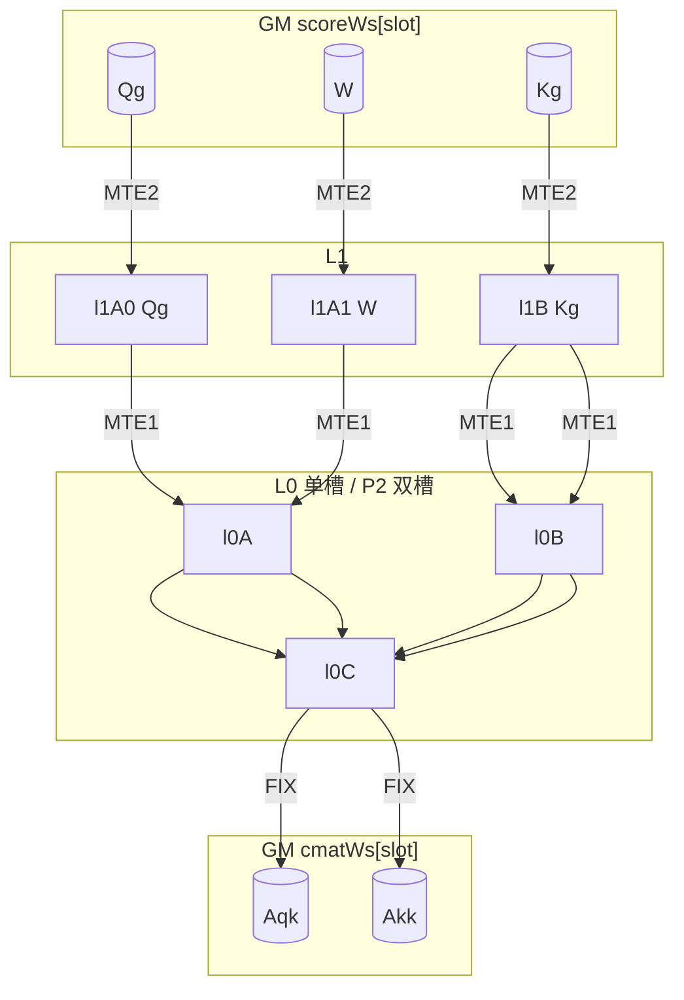

# Cube Score 理论最优流水（0723 方案）

> 范围：**AIC Score 阶段**（`Qg@Kg` / `W@Kg`）及与之相关的 **GM 多槽 / L1·L0 划槽 / MTE2·MTE3 角色**。  
> 依据：`0723/.../chunk_kda_fwd_intra_sub_chunk_cube.h`、`SCORE_TILE_DBUF_PLAN.md`、`VEC_2WIN_PIPE` 协议。  
> 不展开 Vector FwdSub 内部算法；仅标出 Vector 对 `scoreWs` / `cmatWs` 的 MTE2/MTE3，便于对照槽位生命周期。

热路径尺寸：`BC=16`，`K≤128`，dtype `bf16/fp16`（Score 面），`cmat` 为 `fp32`。
（模型 case `BT=64` ⇒ `NC=4` 个 sub-chunk；Score tile 仍是 `BC×K`。）

---

## 1. 管道角色一览

| 管道 | 侧 | 典型动作 | 本算子涉及的 tensor |
|------|----|----------|---------------------|
| **MTE2** | AIV | GM → UB | 读 `q/k/g/beta`；读 `cmatWs`（Post） |
| **MTE3** | AIV | UB → GM | 写 `scoreWs`（Prep：Qg/W/Kg）；写 `aqk_/akkd_`（Post 输出） |
| **MTE2** | AIC | GM → L1 | 读 `scoreWs`：Qg / W / Kg |
| **MTE1** | AIC | L1 → L0 | Qg/W → L0A；Kg → L0B |
| **M** | AIC | MMAD | `Aqk = Qg@Kgᵀ`，`Akk = W@Kgᵀ` → L0C |
| **FIX** | AIC | L0C → GM | 写 `cmatWs`：Aqk / Akk（**不是 MTE3**） |

要点：

- Cube **写回 GM 走 FIX**，不要和 Vector 的 MTE3 混称。
- 跨核可见性：AIV `SetS0Ready`（`PIPE_MTE3`）→ AIC `WaitS0`；AIC `SetCubeDone`（`PIPE_FIX`）→ AIV `WaitCube`。

```text
AIV Prep ──MTE3──► scoreWs[slot] ──MTE2──► AIC L1 ──MTE1──► L0 ──M──► L0C
                                                         │
                                                         └──FIX──► cmatWs[slot]
                                                                      │
AIV Post ◄──MTE2──────────────────────────────────────────────────────┘
     │
     └──MTE3──► aqk_ / akkd_（最终输出）
```

---

## 2. GM 多槽（`depth=4`）

### 2.1 常量

| 符号 | 值 | 含义 |
|------|----|------|
| `NUM_GM_SLOTS` / `SCORE_QUEUE_DEPTH` | **4** | 每核 score/cmat 队列深度 |
| `SCORE_PLANES` | 3 | `PLANE_QG=0`, `PLANE_W=1`, `PLANE_KG=2` |
| `C_PLANES` | 2 | `PLANE_AQK=0`, `PLANE_AKK=1` |
| `KDA_ISUB_PREFILL_WINDOWS` | 2 | S0 实灌预填窗数 |
| window | 2 heads | `hvBase`, `hvBase+1`（不足则单头） |

寻址（每核）：

```text
ScoreOff(slot, plane, row, d) =
  ((coreIdx * depth + slot) * 3 + plane) * BC * K + ...

CmatOff(slot, plane, row, col) =
  ((coreIdx * depth + slot) * 2 + plane) * BC * BC + ...
```

### 2.2 Slot 映射

```text
slot = SlotOfWindow(w, headInWin) = (w % 2) * 2 + headInWin

         head0   head1
bank0:    0       1      ← window 偶数 w=0,2,4,...
bank1:    2       3      ← window 奇数 w=1,3,5,...
```

同 bank 复用：`Post(w)` 读 `cmat[bank]`，`Prep(w+2)` 写 `score[bank]` —— **必须先 Post 再 Prep**，不能颠倒。

### 2.3 每 slot 上的 GM tensor

| Workspace | Plane | Shape（逻辑） | Producer | Consumer | 管道 |
|-----------|-------|---------------|----------|----------|------|
| `scoreWs` | Qg | `BC×K`，T | AIV Prep **MTE3** | AIC **MTE2→L1A[0]** | |
| `scoreWs` | W | `BC×K`，T | AIV Prep **MTE3** | AIC **MTE2→L1A[1]** | |
| `scoreWs` | Kg | `K×BC`（ColMajor 视图），T | AIV Prep **MTE3** | AIC **MTE2→L1B** | |
| `cmatWs` | Aqk | `BC×BC`，fp32 | AIC **FIX** | AIV Post **MTE2** | |
| `cmatWs` | Akk | `BC×BC`，fp32 | AIC **FIX** | AIV Post **MTE2** | |

### 2.4 窗级 CV + 槽生命周期（Vec2Win）

```text
AIV: Prefill S0(w=0,1) → for w:
        WaitCube(w) → Post(w) → Prep(w+2) → SetS0ReadyJoined
AIC: for w:
        WaitS0 → Score(h0)[, Score(h1)] → DrainAkkFix → Barrier FIX → SetCubeDone
```

| 时刻 | bank 占用 |
|------|-----------|
| Prefill 完 | bank0+bank1 的 score 已写；Cube 尚未 Done |
| Cube(w) 算完 | 该 bank 的 cmat 对 Vector 可见 |
| Post(w) | 读 cmat[bank]；随后 Prep(w+2) 覆盖同 bank 的 score |

`FLAG_SLOT_FREE0..3`：仅 Process 首尾 bookend（AIV Set×4 / AIC Wait×4），**不在热路径**。

---

## 3. L1 / L0 划槽

### 3.1 尺寸

```text
TILE_A = BC * K * sizeof(T)     // 16*128*2 = 4 KiB
TILE_B = K * BC * sizeof(T)     // 4 KiB
L0C    = BC * BC * sizeof(fp32) // 1 KiB 量级（按布局对齐）
```

### 3.2 路径 A — 理论最优：`ComputeScoreTile`（`L1A_DBUF=1`，无 WIN resident）

单 head、单次 Score，L1 **只服务当前 head**：

```text
offset          buffer     tensor
─────────────────────────────────
0               l1A[0]     Qg
TILE_A          l1A[1]     W
2*TILE_A        l1B        Kg   ← MMAD1/2 resident，不换槽
```

L0（当前默认 **单槽**；P2 未默认开）：

```text
l0A[0]  ← Qg 或 W（先后）
l0B[0]  ← Kg（MMAD1 与 MMAD2 各拷一次）
l0C[0]  ← Aqk 写完再写 Akk（串行，不做 L0C-DB）
```

P2 理论扩展（`USE_SCORE_L0_DBUF`，门禁未过）：

```text
l0A[0]/l0B[0]  → MMAD1 (Qg, Kg)
l0A[1]/l0B[1]  → MMAD2 (W,  Kg)   // 可在 MMAD1/Fix(Aqk) 期间预填
```

### 3.3 路径 B — 可选：`WIN_L1_RESIDENT=1`（默认关）

WaitS0 后 **一次 Prefetch 两头**，L1 按 head 切块（每头 3 槽）：

```text
headIdx ∈ {0,1}
base = headIdx * 3 * TILE_A

base + 0        l1A0(h)    Qg_h
base + TILE_A   l1A1(h)    W_h
base + 2*TILE   l1B(h)     Kg_h
```

两头合计：`2 × 3 × 4 KiB = 24 KiB` ≪ 512 KiB。

```text
L1 地图（resident）:

  [ head0: Qg | W | Kg ][ head1: Qg | W | Kg ]
  |←—— 3*TILE ——→||←—— 3*TILE ——→|
```

L0 **仍单槽共用**：`ComputeScoreTileFromL1` 按 head 顺序轮流吃对应 L1 三段；**无跨头 L0-DB**。

| 对比 | 路径 A `ComputeScoreTile` | 路径 B `Prefetch + FromL1` |
|------|---------------------------|----------------------------|
| MTE2(W) ‖ MMAD1 | ✅ | ❌（W 已在 Prefetch 搬完） |
| Akk Fix ‖ 下头 MTE2 | ✅（C1） | ❌（下头无 MTE2；且先 Wait FIX） |
| Fix(Aqk) ‖ MTE1(MMAD2) | ✅ | ✅ |
| Prefetch 摊平带宽 | — | ✅ 两头 MTE2 前置 |

---

## 4. 理论最优流水（路径 A：P1 + 片内 Fix‖MTE1 + C1）

### 4.1 硬约束

1. **`Wait(W ready)` 必须在 `Fix(Aqk)` 之前**（禁止 W-MTE2 ‖ Fix Aqk）。  
2. `SetCubeDone` 前必须 **Drain** 未完成的 Akk Fix（`akkFixPending_`）。  
3. L0C 单槽：Fix(Aqk) 完成前不可开写 Akk 的 MMAD2（故 MTE1 可与 Fix 叠，MMAD2 必须等 FIX）。

### 4.2 单 head 时间线（tensor + 管道）

```text
GM score[slot]                L1                    L0              L0C / GM cmat
─────────────────────────────────────────────────────────────────────────────────
MTE2 Kg ───────────────────► l1B
MTE2 Qg ───────────────────► l1A0
                    MTE1 ──► l0A←Qg, l0B←Kg
MTE2 W ────────────────────► l1A1          ║
                              (W in flight) ║  M: MMAD1 → L0C=Aqk
                              Wait W ★      ║
                    ───────────────────────── Fix ──► cmat.Aqk
                    MTE1 ──► l0A←W,  l0B←Kg  ║ (‖ Fix Aqk)
                              Wait FIX      ║
                              M: MMAD2 → L0C=Akk
                              Fix ──► cmat.Akk ; Set FIX_MTE2 ; pending
```

重叠摘要：

| 重叠 | 管道对 | tensor |
|------|--------|--------|
| P1 | MTE2 ‖ M | W→L1A1 ‖ MMAD1(Qg@Kg) |
| 片内 C1′ | MTE1 ‖ FIX | (W,Kg)→L0 ‖ Fix(Aqk) |
| 跨头 C1 | MTE2 ‖ FIX | 下头 Kg(+/Qg)→L1 ‖ Fix(Akk_上) |

### 4.3 双头 + 窗尾（含 slot）

```text
WaitS0                         // score[slot0], score[slot1] 已由 AIV MTE3 写好

── head0 / slot0 ──
  [C1] if pending: MTE2(Kg₀) ‖ Wait Fix(Akk_prev)
  MTE2 Qg₀,Kg₀ → L1 ; MTE1 → L0
  MTE2 W₀ ‖ MMAD1
  Wait W₀ ; Fix Aqk₀ ‖ MTE1(W₀,Kg) ; MMAD2 ; Fix Akk₀ (pending)

── head1 / slot1 ──
  MTE2 Kg₁(+Qg₁) ‖ Wait Fix(Akk₀)     // C1 跨头
  … 同 P1 + Fix‖MTE1 …
  Fix Akk₁ (pending)

DrainAkkFix
PipeBarrier<PIPE_FIX>
SetCubeDone                        // cmat[slot0/1] 对 AIV 可见
```

### 4.4 流程图（单 tile）



### 4.5 伪代码 ↔ 0723 代码

| 步骤 | 伪代码 | `cube.h` |
|------|--------|----------|
| C1 入口 | `issue MTE2(Kg); Wait(FIX_EVT)` | `ComputeScoreTile` ~254–265 |
| 装 Qg | `MTE2 Qg→l1A0; MTE1→L0` | ~271–277 |
| P1 | `MTE2 W→l1A1; MMAD1; Wait W before Fix` | ~278–287 |
| Fix Aqk ‖ MTE1 | `Fix Aqk; copy L1→L0(W); Wait FIX` | ~287–294 |
| Akk 挂起 | `Fix Akk; Set EVT_FIX; pending=true` | ~298–301 |
| 窗尾 | `DrainAkkFix; Barrier FIX; SetCubeDone` | ~111–115 |
| resident 变体 | Prefetch 两头后只跑 M/FIX | `PrefetchWindowToL1` + `ComputeScoreTileFromL1` |

HardEvent ID（Cube Score）：

| ID | 名 | 用途 |
|----|-----|------|
| 3 | `SCORE_EVT` | 通用 MTE2↔MTE1 / MTE1↔M / M↔FIX / Fix(Aqk)↔MTE2 |
| 4 | `SCORE_EVT_W` | W 的 `MTE2_MTE1`（与 3 分离，保证 Wait W 语义清晰） |
| 5 | `SCORE_EVT_FIX` | Akk Fix 挂起（`FIX_MTE2`），供下 tile C1 |

---

## 5. 与 Vector MTE2/MTE3 的槽位对照（同 bank）

仅列和 Cube 共享的 workspace，便于看「谁占槽」：

```text
slot s = (w%2)*2 + head

AIV Prep(s):
  MTE2: q,k,g → UB
  MTE3: UB → scoreWs[s].{Qg,W,Kg}     ★ Cube 的 MTE2 源

AIC Score(s):
  MTE2: scoreWs[s] → L1
  FIX:  L0C → cmatWs[s].{Aqk,Akk}     ★ Vector Post 的 MTE2 源

AIV Post(s):
  MTE2: cmatWs[s] → UB
  MTE3: UB → aqk_ / akkd_             （最终输出，不回 score 槽）
```

多槽乒乓（示意，prefill=2）：

```text
时间 →
AIV:  S0(0) S0(1) | WaitCube0 Post0 Prep2 | WaitCube1 Post1 Prep3 | ...
AIC:  WaitS0_0 Score0 | WaitS0_1 Score1 | WaitS0_2 Score2 | ...
GM:   bank0: slot0/1     bank1: slot2/3     bank0 复用 ...
```

---

## 6. 理论最优 vs 0723 默认配置

| 宏 | 0723 默认 | 理论最优含义 |
|----|-----------|--------------|
| `USE_SCORE_L1A_DBUF` | 1 | L1A 双槽 Qg/W，支撑 P1 |
| `USE_SCORE_FIX_MTE2_DBUF` | 1 | Akk Fix 挂起，支撑跨 tile C1 |
| `USE_SCORE_WIN_L1_RESIDENT` | **0** | 两头 Prefetch；**削弱 P1/C1**；精度未绿故默认关 |
| `USE_SCORE_L0_DBUF` | 0（未合入/门禁） | 理论 P2：MMAD1 ‖ 预填 MMAD2 的 L0 |
| `USE_SCORE_MMAD1_LOAD_W` | 0（强制） | 单 L1A 覆盖写已否决 |

**记法建议：**

- **理论最优 Cube 流水** = 路径 A（`L1A_DBUF` + `FIX_MTE2_DBUF` + 可选 `L0_DBUF`），按 §4 排布。  
- **0723 现网默认** = 路径 A（`L1A_DBUF=1` + `FIX_MTE2_DBUF=1` + `WIN_L1_RESIDENT=0`）；GM 仍为 4-slot Vec2Win。路径 B 代码保留、默认关。

---

## 7. 相关文件

| 文件 | 内容 |
|------|------|
| `0723/.../op_kernel/chunk_kda_fwd_intra_sub_chunk_cube.h` | Cube 实现（P1/C1/resident） |
| `0723/.../SCORE_TILE_DBUF_PLAN.md` | P0–P3 方案与伪代码 |
| `0723/.../DOUBLE_BUFFER_EVAL.md` | DB 层级结论 |
| `op_kernel/..._common.h` | slot / plane / flag / ScoreOff |
| `VEC_2WIN_PIPE.md`（本树） | CV 窗协议与 SetFree bookend |
