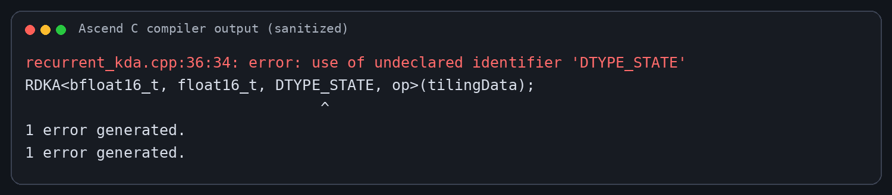
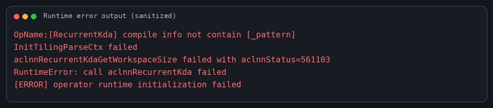
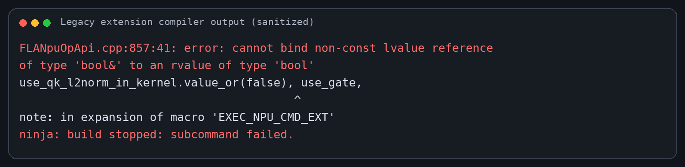
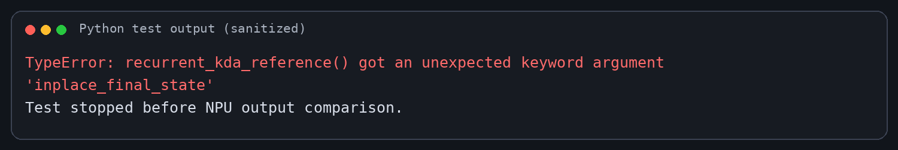
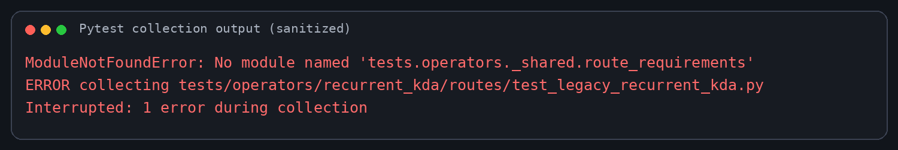
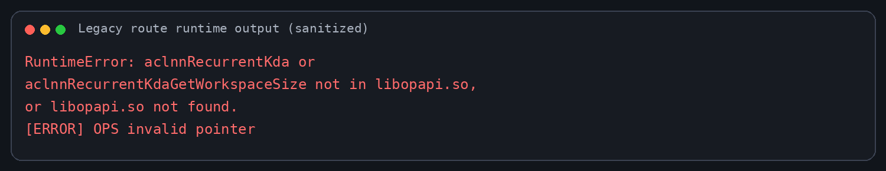

# RecurrentKda 6.0 开发问题记录

本文记录 RecurrentKda 6.0 接口升级过程中实际遇到的编译与运行时问题。截图由实际错误日志脱敏生成，仅保留错误文本和必要上下文，不包含服务器、账号、绝对路径、环境路径或日志路径。

## Issue 01：IR 输入重命名后 kernel dtype 宏未同步

- 阶段：Ascend 910B 单算子 run 包编译
- 状态：已解决

### 现象与报错

```text
recurrent_kda.cpp:36:34: error: use of undeclared identifier 'DTYPE_STATE'
```



### 根因分析

IR 输入从旧名称 `state` 更新为 6.0 原型中的 `initial_state` 后，编译框架生成的类型宏变为 `DTYPE_INITIAL_STATE`，kernel 入口仍使用旧宏 `DTYPE_STATE`，导致模板实例化失败。

### 解决办法

仅将 kernel 入口的状态类型宏更新为 `DTYPE_INITIAL_STATE`，保留原有模板和计算路径。

### 验证结果

Ascend 910B 单算子 run 包重新编译成功，FP32/BF16 state 对应 kernel binary 均成功生成。

## Issue 02：GetWorkspaceSize 阶段进入 AutoTiling 并报缺少 `_pattern`

- 阶段：运行时（aclnn workspace/tiling 初始化）
- 状态：已解决

### 现象与报错

```text
OpName:[RecurrentKda] compile info not contain [_pattern]
InitTilingParseCtx failed
aclnnRecurrentKdaGetWorkspaceSize failed with aclnnStatus=561103
```



### 根因分析

本算子的 kernel JSON 中 `compileInfo` 为空是已有 custom tiling 路径的正常形式。正常运行依赖 `IMPL_OP_OPTILING` 注册的 `TilingParse` 和 tiling 函数。测试进程先导入 `torch_npu`，若仅在首次 wrapper 调用时追加 OPP 环境变量，CANN 初始化已经完成，内嵌 `liboptiling.so` 不会被回溯加载，运行时因此回退到要求 `_pattern` 的 AutoTiling parser。

### 解决办法

- 保留原实现的 tiling 模板、tiling 函数和 parse 注册。
- wheel 在加载 `libcust_opapi.so` 前，以全局符号模式预加载内嵌 `op_tiling/liboptiling.so`，保证 `GetWorkspaceSize` 前完成注册。
- 不向 kernel JSON 人工增加 `_pattern`。

### 验证结果

不需要额外配置 OPP 环境变量，新的 Python 进程可以直接调用 aclnn wrapper 并命中 custom tiling。

## Issue 03：legacy 扩展生成与宏参数约束不兼容

- 阶段：可选 legacy PyTorch C++ extension 生成和编译
- 状态：已解决

### 现象与报错

生成阶段先后暴露出可选 `Tensor?` 返回值、带默认值的可变可选 Tensor 不受当前生成器支持；调整 schema 后，C++ 编译继续报错：

```text
error: cannot bind non-const lvalue reference of type 'bool&' to an rvalue of type 'bool'
```



### 根因分析

当前 `torchnpugen` 对可选 Tensor 返回值和带默认值的可变可选 Tensor 支持不完整。同时，`EXEC_NPU_CMD_EXT` 内部的类型转换模板按非 const 左值引用接收参数，直接传入 `optional<bool>.value_or(...)` 产生的临时值无法绑定。

### 解决办法

- legacy schema 使用生成器支持的双 Tensor 返回形式，并将可变 `initial_state` 设为必选；推荐的 ctypes/aclnn Python 入口仍保留 `initial_state=None` 时自动创建零状态的能力。
- C++ adapter 在调用宏前把可选 bool 属性保存为具名局部变量。
- 扩展 source 列表使用相对路径，避免 setuptools 拒绝绝对路径。
- 清理损坏的中间生成文件后重新生成并编译。

### 验证结果

`FLA_NPU_BUILD_LEGACY_EXTENSION=1` 的 wheel 完整编译和链接成功。

## Issue 04：新增 inplace 属性未同步到测试 golden 签名

- 阶段：运行时（CPU golden）
- 状态：已解决

### 现象与报错

```text
TypeError: recurrent_kda_reference() got an unexpected keyword argument 'inplace_final_state'
```



### 根因分析

TND/K-first 用例通过同一组参数调用 NPU wrapper 和 CPU golden。wrapper 已支持 6.0 的 `inplace_final_state`，但 reference 函数签名尚未同步，测试在进入 NPU 输出比较前失败。

### 解决办法

同步 reference 签名和 state 写回语义，并在无初始 state 场景显式使用非原地 final state；同时显式设置 `state_v_first`，避免旧测试依赖历史默认值。

### 验证结果

TND、K-first、无初始 state、非原地 final state 场景均通过精度比较。

## Issue 05：算子测试目录缺少 route 条件辅助模块

- 阶段：pytest 收集
- 状态：已解决

### 现象与报错

```text
ModuleNotFoundError: No module named 'tests.operators._shared.route_requirements'
```



### 根因分析

`recurrent_kda/routes` 已引用共享的 route 条件辅助模块，但当前分支未包含该历史文件，导致整个测试目录在 collection 阶段中止。

### 解决办法

从仓库历史实现恢复 `tests/operators/_shared/route_requirements.py`，不改变其环境开关语义。

### 验证结果

完整算子测试目录可正常收集并完成。默认环境结果为 `25 passed, 2 skipped`；启用已构建的 legacy 路由和长序列大 shape 开关后，最终结果为 `27 passed`。


## Issue 06：legacy 路由未在进程启动前配置 custom opapi 搜索路径

- 阶段：运行时（`torch.ops.npu` legacy 路由）
- 状态：已解决

### 现象与报错

```text
RuntimeError: aclnnRecurrentKda or aclnnRecurrentKdaGetWorkspaceSize not in libopapi.so,
or libopapi.so not found.
```



### 根因分析

legacy op-plugin 在进程内通过 `dlopen("libopapi.so")` 查找接口。只在 Python 运行后修改 `LD_LIBRARY_PATH`，不能保证动态加载器重新读取搜索路径；因此它可能命中系统库而不是 wheel 内嵌 custom opapi。推荐的 ctypes/aclnn 路径直接按绝对位置加载，不受此限制。

### 解决办法

legacy 专用测试在 Python 进程启动前配置 custom OPP，并将其 `op_api/lib` 加入动态库搜索路径；该配置只用于旧 `torch.ops.npu` 兼容路径。

### 验证结果

legacy 路由测试通过；同时启用长序列大 shape 用例后，完整测试目录结果为 `27 passed`。

## Issue 07：AIV workspace 发布后 Cube 读取到旧数据

- 阶段：Ascend950 mixed kernel 运行时
- 状态：已解决

### 现象与报错

```text
受控输入中，AIV state 更新正常，但 Cube 对 state 的贡献为 0；使用逐 AIV 的 0x4 ready
事件后 kernel 不死锁，仍可观察到前一轮数据滞后。
```

### 根因分析

逐 AIV 的普通事件没有复现参考算子对两个 AIV MTE3 写出的聚合可见性协议。AIC 虽被唤醒，
但读取 workspace 时数据发布顺序不满足该 mixed kernel 的要求。

### 解决办法

两个 AIV 使用同一个 `CrossCoreFlagWithReverse<0x2>`，在 `PIPE_MTE3` 发布 state ready；
AIC 在 `PIPE_FIX` 等待一次聚合事件。state free 和 L0C→UB result ready/free 仍按两个子核
分别闭环。

### 验证结果

受控单位输入恢复默认 scale 后的预期输出，最终状态保持不变；完整 PTA 的前两组场景立即通过。

## Issue 08：BF16 Cube mirror 导致递归状态误差累积

- 阶段：Ascend950 精度测试
- 状态：已解决

### 现象与报错

```text
TND precomputed log gate:
out failed=20/2048
final_state failed=2702/131072
```

### 根因分析

AIV 中的 state 工作副本为 FP32，而 Cube 输入 mirror 为 BF16。较大 beta 或多 token 递推时，
`S @ k` 与 `S @ q` 的 BF16 输入量化误差会进入 delta 并累积到 final state。全 FP32 Cube
版本虽能编译，但运行时间超过验收保护时限，不适合作为最终方案。

### 解决办法

保留 BF16 Cube 主计算和 L0C→UB，AIV 使用 `FP32 state - BF16 mirror` 计算两组 RegBase
残差点积并加回 Cube 结果。Ascend950 专属 `vStep` 限为 32，为 residual 临时矩阵留出 UB；
Ascend910B/Ascend910_93 tiling 不变。

### 验证结果

PTA 的 5 个场景中，`out` 和 `final_state` 全部 PASS。

## Issue 09：手写寄存器残差归约触发 BiSheng backend 限制

- 阶段：Ascend950 kernel 编译
- 状态：已解决

### 现象与报错

```text
fatal error: error in backend: VAG's non-zero args must be hoisted.
```

### 根因分析

在 `__VEC_SCOPE__` 中直接组合 BF16/FP32 指针偏移、转换和归约，触发当前 BiSheng 后端
对 VAG 非零参数提升的限制。改用仓内已验证的 LocalTensor 组合后编译成功。
